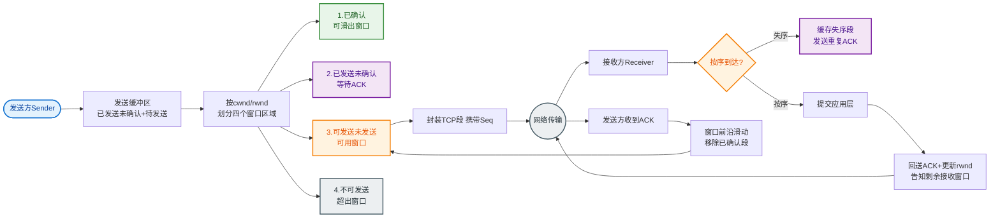

# 什么是接收方滑动窗口？

接收方滑动窗口是 TCP 流量控制的核心机制，用于告知发送方当前接收缓冲区的剩余可用空间，防止发送方发送过快导致接收方溢出。

### 窗口结构细节
接收方将数据流划分为四个部分（比基础三部分划分更精确）：
1.  **已接收并确认**：数据已正确接收，ACK 已发送，且已被应用层读取。
2.  **已接收未确认**：数据已正确接收并暂存于缓冲区，等待应用层读取，但 ACK 尚未发送或处理。
3.  **允许接收**（窗口范围）：接收方当前缓冲区剩余的可用空间大小，即通告窗口大小。
4.  **不可接收**：超出当前缓冲区处理能力的后续数据。

### 工作机制与细节
接收方在回复 ACK 时，会携带 TCP 头部中的**窗口大小**字段。发送方根据该值计算其**可用窗口**。
- **通告窗口为 0**：如果接收方应用层读取数据慢，缓冲区填满，通告窗口将变为 0（称为 Zero Window）。发送方将停止发送数据，启动**坚持定时器** 探测窗口更新。
- **窗口更新**：当应用层读取数据腾出空间后，接收方会发送携带非 0 窗口大小的 ACK（或纯 ACK），发送方恢复发送。

### 架构图解
```text
接收方数据流视角（字节流编号）

1. 已接收并交付应用层
   ┌──────────────────────────────────────┐
2. 已接收未读（在缓冲区中）
   │┌────┐┌────┐┌────┐┌────┐┌────┐┌────┐│
   ││ 5  ││ 6  ││ 7  ││ 8  ││ 9  ││ 10 ││  <-- 当前 LastByteRcvd
   │└────┘└────┘└────┘└────┘└────┘└────┘│
3. 允许接收（接收窗口 rwnd = 6）
   │┌────┐┌────┐┌────┐┌────┐┌────┐┌────┐│  <-- 可用空间，通告给发送方
   ││ 11 ││ 12 ││ 13 ││ 14 ││ 15 ││ 16 ││
   │└────┘└────┘└────┘└────┘└────┘└────┘│
   └──────────────────────────────────────┘
4. 不可接收
   ┌──────────────────────────────────────┐
   │ 17 │ 18 │ ... │                      │  <-- 超出 rwnd，暂不能接收
   └──────────────────────────────────────┘
```

### 边界条件
- **左边缘滑动**：随着应用层读取数据，窗口左边界向右移动（旧数据被消费）。
- **右边缘滑动**：随着接收方处理速度，窗口右边界可能扩张（处理快）或收缩（处理慢）。
- **糊涂窗口综合征 (SWS)**：为了避免频繁通告极小的窗口（如 1 字节），通常建议接收方只在窗口达到一定阈值（如 MSS 或缓冲区一半）时才更新窗口。

---

### 实战案例
在微服务架构中，如果下游服务处理请求非常慢（例如由于复杂的 SQL 计算），TCP 接收缓冲区会被迅速填满，`rwnd` 降为 0。此时上游服务的发送线程会因为写 Socket 阻塞而挂起，如果未设置超时，可能导致大量线程阻塞甚至线程池耗尽（服务假死）。这就是需要应用层限流（如 Sentinel）配合 TCP 流量控制的原因。

### 流量控制 vs 拥塞控制

| 维度 | 流量控制 | 拥塞控制 |
| :--- | :--- | :--- |
| **目的** | 保护接收方不被淹没 | 保护网络不被过载 |
| **作用对象** | 端到端 | 全局/网络环境 |
| **机制** | 滑动窗口 | 慢启动、拥塞避免、快重传/快恢复 |
| **反馈源** | 接收方通告 | 丢包或延时 inferred |

### 代码示例 (Java Socket处理)
```java
// 模拟接收方设置接收缓冲区大小（影响窗口大小）
ServerSocket serverSocket = new ServerSocket(8080);
Socket socket = serverSocket.accept();

// 设置接收缓冲区为 32KB，这也是 rwnd 的理论上限
// 如果应用层消费慢，TCP 通告窗口会逐渐变小直到 0
socket.setReceiveBufferSize(32 * 1024); 

InputStream input = socket.getInputStream();
// 如果不读取 input，缓冲区最终会满，导致发送方阻塞
byte[] buffer = new byte[1024];
while (true) {
    int bytesRead = input.read(buffer); // 读取数据腾出窗口空间
}
```

## 常见考点
1. **窗口关闭与零窗口探测**：如果接收方处理慢导致窗口为 0，发送方如何知道接收方恢复？
2. **流量控制与拥塞控制的区别**：流量控制是端到端的（防止淹没接收方），拥塞控制是全局性的（防止淹没网络）。
3. **糊涂窗口综合征 (SWS)**：如何避免微小数据包的传输？（接收方延迟确认，发送方 Nagle 算法）。


## 核心流程图


## 记忆要点

- 核心目的：接收方通告剩余缓冲区大小，防止被发送方淹没(点对点)
- 窗口为0(Zero Window)：缓冲满发送方停发，靠坚持定时器探测更新
- 窗口滑动机制：左边缘随应用读取向右移，右边缘随可用空间伸缩
- 防糊涂窗口综合征(SWS)：避免通告极小窗口，累计至阈值再更新
- 对比：流量控制是端到端保护接收端，拥塞控制是全局防网络过载

## 结构化回答

**30 秒电梯演讲：** 接收方通告缓冲区剩余空间，控制发送方发送速率，实现流量控制。打个比方，像水管龙头，如果你（接收方）接水太慢，水箱满了就关掉龙头（发送方），防止溢出。

**展开框架：**
1. **核心目的** — 接收方通告剩余缓冲区大小，防止被发送方淹没(点对点)
2. **窗口为0(Zero Window)** — 缓冲满发送方停发，靠坚持定时器探测更新
3. **窗口滑动机制** — 左边缘随应用读取向右移，右边缘随可用空间伸缩

**收尾：** 我在项目里踩过坑——在微服务架构中，如果下游服务处理请求非常慢（例如由于复杂的 SQL 计算），TCP 接收缓冲区会被迅速填满，`rwnd` 降为 0。您想深入聊哪一段：原理、避坑还是对比选型？

## 视频脚本

> 预计时长：2 分钟 | 由浅入深

| 时间 | 画面/字幕 | 口播台词 | 讲解要点 |
|------|----------|----------|----------|
| 0:00 | 标题卡：什么是接收方滑动窗口 | "什么是接收方滑动窗口？一句话——像水管龙头，如果你（接收方）接水太慢，水箱满了就关掉龙头（发送方），防止溢出。" | 开场钩子 |
| 0:40 | 概念动画/示意图 | "接收方通告缓冲区剩余空间，控制发送方发送速率，实现流量控制——像水管龙头，如果你（接收方）接水太慢，水箱满了就关掉龙头（发送方），防止溢出" | 核心定义 |
| 1:20 | 核心目的示意 | "接收方通告剩余缓冲区大小，防止被发送方淹没(点对点)" | 要点1 |
| 2:00 | 总结卡 | "记住这几条，面试不慌。下期讲进阶追问。" | 收尾 |
