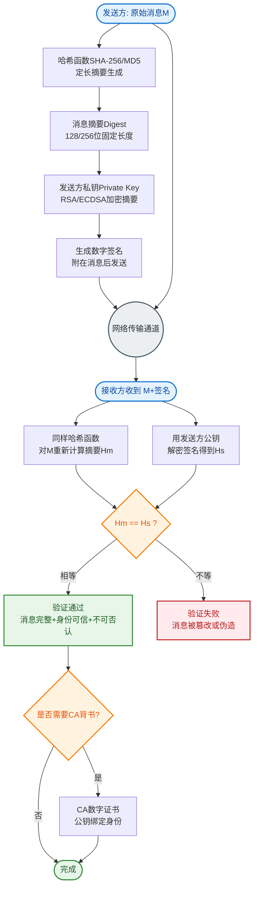

# 什么是摘要算法+数字签名？

### 摘要算法 + 数字签名
为了保证传输的内容不被修改，可以将传输的内容计算出一个【指纹】，对方收到后，也把接收的内容计算出一个【指纹】，然后进行对比，如果【指纹】相同，则说明内容没有被篡改。常常会使用摘要算法（哈希函数，如 MD5、SHA-256）来计算出内容的哈希值，通过摘要算法可以生成数据的唯一标识（固定长度），从而验证数据的完整性。

但是摘要算法只能保证内容不被修改，不能保证发送者的身份（防抵赖）。为了避免这种情况，计算机里会用非对称加密算法来解决，共有两个密钥：公钥用于验证签名，私钥用于生成签名。私钥是由服务端保管，然后服务端会向客户端颁发对应的公钥。如果客户端收到的信息，能被公钥解密，就说明该消息是由服务器发送的。

### 完整流程

1.  **生成数字签名**：
    发送方对原始消息进行哈希运算得到摘要。然后，发送方使用自己的**私钥**对该摘要进行加密，生成的密文即**数字签名**。

2.  **发送消息**：
    发送方将【原始消息】和【数字签名】一起发送给接收方。

3.  **验证数字签名**：
    接收方收到消息后，执行两步操作：
    *   **解密签名**：使用发送方的**公钥**对数字签名进行解密，得到原始的摘要值 A。
    *   **计算摘要**：使用相同的哈希函数对收到的【原始消息】进行计算，得到新的摘要值 B。
    *   **对比**：如果 A 和 B 相同，说明消息未被篡改，且确认是持有私钥的发送方发出的。

### 流程架构图
```text
发送方流程                     网络传输                    接收方验证流程
                                                                          
  [原始消息]                                                         [原始消息]
      │                                                                  │
      ├──────(Hash运算)───────> [摘要 A]                               (Hash运算) ───────> [摘要 B]
      │                           │                                          │
      │                         加密 │                                        对比
      │                           ▼                                          ▲
      │                      [私钥加密]                                     │
      │                           │                                          │
      │                     [数字签名] ───────────────────────────> [公钥解密]
      │                                                                        │
      └─────────────────> (消息 + 签名) ───────────────────────────────────────┘
                          [如果 摘要A == 摘要B，则验证通过]
```

### 实战案例
在对接微信支付或支付宝时，回调通知通常包含签名。如果开发者直接对整个请求体（包括随机的时间戳或空格差异）进行验签，很容易导致签名不一致。实战中通常需要对参数进行**按字典序排序**并拼接成特定格式字符串后再进行哈希运算，且必须处理不同编码（如 UTF-8 vs GBK）带来的哈希差异。

### 代码示例（Java 演示签名生成）
```java
import java.security.*;

public class SignatureDemo {
    public static byte[] sign(String data, PrivateKey privateKey) throws Exception {
        // 1. 使用 SHA-256 摘要算法 + RSA 算法
        Signature signature = Signature.getInstance("SHA256withRSA");
        signature.initSign(privateKey);
        // 2. 传入原始数据
        signature.update(data.getBytes());
        // 3. 生成签名
        return signature.sign();
    }
}
```

### 常见考点
1. **摘要算法的特性**：单向性（不可逆）、抗碰撞性（难以找到两个不同内容有相同摘要）。
2. **私钥的作用**：为什么是"私钥加密，公钥解密"？（为了验证身份，即签名；公钥加密是为了保密，即加密）。
3. **证书的作用**：如何确保拿到的公钥确实是服务器的，而不是中间人的？（引入数字证书 CA）。


## 核心流程图


## 记忆要点

- 摘要(如SHA-256)提取内容唯一指纹，保证数据完整性防篡改
- 数字签名解决身份防抵赖：发送方用私钥对摘要加密生成签名
- 验证流程：接收方用公钥解出摘要A，自算原文摘要B，相等则合法
- 核心对比：私钥加密为签名验身份，公钥加密为保密防窃听
- 防中间人伪造公钥：引入权威CA颁发数字证书绑定真实身份

## 结构化回答

**30 秒电梯演讲：** 结合哈希摘要与非对称加密，确保数据完整且来源可信。打个比方，把信件内容算出指纹，再用私钥封在信封里，别人用公钥开箱对比指纹防伪。

**展开框架：**
1. **摘要(如SHA-256)提取内容唯一指纹** — 保证数据完整性防篡改
2. **数字签名解决身份防抵赖** — 发送方用私钥对摘要加密生成签名
3. **验证流程** — 接收方用公钥解出摘要A，自算原文摘要B，相等则合法

**收尾：** 我在项目里踩过坑——在对接微信支付或支付宝时，回调通知通常包含签名。您想深入聊哪一段：原理、避坑还是对比选型？

## 视频脚本

> 预计时长：2 分钟 | 由浅入深

| 时间 | 画面/字幕 | 口播台词 | 讲解要点 |
|------|----------|----------|----------|
| 0:00 | 标题卡：什么是摘要算法+数字签名 | "什么是摘要算法+数字签名？一句话——把信件内容算出指纹，再用私钥封在信封里，别人用公钥开箱对比指纹防伪。" | 开场钩子 |
| 0:40 | 概念动画/示意图 | "结合哈希摘要与非对称加密，确保数据完整且来源可信——把信件内容算出指纹，再用私钥封在信封里，别人用公钥开箱对比指纹防伪" | 核心定义 |
| 1:20 | 要点1图解示意 | "保证数据完整性防篡改" | 要点1 |
| 2:00 | 总结卡 | "记住这几条，面试不慌。下期讲进阶追问。" | 收尾 |
