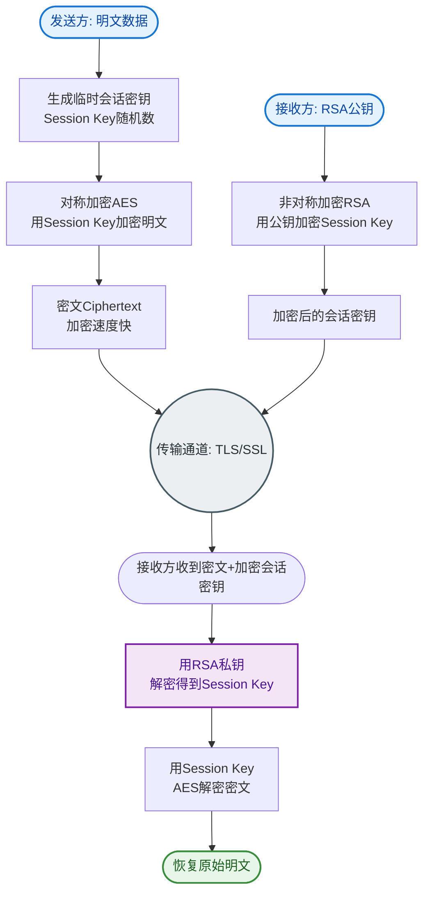
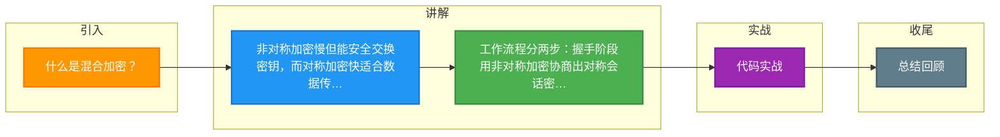

# 什么是混合加密？

### 混合加密
HTTPS 采用对称加密和非对称加密结合的【混合加密】方式，保证信息的机密性，解决了窃听的风险。

#### 核心概念对比

**非对称加密**（如 RSA、ECC）：
*   **机制**：使用一对密钥，公钥加密，私钥解密；或私钥签名，公钥验签。
*   **优点**：安全性高，公钥可以公开分发，解决了密钥交换难题。
*   **缺点**：计算复杂，运算速度极慢（比对称加密慢 2-3 个数量级），不适合加密大量数据。

**对称加密**（如 AES、ChaCha20）：
*   **机制**：发送方和接收方共享同一个密钥，加解密使用同一个密钥。
*   **优点**：算法简单，计算速度快，适合处理大量数据流。
*   **缺点**：密钥分发困难，如何在不安全的通道中安全地传输共享密钥是主要挑战。

#### 对比表格
| 特性 | 对称加密 | 非对称加密 |
| :--- | :--- | :--- |
| **密钥数量** | 单一密钥（加解密相同） | 密钥对（公钥+私钥） |
| **运算速度** | 快（适合大数据流） | 慢（CPU 密集型） |
| **安全性** | 依赖密钥保管，密钥分发难 | 依赖数学难题，安全性高 |
| **主要用途** | 数据传输加密 | 密钥交换、数字签名 |
| **典型算法** | AES, DES, RC4 | RSA, ECC, ElGamal |

#### 混合加密工作流程

1.  **通信建立前（密钥交换）**：
    使用非对称加密算法。客户端使用服务器的公钥加密生成的随机数（Pre-Master Secret），或者使用 ECDHE 算法直接协商，从而安全地交换**会话密钥**。这一步保证了只有持有私钥的服务器才能拿到密钥。

2.  **通信过程中（数据传输）**：
    全部使用对称加密的**会话密钥**对后续的 HTTP 明文数据进行加密传输。由于是对称加密，速度极快，保证了性能。

#### 流程架构图
```text
阶段1: 握手与密钥交换 (慢速，使用非对称加密)

  Client                                      Server
    │                                           │
    │  1. ClientHello (支持加密套件)            │
    │──────────────────────────────────────────>│
    │                                           │
    │<──────────────────────────────────────────│
    │  2. ServerHello (发送证书+公钥)           │
    │                                           │
    │  3. 验证证书，用公钥加密 [会话密钥]        │
    │──────────────────────────────────────────>│
    │                                (Server用私钥解密得到会话密钥)

阶段2: 数据传输 (快速，使用对称加密)

  Client           [会话密钥]           Server
    │                 │                  │
    │  4. 加密数据 [明文+MAC]            │
    │───────────────────────────────────>│
    │                 │                  │ 解密 & 验证
    │<───────────────────────────────────│
    │  5. 加密响应数据                    │
```

#### 实战案例
在高并发秒杀场景下，如果全部使用非对称加密（如早期的 SSL 握手仅支持 RSA），服务器 CPU 会迅速飙升导致服务不可用（称为 SSL 握手风暴）。优化方案是启用 **TLS 1.2/1.3 的 ECDHE  suites**（椭圆曲线 Diffie-Hellman），不仅支持前向安全性（Perfect Forward Secrecy），而且握手计算量相比 RSA 大幅降低，能抗更高并发。

#### 代码示例（Node.js 混合加密思路）
```javascript
const crypto = require('crypto');

// 模拟：使用公钥加密会话密钥 (非对称)
const publicKey = `...`; // 服务端公钥
const sessionKey = crypto.randomBytes(32); // 生成对称密钥 AES-256
const encryptedSessionKey = crypto.publicEncrypt(publicKey, sessionKey);

// 模拟：使用会话密钥加密数据 (对称)
const iv = crypto.randomBytes(16);
const cipher = crypto.createCipheriv('aes-256-cbc', sessionKey, iv);
let encryptedData = cipher.update('Hello Secret World', 'utf8', 'hex');
encryptedData += cipher.final('hex');
```

#### 采用原因总结
结合两者优点：利用非对称加密解决密钥分发的安全问题，利用对称加密解决数据传输的性能问题。

## 常见考点
1. **为什么不全用非对称加密？**：性能原因，CPU 开销太大。
2. **为什么不全用对称加密？**：密钥分发困难，在不安全网络上无法安全传输密钥。
3. **中间人攻击**：在非对称加密阶段，如何防止黑客拦截并发送自己的公钥？（引出数字证书的概念）。


## 核心流程图


## 记忆要点

- 非对称加密慢但能安全交换密钥，而对称加密快适合数据传输，因各有优劣所以采用混合加密
- 工作流程分两步：握手阶段用非对称加密协商出对称会话密钥
- 数据传输阶段全程使用对称会话密钥加解密，兼顾了安全与性能

## 结构化回答


**30 秒电梯演讲：** 见面时用保险箱（非对称）互换家门钥匙，之后聊天直接用家门钥匙（对称）开门。

**展开框架：**
1. **非对称加密安** — 非对称加密安全性高但速度慢，用于密钥交换
2. **对称加密速度快** — 对称加密速度快，用于后续数据传输
3. **结合两者优势** — 结合两者优势，解决密钥分发和性能瓶颈

**收尾：** 这是我实战中的理解，您想深入哪一段？


## 视频脚本

> 预计时长：2 分钟 | 由浅入深

| 时间 | 画面/字幕 | 口播台词 | 讲解要点 |
|------|----------|----------|----------|
| 0:00 | 标题卡：什么是混合加密 | "什么是混合加密？一句话——见面时用保险箱（非对称）互换家门钥匙，之后聊天直接用家门钥匙（对称）开门。" | 开场钩子 |
| 0:40 | 概念动画/示意图 | "利用非对称加密交换密钥，利用对称加密传输数据，兼顾安全与效率——见面时用保险箱（非对称）互换家门钥匙，之后聊天直接用家门钥匙（对称）开门" | 核心定义 |
| 1:20 | 要点1图解示意 | "而对称加密快适合数据传输，因各有优劣所以采用混合加密" | 要点1 |
| 2:00 | 总结卡 | "记住这几条，面试不慌。下期讲进阶追问。" | 收尾 |

---

### 视频流程图




## 延伸：什么是对称加密和非对称加密？

> 合并自 `core-100`（相似度 81%）

### 对称加密与非对称加密

#### 1. 对称加密
- **定义**：加密和解密使用**同一个密钥**（即私钥）。
- **特点**：
  - 算法计算速度快，适合对大量数据进行加密。
  - 密钥分发困难：如何安全地将密钥传输给接收方是一个巨大的挑战。
- **常见算法**：AES、DES、RC4。

#### 2. 非对称加密
- **定义**：加密和解密使用**不同的密钥**，即**公钥**和**私钥**。
  - 公钥加密的数据，只有对应的私钥才能解密。
  - 私钥加密（签名）的数据，只有对应的公钥才能解密（验证）。
- **特点**：
  - 安全性高，解决了密钥分发问题，公钥可以公开。
  - 计算速度远慢于对称加密，通常只加密少量数据（如对称密钥）。
- **常见算法**：RSA、ECC、DSA。
- **应用**：HTTPS 握手阶段使用非对称加密传输**会话密钥（对称密钥）**，后续通信使用对称加密传输数据。

#### HTTPS 混合加密流程图
```text
   Client                  Server
      │                        │
      │  1. Client Hello       │
      │───────────────────────>│
      │                        │
      │<───────────────────────│
      │  2. Server Hello + Certificate(公钥)
      │                        │
      │  3. 生成随机数(预备密钥) │
      │  4. 使用Server公钥加密   │
      │───────────────────────>│  5. Server私钥解密得到预备密钥
      │                        │
      │   ✅ 双方生成相同的「会话密钥」(对称)
      │                        │
      │  6. 会话密钥加密数据通信  │
      │<──────────────────────>│
```

#### HTTPS 中的 SSL/TLS
- **SSL/TLS** 是介于 TCP 和 HTTP 之间的安全协议层。
- **作用**：
  1. **加密**：防止数据被窃听。
  2. **身份验证**：通过数字证书验证服务器身份（CA 机构）。
  3. **数据完整性**：防止数据在传输过程中被篡改。

#### 加密算法对比
| 维度 | 对称加密 | 非对称加密 |
| :--- | :--- | :--- |
| **密钥数量** | 单一密钥（共享） | 密钥对（公钥+私钥） |
| **运算速度** | 快 (适合大数据流) | 慢 (比对称慢 2-3 个数量级) |
| **安全性** | 依赖密钥保管，易泄露 | 依赖数学难题，安全性高 |
| **主要用途** | 数据传输加密 (如 AES-GCM) | 密钥交换、数字签名 (如 RSA/ECC) |
| **典型算法** | AES, DES, 3DES | RSA, ECC, ElGamal |

#### 实战案例
在旧系统中，曾遇到使用 RSA 直接传输用户密码的情况。由于 RSA 有长度限制（如 1024位密钥只能加密 117字节），且性能极差，导致接口响应慢且存在安全隐患。**改进**：使用 RSA 仅加密随机生成的 AES Key，后续敏感数据（如密码、身份证号）全部使用 AES 加密传输。

#### 关键代码示例 (Java)
```java
// 混合加密伪代码：用 RSA 公钥加密 AES 密钥
Cipher rsaCipher = Cipher.getInstance("RSA/ECB/PKCS1Padding");
rsaCipher.init(Cipher.ENCRYPT_MODE, publicKey);
byte[] encryptedAesKey = rsaCipher.doFlush(aesKey.getEncoded());

// 发送 encryptedAesKey + 使用 AES 加密的业务数据
// 对方先用私钥解密得到 AES Key，再用 AES 解密数据
```

## 常见考点
1. **中间人攻击（MITM）**：非对称加密如何防止中间人攻击？（核心在于数字证书和 CA 签名，客户端验证证书合法性）。
2. **RSA 填充**：为什么不能直接使用 RSA 加密明文？需要使用 OAEP 等填充模式防止数学攻击。
3. **密钥交换算法**：除了 RSA 传输密钥，还了解 Diffie-Hellman (DH) 或 ECDHE 算法吗？（它们可以实现前向安全性，即服务器私钥泄露也无法破解之前的会话）。

## 记忆要点

- 对称加密：单密钥体制，加解密极快，适合大数据加密，难点在密钥分发
- 非对称加密：公私钥对，安全性高但极慢，适合加密少量数据(如对称密钥)与签名
- 混合加密体系：非对称加密解决密钥交换，对称加密负责后续数据传输
- 常见算法对比：AES/DES属对称，RSA/ECC属非对称

## 结构化回答

**30 秒电梯演讲：** 对称加密速度快需同钥，非对称加密安全需双钥。打个比方，对称加密像只有一把钥匙的锁，钥匙丢了就全完了；非对称加密像信箱，投信口（公钥）大家都有，钥匙（私钥）只有主人有。

**展开框架：**
1. **对称加密** — 单密钥体制，加解密极快，适合大数据加密，难点在密钥分发
2. **非对称加密** — 公私钥对，安全性高但极慢，适合加密少量数据(如对称密钥)与签名
3. **混合加密体系** — 非对称加密解决密钥交换，对称加密负责后续数据传输

**收尾：** 我在项目里踩过坑——在旧系统中，曾遇到使用 RSA 直接传输用户密码的情况。您想深入聊哪一段：原理、避坑还是对比选型？

## 视频脚本

> 预计时长：2 分钟 | 由浅入深

| 时间 | 画面/字幕 | 口播台词 | 讲解要点 |
|------|----------|----------|----------|
| 0:00 | 标题卡：什么是对称加密和非对称加密 | "什么是对称加密和非对称加密？一句话——对称加密像只有一把钥匙的锁，钥匙丢了就全完了；非对称加密像信箱，投信口（公钥）大家都有，钥匙（私钥）只有主人有。" | 开场钩子 |
| 0:40 | 概念动画/示意图 | "对称加密速度快需同钥，非对称加密安全需双钥——对称加密像只有一把钥匙的锁，钥匙丢了就全完了；非对称加密像信箱，投信口（公钥）大家都有，钥匙（私钥）只有主人有" | 核心定义 |
| 1:20 | 对称加密示意 | "单密钥体制，加解密极快，适合大数据加密，难点在密钥分发" | 要点1 |
| 2:00 | 总结卡 | "记住这几条，面试不慌。下期讲进阶追问。" | 收尾 |

---

### 视频流程图


## 延伸：HTTPS是怎么建立连接的？

> 合并自 `core-041`（相似度 79%）

HTTPS 建立连接的过程主要包含两个阶段：**证书验证**和**密钥交换**。以下是基于 TLS 的简化流程：

### 1. ClientHello
客户端向服务器发起请求，包含：
- 支持的 TLS 版本。
- 支持的加密套件（加密算法）。
- 一个随机数，用于后续生成会话密。

### 2. ServerHello
服务器收到请求后回复，包含：
- 确认使用的 TLS 版本和加密套件。
- 服务器生成的随机数。
- **数字证书**（包含公钥和服务器身份信息）。

### 3. 证书验证 (客户端操作)
客户端收到证书后，验证证书的合法性：
- **验证签名**：利用浏览器内置的 CA 机构公钥解密证书签名，对比哈希值。
- **验证域名**：检查证书域名是否与访问的域名一致。
- **验证有效期**：检查证书是否过期。
如果验证通过，客户端从证书中提取出服务器的**公钥**。

### 4. 密钥交换
1. **生成 Pre-Master Secret**：客户端生成一个新的随机数，称为 `Pre-Master Secret`。
2. **加密传输**：客户端使用服务器证书中的**公钥**加密 `Pre-Master Secret`，发送给服务器。
3. **解密获取**：服务器收到后，使用自己的**私钥**解密，得到 `Pre-Master Secret`。

### 5. 生成会话密钥
此时，客户端和服务器都有了三个随机数（Client随机数、Server随机数、Pre-Master Secret）。双方使用相同的伪随机函数（PRF），根据这三个随机数计算出最终的**会话密钥**。

### 6. 加密通信
后续的所有通信数据都使用这个**会话密钥**进行对称加密传输（因为对称加密效率远高于非对称加密）。

```text
客户端                                           服务端
  |                                                 |
  | ----------------- ClientHello ----------------> |
  | (TLS版本, 加密套件, Random_C)                   |
  |                                                 |
  | <---------------- ServerHello ----------------- |
  | (TLS版本, 加密套件, Random_S, 证书)            |
  |                                                 |
  | [验证证书合法性]                                |
  |                                                 |
  | --(用公钥加密 Pre-Master Secret)--------------> |
  |                                                 |
  |                              [用私钥解密获取 PMS]|
  |                                                 |
  | [生成会话密钥] <----------------- [生成会话密钥]
  | (Random_C + Random_S + PMS)                     |
  |                                                 |
  | ----------------- Encrypted Data -------------> |
  | <---------------- Encrypted Data -------------- |
```

### 实战案例
曾排查过一个安卓客户端的 SSL Handshake Failed 问题。原因是服务端证书链配置不完整，缺少中间证书，导致部分老旧手机系统的本地信任库中无法追溯到根证书，验证失败。解决方案是在 Nginx 配置中合并证书链文件，确保证书链完整（Leaf -> Intermediate -> Root）。

### 代码示例 (Java - SSLContext 配置)

```java
// Java 中创建支持 TLSv1.2/1.3 的 SSLContext (忽略证书校验仅供调试)
SSLContext sslContext = SSLContext.getInstance("TLSv1.3");
sslContext.init(null, new TrustManager[]{
    new X509TrustManager() {
        public X509Certificate[] getAcceptedIssuers() { return new X509Certificate[0]; }
        public void checkClientTrusted(X509Certificate[] certs, String authType) {}
        public void checkServerTrusted(X509Certificate[] certs, String authType) {}
    }
}, new SecureRandom());

SSLSocketFactory factory = sslContext.getSocketFactory();
```

## 常见考点
1. **为什么最后使用对称加密传输数据？**：非对称加密（如 RSA）计算复杂，耗时较长，效率低；对称加密（如 AES）速度快。因此结合两者优势：用非对称加密协商密钥，用对称加密传输数据。
2. **中间人攻击是如何被防止的？**：通过 CA 机构的数字签名。如果中间人伪造证书，无法通过 CA 公钥验证（或者浏览器提示证书不可信），从而被拦截。
3. **RSA 和 ECDHE 的区别？**：上述流程是 RSA 密钥交换。现代 HTTPS 更倾向于使用 ECDHE（椭圆曲线 Diffie-Hellman），因为它具有**前向安全性**：即使服务端的私钥在未来泄露，黑客也无法解密过去截获的流量，因为会话密钥并未经过私钥加密传输，而是通过双方协商得出。

## 记忆要点

- 两阶段非对称加密：先通过CA证书验证身份，再非对称加密交换密钥
- 三个随机数：客户端、服务端随机数加上预主密钥，共同生成对称会话密钥
- 混合加密机制：非对称加密保护密钥传递，对称加密用于后续数据传输
- 验证三要素：客户端验证证书需检查签名、域名有效期以及信任链

## 结构化回答

**30 秒电梯演讲：** 利用非对称加密传输密钥，后续使用对称加密通信。打个比方，寄送保险箱钥匙：先拿身份证（公钥）验证身份，再用锁好的箱子发钥匙。

**展开框架：**
1. **两阶段非对称加密** — 先通过CA证书验证身份，再非对称加密交换密钥
2. **三个随机数** — 客户端、服务端随机数加上预主密钥，共同生成对称会话密钥
3. **混合加密机制** — 非对称加密保护密钥传递，对称加密用于后续数据传输

**收尾：** 我在项目里踩过坑——曾排查过一个安卓客户端的 SSL Handshake Failed 问题。您想深入聊哪一段：原理、避坑还是对比选型？

## 视频脚本

> 预计时长：2 分钟 | 由浅入深

| 时间 | 画面/字幕 | 口播台词 | 讲解要点 |
|------|----------|----------|----------|
| 0:00 | 标题卡：HTTPS是怎么建立连接的 | "HTTPS是怎么建立连接的？一句话——寄送保险箱钥匙：先拿身份证（公钥）验证身份，再用锁好的箱子发钥匙。" | 开场钩子 |
| 0:40 | 概念动画/示意图 | "利用非对称加密传输密钥，后续使用对称加密通信——寄送保险箱钥匙：先拿身份证（公钥）验证身份，再用锁好的箱子发钥匙" | 核心定义 |
| 1:20 | 两阶段非对称加密示意 | "先通过CA证书验证身份，再非对称加密交换密钥" | 要点1 |
| 2:00 | 总结卡 | "记住这几条，面试不慌。下期讲进阶追问。" | 收尾 |

---

### 视频流程图


## 延伸：HTTPS三次握手流程是什么？

> 合并自 `core-001`（相似度 81%）

HTTPS 在 TCP 三次握手完成后，还需要进行 TLS 握手来建立加密通道。以 **TLS 1.2**（最常用面试考点）为例，完整流程如下：

### 1. ClientHello（客户端问候）
- **发送内容**：支持的 TLS 版本号（如 TLS 1.2、1.3）、支持的加密套件列表（如 `RSA-AES128-GCM-SHA256`）、一个客户端生成的随机数（Client Random）、支持的压缩算法。
- **目的**：告诉服务器自己的能力集，并协商后续加密参数的基础。

### 2. ServerHello（服务器问候）
- **回复内容**：确认使用的 TLS 版本、选定的加密套件、服务器生成的随机数（Server Random）。
- **目的**：确定双方共同支持的最高版本和最强的加密算法。

### 3. 证书传输
- 服务器发送**数字证书**（包含公钥、颁发机构 CA、域名、有效期等）。
- **可选**：如果服务器要求客户端验证，会发送 `Certificate Request`；如果是双向认证，还会索要客户端证书。

### 4. 密钥交换
- **客户端验证证书**：客户端检查证书是否过期、CA 是否受信任、证书域名是否与访问域名匹配。若通过，取出服务器公钥。
- **生成 Pre-Master Secret**：客户端生成一个随机字符串。
- **加密发送**：使用服务器证书中的公钥加密 `Pre-Master Secret`，发送给服务器。
- **计算 Master Secret**：
  - **客户端**：利用 `Client Random` + `Server Random` + `Pre-Master Secret` 通过 PRF（伪随机函数）计算出 `Master Secret`。
  - **服务端**：收到加密的 PMS 后，用私钥解密得到 PMS，使用相同的三个参数计算出 `Master Secret`。
- **派生会话密钥**：基于 `Master Secret` 派生出对称加密用的会话密钥（Session Key，用于后续数据加密）。

### 5. Finished（完成）
- 双方发送 `Change Cipher Spec` 消息，通知对方后续通信将使用协商好的密钥加密。
- 双方发送 `Finished` 消息（包含之前所有握手消息的 Hash 值，并用协商密钥加密），验证握手过程未被篡改且密钥计算正确。

> **注意**：TLS 1.3 简化了流程，仅需 1-RTT（1 次往返）即可完成握手，Server Hello 之后就直接发送加密数据，比 TLS 1.2 的 2-RTT 更快。

### 流程架构图

```text
客户端                                      服务端
  |                                          |
  | ----------------- TCP 三次握手 ----------> |
  |                                          |
  | ------------ ClientHello ---------------> |
  |    (TLS Ver, Cipher Suites, Random C)    |
  |                                          |
  | <------------- ServerHello -------------- |
  |    (TLS Ver, Cipher Suite, Random S)     |
  | <------------- Certificate ------------- |
  |           (Server Certificate)            |
  | <----------- ServerHelloDone ------------ |
  |                                          |
  | [验证证书][生成Pre-Master Secret]         |
  | -------- (Encrypted Pre-Master) --------> |
  |                                          |
  | [计算 Master Secret & Session Key]       | [解密PMS][计算 Master Secret & Session Key]
  | <----------- Change Cipher Spec --------- |
  | <---------------- Finished -------------- |
  | ----------- Change Cipher Spec ---------> |
  | ----------------- Finished ------------> |
  | [加密通信开始]                            | [加密通信开始]
```

### 实战案例
在排查高延迟API问题时，发现每次新建连接耗时约200ms，经分析是客户端与服务端距离过远，导致TCP三次握手（约70ms）和TLS 1.2握手（约130ms）叠加。通过启用HTTP/2和TLS 1.3，并调整Nginx配置开启`ssl_session_cache`（会话复用），将握手降至1-RTT甚至0-RTT，首包延迟优化至30ms以内。

### TLS 版本对比
| 特性 | TLS 1.2 | TLS 1.3 |
| :--- | :--- | :--- |
| **握手耗时** | 2-RTT | 1-RTT (Resume 0-RTT) |
| **加密套件** | 支持 RSA, DH, ECDH 等 | 移除 RSA, 仅支持 (EC)DHE |
| **前向安全性** | 需手动配置 ECDHE 套件 | 强制开启 (默认支持) |
| **性能** | 相对较慢 | 握手更快，加密算法更少 |

## 记忆要点

- 两次握手：先TCP三次握手，随后再进行TLS加密握手协商
- TLS核心：客户端与服务端通过互换随机数，并结合证书公钥加密传递Pre-Master Secret
- 密钥生成：双方利用三个核心随机参数，最终计算出对称加密的会话密钥
- 版本差异：TLS 1.2需2-RTT，而TLS 1.3精简流程至1-RTT，握手更快

## 结构化回答

**30 秒电梯演讲：** 通过非对称加密协商密钥，再用对称密钥加密通信。打个比方，像在信封里锁一把钥匙寄给对方，以后都用这把钥匙锁箱子互寄物品。

**展开框架：**
1. **两次握手** — 先TCP三次握手，随后再进行TLS加密握手协商
2. **TLS核心** — 客户端与服务端通过互换随机数，并结合证书公钥加密传递Pre-Master Secret
3. **密钥生成** — 双方利用三个核心随机参数，最终计算出对称加密的会话密钥

**收尾：** 我在项目里踩过坑——在排查高延迟API问题时，发现每次新建连接耗时约200ms，经分析是客户端与服务端距离过远，导致TCP三次握手（约70ms）和TLS 1.2握手（约130ms）叠加。您想深入聊哪一段：原理、避坑还是对比选型？

## 视频脚本

> 预计时长：2 分钟 | 由浅入深

| 时间 | 画面/字幕 | 口播台词 | 讲解要点 |
|------|----------|----------|----------|
| 0:00 | 标题卡：HTTPS三次握手流程是什么 | "HTTPS三次握手流程是什么？一句话——像在信封里锁一把钥匙寄给对方，以后都用这把钥匙锁箱子互寄物品。" | 开场钩子 |
| 0:40 | 概念动画/示意图 | "通过非对称加密协商密钥，再用对称密钥加密通信——像在信封里锁一把钥匙寄给对方，以后都用这把钥匙锁箱子互寄物品" | 核心定义 |
| 1:20 | 两次握手示意 | "先TCP三次握手，随后再进行TLS加密握手协商" | 要点1 |
| 2:00 | 总结卡 | "记住这几条，面试不慌。下期讲进阶追问。" | 收尾 |

### 视频流程图


