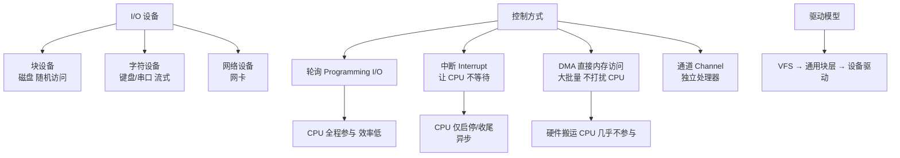

# 什么是输入/输出设备？

**输入/输出设备（I/O Devices）**是计算机系统中与外部世界进行信息交换的硬件设备。

## 分类

| 类别 | 功能 | 典型设备 |
|------|------|----------|
| **输入设备** | 将外部信息（模拟/数字）转换为计算机可识别的数字信号 | 键盘、鼠标、扫描仪、麦克风 |
| **输出设备** | 将计算机处理的数字结果转换为人可感知的形式（模拟/视觉） | 显示器、打印机、音响 |
| **输入/输出设备** | 既可输入也可输出，具备双向数据传输能力 | 网卡、磁盘驱动器（SSD/HDD）、触摸屏 |

## I/O 控制方式对比

| 方式 | CPU 参与度 | 数据传输单位 | 适用场景 | 优势/劣势 |
| :--- | :--- | :--- | :--- | :--- |
| **程序轮询** | 100% (忙等待) | 字/字块 | 简单嵌入式系统 | 简单但极度浪费 CPU |
| **中断驱动** | 启动/结束时介入 | 字节/小数据块 | 键盘、鼠标等低速设备 | 相对高效，但频繁中断开销大 |
| **DMA** | 极低 (仅首尾) | 数据块 | 磁盘、网卡等高速块设备 | 高效，减少 CPU 干预 |
| **通道** | 几乎为零 | 一组数据块集 | 高端服务器、大型机 | 极高的并行度，独立性强 |

## I/O 控制方式 (核心考点)

1.  **程序查询（轮询）**：
    -   **原理**：CPU 不断发起指令检查设备状态寄存器，直到设备就绪。
    -   **缺点**：CPU 极度浪费，大部分时间在空转，效率极低。

2.  **中断驱动**：
    -   **原理**：CPU 发出命令后继续执行其他任务，设备就绪后向 CPU 发送中断信号。
    -   **优点**：CPU 利用率高，支持并发。
    -   **缺点**：每次数据传输都需要中断 CPU，频繁中断（如传输大量数据）会消耗上下文切换开销。

3.  **DMA 方式**：
    -   **原理**：直接存储器访问。硬件 (DMA 控制器) 接管总线，直接在设备和内存间传输数据，仅在传输开始和结束时通知 CPU。
    -   **优点**：大幅减少 CPU 干预，适合高速块设备（如磁盘）。
    -   **边界**：仍然需要 CPU 设置传输参数。

4.  **通道方式**：
    -   **原理**：通道是一个独立的 I/O 处理器，具有自己的指令集。CPU 只需发出"I/O 通道程序"启动指令，通道自行完成所有 I/O 操作。
    -   **优点**：CPU 几乎完全不参与，实现了极高的并行度，常用于大型机。

### 实战案例
在高性能网络服务（如 Nginx/Netty）中，传统的“每连接一个线程/进程”模型（类似中断驱动的逻辑变体）在 C10K（1万并发连接）时会因上下文切换耗尽 CPU。实战中采用 **IO 多路复用（epoll/kqueue）配合 DMA**，网卡接收数据包通过 DMA 直接写入内存，并通知操作系统，使得单个线程就能管理数万连接，极大降低了 CPU 中断和上下文切换的消耗。

### 代码示例（Linux 下使用 ioctl 检查设备状态 - 模拟轮询）
```c
#include <sys/ioctl.h>
#include <fcntl.h>
#include <unistd.h>

// 简单演示：轮询检查文件描述符是否可读 (非阻塞 I/O 的一种变体)
int is_ready(int fd) {
    int flags;
    // 获取文件状态标志
    if ((flags = fcntl(fd, F_GETFL, 0)) < 0) return -1;
    // 设置为非阻塞模式
    fcntl(fd, F_SETFL, flags | O_NONBLOCK);
    
    // 尝试读取，如果返回 EAGAIN 则表示未就绪
    char buffer[1];
    ssize_t n = read(fd, buffer, 1);
    if (n > 0) return 1; // 就绪
    return 0; // 未就绪
}
```

### I/O 控制方式演进流程图
```text
          [I/O 控制方式演进：CPU 介入程度越来越少]

程序查询方式      中断驱动方式        DMA 方式           通道方式
   │                 │                │                  │
   ├─ CPU 轮询      ├─ 设备就绪       ├─ DMA 控制器      ├─ 通道(I/O处理器)
   │   100% 占用     │   发中断        │   直接搬运        │   执行指令
   │                 │                │                  │
   ▼                 ▼                ▼                  ▼
CPU 效率: 最低  ->  中等  ->  高 (块数据)  ->  极高 (完全自主)
```

## 关键概念

*   **缓冲技术**：在内存中开辟缓冲区，缓解高速 CPU 与低速 I/O 设备之间的速度不匹配，减少中断频率。
*   **SPOOLing 技术**：假脱机技术。将独占设备（如打印机）虚拟化为共享设备。
*   **设备驱动程序**：操作系统中控制特定 I/O 设备的软件层。

## 常见考点
1.  **中断与 DMA 的区别**：DMA 主要用于数据块的传输，减少中断次数；中断适用于少量数据或异常通知。
2.  **SPOOLing 的目的**：将独占设备改造为共享设备，提高利用率。
3.  **缓冲的目的**：匹配速度，解决数据粒度不匹配。


## 核心架构图


## 记忆要点

- I/O设备是计算机与外部交换信息的硬件，分为纯输入、纯输出、双向设备（如网卡/磁盘）
- CPU参与度越来越少：轮询最耗时，中断驱动介入中等
- DMA方式仅在传输首尾介入，适合高速块设备；通道则是独立处理器几乎不占用CPU

## 结构化回答

**30 秒电梯演讲：** 计算机与外部世界交互的硬件接口及其控制机制。打个比方，计算机的感官（眼耳）和手脚（嘴手），以及控制它们的神经反射。

**展开框架：**
1. **I/O设备是计算机与外部交换信息的硬件** — 分为纯输入、纯输出、双向设备（如网卡/磁盘）
2. **CPU参与度越来越少** — 轮询最耗时，中断驱动介入中等
3. **DMA方式仅在传输首尾介入** — 适合高速块设备；通道则是独立处理器几乎不占用CPU

**收尾：** 我在项目里踩过坑——在高性能网络服务（如 Nginx/Netty）中，传统的“每连接一个线程/进程”模型（类似中断驱动的逻辑变体）在 C10K（1万并发连接）时会因上下文切换耗尽 CPU。您想深入聊哪一段：原理、避坑还是对比选型？

## 视频脚本

> 预计时长：2 分钟 | 由浅入深

| 时间 | 画面/字幕 | 口播台词 | 讲解要点 |
|------|----------|----------|----------|
| 0:00 | 标题卡：什么是输入/输出设备 | "什么是输入/输出设备？一句话——计算机的感官（眼耳）和手脚（嘴手），以及控制它们的神经反射。" | 开场钩子 |
| 0:40 | 概念动画/示意图 | "计算机与外部世界交互的硬件接口及其控制机制——计算机的感官（眼耳）和手脚（嘴手），以及控制它们的神经反射" | 核心定义 |
| 1:20 | 要点1图解示意 | "分为纯输入、纯输出、双向设备（如网卡/磁盘）" | 要点1 |
| 2:00 | 总结卡 | "记住这几条，面试不慌。下期讲进阶追问。" | 收尾 |
