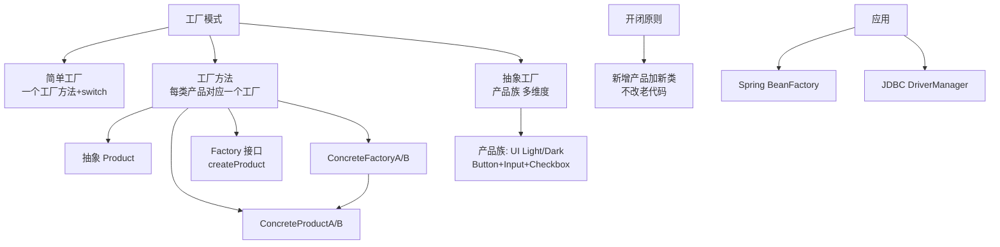
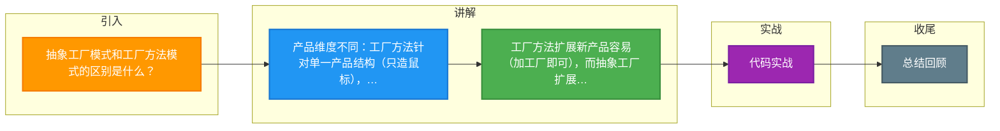

# 抽象工厂模式和工厂方法模式的区别是什么？

**抽象工厂模式**和**工厂方法模式**都属于创建型设计模式，但在产品维度的支持上有区别。

### 1. 工厂方法模式
- **定义**：定义一个用于创建对象的接口，让子类决定实例化哪一个类。
- **特点**：针对**一个产品等级结构**（如只生产鼠标）。每个具体工厂只创建一种具体产品。
- **适用**：当系统只需要新增一种具体产品时，符合开闭原则，只需新增对应工厂类。

### 2. 抽象工厂模式
- **定义**：提供一个接口，用于创建相关或依赖对象的家族，而无需明确指定具体类。
- **特点**：针对**多个产品等级结构**（如同时生产鼠标和键盘）。每个具体工厂负责创建一个**产品族**（如戴尔工厂生产戴尔鼠标和戴尔键盘）。
- **适用**：当需要增加产品族时（如增加惠普工厂），符合开闭原则；但如果需要新增产品等级结构（如增加显示器），则需要修改所有工厂类，违背开闭原则。

### 模式对比表
| 维度 | 工厂方法模式 | 抽象工厂模式 |
| :--- | :--- | :--- |
| **产品维度** | 单一产品等级结构（一个抽象产品） | 多个产品等级结构（多个抽象产品） |
| **工厂职责** | 只创建一种具体产品 | 创建一整族相关的产品 |
| **扩展性** | 新增产品容易（加新工厂） | 新增产品族容易，新增产品种类困难 |
| **复杂度** | 较低，结构简单 | 较高，客户端依赖抽象接口 |
| **典型应用** | 日志库（FileLogger/DBLogger） | 跨平台 UI 组件（WinButton/MacButton） |

### 架构对比图

```text
      【工厂方法模式】                     【抽象工厂模式】
 (单一产品等级结构)                     (多产品等级结构)

  Product (鼠标)                        AbstractFactory
    ^                                    |    + createMouse()
    |                                    |    + createKeyboard()
ConcreteProduct                         v
    |                              ConcreteFactory (DellFactory)
    |                                    |
Creator (Factory)                        v
    |                                    +---> Mouse (DellMouse)
    + create()                           +---> Keyboard (DellKeyboard)
    |
    v
ConcreteCreator (DellMouseFactory)
    |
    +---> DellMouse
```

### 3. 深度对比
- **维度扩展性**：
  - **工厂方法**：扩展新产品（如新鼠标）容易，只需加新工厂；扩展新类型（如键盘）需修改客户端结构，侵入性强。
  - **抽象工厂**：扩展新产品族（如惠普整套）容易；扩展新产品种类（如加显示器）难，需改动所有工厂接口及实现类（违背开闭原则）。
- **依赖倒置**：
  - 两者都依赖于抽象而非具体实现，但抽象工厂引入了“产品族”的概念，使得客户端代码在应对多个相互依赖的产品时更为统一。
- **客户端复杂度**：
  - 工厂方法客户端通常只需要依赖一个具体工厂。
  - 抽象工厂客户端依赖一个大的工厂接口，通过该实例化一系列对象，减少了具体工厂类的数量，但增加了接口的复杂度。

### 实战案例
在开发支持多数据库的应用时，如果使用工厂方法，可能需要 `MySQLConnectionFactory` 和 `PostgreSQLConnectionFactory` 分别创建连接。但如果需要确保 **MySQL 的连接与 MySQL 的事务对象匹配**，不能混用，就需要抽象工厂模式（如 `MySQLFactory` 创建 `MySQLConnection` 和 `MySQLTransaction`），从而保证整个数据访问层组件的一致性，避免误用不同数据库组件组合导致的运行时错误。

### 代码示例（C# 抽象工厂模式）
```csharp
// 抽象产品接口
public interface IButton { void Paint(); }
public interface ICheckbox { void Check(); }

// 抽象工厂接口
public interface IGUIFactory {
    IButton CreateButton();
    ICheckbox CreateCheckbox();
}

// 具体工厂：Win 风格
public class WinFactory : IGUIFactory {
    public IButton CreateButton() => new WinButton();
    public ICheckbox CreateCheckbox() => new WinCheckbox();
}

// 客户端使用
public class Application {
    private IButton button;
    public Application(IGUIFactory factory) {
        button = factory.CreateButton(); // 不需要知道具体是 Win 还是 Mac
    }
}
```

### 总结
工厂方法模式是抽象工厂模式的简化版（单维度），抽象工厂模式是工厂方法模式的升级版（多维度产品族），用于处理多产品维度的创建。

## 常见考点
1. **开闭原则的边界**：在抽象工厂模式中，为什么增加“产品等级结构”（如新产品类）会违背开闭原则？
2. **实际应用**：Spring 中的 `BeanFactory` 和 `FactoryBean` 分别接近哪种模式？
3. **模式退化**：当抽象工厂中只有一个产品等级结构时，它是否退化为了工厂方法模式？


## 核心架构图



## 记忆要点

- 产品维度不同：工厂方法针对单一产品结构（只造鼠标），抽象工厂针对多个产品族（造鼠标+键盘）
- 工厂方法扩展新产品容易（加工厂即可），而抽象工厂扩展新种类困难（违背开闭原则）
- 抽象工厂核心用于创建相关联的产品家族，保证多产品组合的一致性（如全套WinUI组件）

## 结构化回答

**30 秒电梯演讲：** 工厂方法生产单一产品，抽象工厂生产成套的产品族。打个比方，工厂方法像只造椅子的作坊，抽象工厂像造整套家具（桌椅沙发）的品牌工厂。

**展开框架：**
1. **产品维度不同** — 工厂方法针对单一产品结构（只造鼠标），抽象工厂针对多个产品族（造鼠标+键盘）
2. **工厂方法扩展新产品容易（加工厂即可）** — 而抽象工厂扩展新种类困难（违背开闭原则）
3. **抽象工厂核心用于创建相关联的产品家族** — 保证多产品组合的一致性（如全套WinUI组件）

**收尾：** 我在项目里踩过坑——public interface IButton { void Paint(); }。您想深入聊哪一段：原理、避坑还是对比选型？

## 视频脚本

> 预计时长：2 分钟 | 由浅入深

| 时间 | 画面/字幕 | 口播台词 | 讲解要点 |
|------|----------|----------|----------|
| 0:00 | 标题卡：抽象工厂模式和工厂方法模式的区别是什… | "抽象工厂模式和工厂方法模式的区别是什么？一句话——工厂方法像只造椅子的作坊，抽象工厂像造整套家具（桌椅沙发）的品牌工厂。" | 开场钩子 |
| 0:40 | 概念动画/示意图 | "工厂方法生产单一产品，抽象工厂生产成套的产品族——工厂方法像只造椅子的作坊，抽象工厂像造整套家具（桌椅沙发）的品牌工厂" | 核心定义 |
| 1:20 | 产品维度不同示意 | "工厂方法针对单一产品结构（只造鼠标），抽象工厂针对多个产品族（造鼠标+键盘）" | 要点1 |
| 2:00 | 总结卡 | "记住这几条，面试不慌。下期讲进阶追问。" | 收尾 |

### 视频流程图



