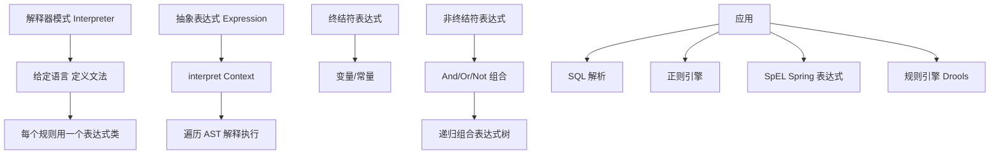
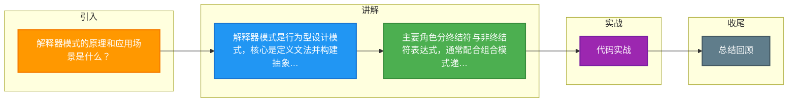

# 解释器模式的原理和应用场景是什么？

**解释器模式（Interpreter Pattern）**是一种行为型设计模式，给定一个语言，定义它的文法的一种表示，并定义一个解释器来解释该语言中的句子。

### 主要角色

| 角色 | 职责 |
|------|------|
| **AbstractExpression** | 声明抽象解释操作 `interpret(Context)` |
| **NonterminalExpression** | 非终结符表达式，为文法中每条规则实现解释操作 |
| **TerminalExpression** | 终结符表达式，实现与文法中终结符相关联的解释操作 |
| **Context** | 包含解释器之外的全局信息 |

### 代码示例

```java
interface Expression {
    boolean interpret(String context);
}

// 终结符表达式
class TerminalExpression implements Expression {
    private String data;
    public TerminalExpression(String data) { this.data = data; }
    public boolean interpret(String context) {
        return context.contains(data);
    }
}

// 非终结符表达式
class OrExpression implements Expression {
    private Expression expr1, expr2;
    public OrExpression(Expression e1, Expression e2) {
        this.expr1 = e1; this.expr2 = e2;
    }
    public boolean interpret(String context) {
        return expr1.interpret(context) || expr2.interpret(context);
    }
}

// 使用
Expression rule = new OrExpression(
    new TerminalExpression("Java"),
    new TerminalExpression("Python"));
rule.interpret("I love Java"); // true
```

### 解析流程图

```text
输入: "I love Java"
       |
       v
+------------------+
|  OrExpression    |
|  (expr1 || expr2)|
+--------+---------+
         |
    +----+--------------------+
    |                         |
    v                         v
+----------+           +----------+
| Terminal |           | Terminal |
| "Java"   |           | "Python" |
+----------+           +----------+
    |                         |
  contains?                 contains?
  [True]                    [False]
    |                         |
    +----------+-------------+
               |
               v
          Result: True
```

### 应用场景
1. **规则引擎**：解析业务规则表达式
2. **SQL解析器**：解析SQL语句
3. **正则表达式引擎**：解释正则模式
4. **配置文件解析**：解析自定义DSL

### 优缺点
**优点**：易于扩展文法，符合开闭原则
**缺点**：复杂文法导致类膨胀，执行效率较低（大量的递归调用）

### 补充细节
- **文法规则**：解释器模式通常使用“组合模式”来构建抽象语法树（AST）。每一个非终结符表达式都是一个容器，包含对其他表达式的引用。
- **实战案例**：在电商平台中，利用解释器模式解析促销规则 DSL（如 `price > 100 AND category == 'Electronic'`），实现动态配置营销活动，避免每次修改规则都重新发布代码。
- **选型对比**：当需要频繁修改文法规则但性能要求不高时使用解释器模式；对性能要求极高且文法固定时，建议使用编译原理技术（如 ANTLR 生成解析器）。

### 代码片段（规则上下文）
```java
// Context 类：存储变量值，支持动态规则
class Context {
    private Map<String, Object> variables = new HashMap<>();
    
    public void assign(String key, Object value) {
        variables.put(key, value);
    }
    
    public Object lookup(String key) {
        return variables.get(key);
    }
}
```

| 技术选型 | 适用场景 | 性能 | 灵活性 |
| :--- | :--- | :--- | :--- |
| **解释器模式** | 简单 DSL、业务规则引擎 | 低（递归解析） | 高（符合开闭原则） |
| **ANTLR / JavaCC** | 复杂语言（SQL、JSON） | 高（生成词法/语法分析器） | 中（需重新生成代码） |
| **Java Script Engine** | 动态脚本需求 | 中 | 极高（支持完整脚本语言） |


## 核心架构图



## 记忆要点

- 解释器模式是行为型设计模式，核心是定义文法并构建抽象语法树（AST）来解释特定语言
- 主要角色分终结符与非终结符表达式，通常配合组合模式递归调用解析规则
- 典型应用场景：规则引擎、SQL解析器、正则表达式引擎及自定义DSL，缺点是易类膨胀

## 结构化回答

**30 秒电梯演讲：** 为特定语言定义文法规则，并构建解释器解析句子。打个比方，像翻译官，根据语法书把一句外语翻译成能执行的指令。

**展开框架：**
1. **解释器模式是行为型设计模式** — 核心是定义文法并构建抽象语法树（AST）来解释特定语言
2. **主要角色分终结符与非终结符表达式** — 通常配合组合模式递归调用解析规则
3. **典型应用场景** — 规则引擎、SQL解析器、正则表达式引擎及自定义DSL，缺点是易类膨胀

**收尾：** 我在项目里踩过坑——选型对比：当需要频繁修改文法规则但性能要求不高时使用解释器模式；对性能要求极高且文法固定时，建议使用编译原理技术（如 ANTLR 生成解析器）。您想深入聊哪一段：原理、避坑还是对比选型？

## 视频脚本

> 预计时长：3 分钟 | 由浅入深

| 时间 | 画面/字幕 | 口播台词 | 讲解要点 |
|------|----------|----------|----------|
| 0:00 | 标题卡：解释器模式的原理和应用场景是什么 | "解释器模式的原理和应用场景是什么？一句话——像翻译官，根据语法书把一句外语翻译成能执行的指令。" | 开场钩子 |
| 0:45 | 概念动画/示意图 | "为特定语言定义文法规则，并构建解释器解析句子——像翻译官，根据语法书把一句外语翻译成能执行的指令" | 核心定义 |
| 1:30 | 要点1图解示意 | "核心是定义文法并构建抽象语法树（AST）来解释特定语言" | 要点1 |
| 2:15 | 要点2图解示意 | "通常配合组合模式递归调用解析规则" | 要点2 |
| 3:00 | 总结卡 | "记住这几条，面试不慌。下期讲进阶追问。" | 收尾 |

### 视频流程图



