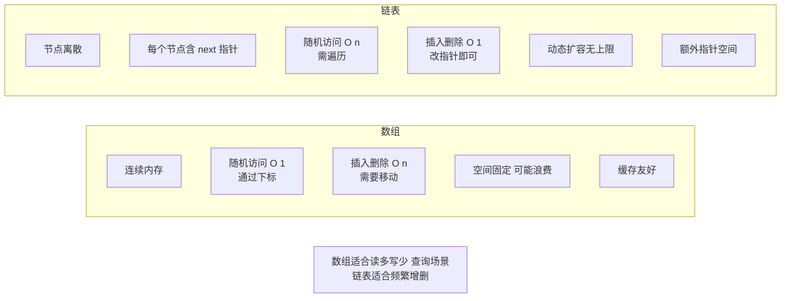

# 链表和数组的区别是什么？链表的常见操作？

**链表和数组是两种基础的线性数据结构，它们在内存分配、访问效率和操作复杂度上有显著区别。**

### 区别对比

| 特性 | 数组 | 链表 |
|------|------|------|
| **内存结构** | 连续内存空间 | 非连续内存空间，依靠指针连接 |
| **访问方式** | 随机访问，支持下标直接访问 | 顺序访问，必须从头遍历 |
| **查找效率** | O(1) | O(n) |
| **插入/删除** | 需要移动元素，效率低 O(n) | 只需修改指针，效率高 O(1)（已知位置） |
| **空间大小** | 通常静态固定（或需扩容） | 动态灵活，按需分配 |

### 内存结构图示

```text
【数组：连续内存】              【链表：分散内存】

+----+----+----+----+          +----+  +----+  +----+
| 10 | 20 | 30 | 40 |          | 10 |->| 20 |->| 30 |
+----+----+----+----+          +----+  +----+  +----+
索引 0    1    2    3         地址 100   204   308
```

### 链表的常见操作

1. **插入**：
   - 在已知节点后插入：修改后继指针，O(1)。
   - 在特定值后插入：需先查找，O(n)。
2. **删除**：
   - 删除已知节点：修改前驱节点的指针，O(1)（若已知前驱）。
   - 按值删除：需先查找，O(n)。
3. **查找**：
   - 按索引或按值查找，需从头节点遍历，O(n)。
4. **反转**：
   - 遍历链表依次修改指针方向，O(n)。

### 补充关键细节
- **空间开销**：链表节点除了存储数据，还需要额外的空间存储指针（引用）。在 64 位系统中，一个指针通常占用 8 字节。
- **CPU 缓存友好性**：数组由于内存连续，对 CPU 缓存非常友好（空间局部性），预命中率高；链表由于内存跳跃，缓存命中率较低，这在遍历大数据量时性能差异明显。
- **双向链表与循环链表**：
  - **双向链表**：每个节点有两个指针（prev 和 next），支持双向遍历，但空间开销更大。删除操作若已知节点指针本身，无需前驱节点即可完成（O(1)）。
  - **循环链表**：尾节点的 next 指向头节点，常用于解决约瑟夫环问题。

- **实战案例**：在实现 LRU（最近最少使用）缓存淘汰算法时，使用双向链表存储键值对节点，配合哈希表实现 O(1) 的数据访问和更新。如果用数组，移动元素的时间复杂度将退化为 O(n)。

### 代码示例（反转链表）
```java
public ListNode reverseList(ListNode head) {
    ListNode prev = null;
    ListNode curr = head;
    while (curr != null) {
        ListNode nextTemp = curr.next; // 暂存后继节点，防止指针丢失
        curr.next = prev;              // 反转指针
        prev = curr;                   // prev 前移
        curr = nextTemp;               // curr 前移
    }
    return prev;
}
```

| 操作场景 | 数组 | 链表 |
| :--- | :--- | :--- |
| **数据量固定** | ✅ 推荐 (节省指针开销) | ❌ 浪费内存 |
| **频繁头部插入/删除** | ❌ O(n) 需要整体移动 | ✅ O(1) 修改指针 |
| **需要二分查找** | ✅ 支持 O(1) 随机访问 | ❌ O(n) 遍历成本高 |
| **内存碎片敏感** | ❌ 需连续大块内存 | ✅ 利用零散内存 |

## 常见考点
1. **面试题：反转链表**：请口述或手写反转单向链表的代码（注意指针丢失问题）。
2. **判环算法**：如何判断链表是否有环？如何找到环的入口？（快慢指针）
3. **内存局部性**：为什么数组遍历通常比链表快？解释 CPU 缓存机制的影响。


## 核心架构图


## 记忆要点

- 数组内存连续支持随机访问O(1)，但增删需移动元素较慢；链表靠指针非连续，增删快O(1)
- 因为内存连续，数组对CPU缓存友好而链表较差；链表无需连续空间，能动态扩容
- 链表已知节点增删时间O(1)，但按值或按索引查找必须遍历，时间复杂度为O(n)

## 结构化回答


**30 秒电梯演讲：** 数组像排好座的影院，找座快但加座难；链表像寻宝游戏，下一个在哪看线索，插入删除方便。

**展开框架：**
1. **数组支持随机访问** — 数组支持随机访问，链表只能顺序访问
2. **数组插入删除** — 数组插入删除需移动元素，链表只需改指针
3. **数组内存连续** — 数组内存连续，链表内存分散

**收尾：** 这是我实战中的理解，您想深入哪一段？


## 视频脚本

> 预计时长：2 分钟 | 由浅入深

| 时间 | 画面/字幕 | 口播台词 | 讲解要点 |
|------|----------|----------|----------|
| 0:00 | 标题卡：链表和数组的区别是什么？链表的常见操… | "链表和数组的区别是什么？链表的常见操作？一句话——数组像排好座的影院，找座快但加座难；链表像寻宝游戏，下一个在哪看线索，插入删除方便。" | 开场钩子 |
| 0:40 | 概念动画/示意图 | "数组是连续空间读写快增删慢，链表是分散节点增删快读写慢——数组像排好座的影院，找座快但加座难；链表像寻宝游戏，下一个在哪看线索，插入删除方便" | 核心定义 |
| 1:20 | 要点1图解示意 | "但增删需移动元素较慢；链表靠指针非连续，增删快O(1)" | 要点1 |
| 2:00 | 总结卡 | "记住这几条，面试不慌。下期讲进阶追问。" | 收尾 |
