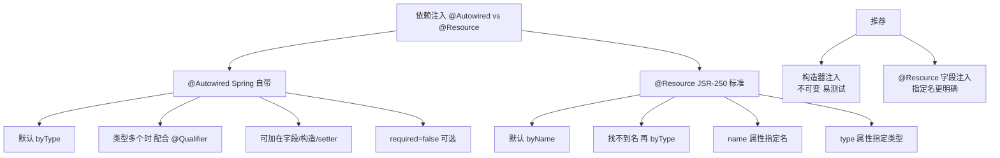
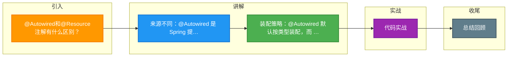

# @Autowired和@Resource注解有什么区别？

### 1. 来源不同
- **@Autowired**：是 Spring 框架提供的注解。
- **@Resource**：是 JDK (JSR-250) 提供的注解。

### 2. 依赖匹配规则不同
- **@Autowired**：默认按照 **类型** 进行装配。如果存在多个相同类型的 Bean，则需要通过 `@Qualifier` 注解指定名称。
- **@Resource**：默认按照 **名称** 进行装配。如果没有指定 `name` 属性：
  - 标注在字段上时，默认取字段名作为 Bean 名称。
  - 标注在 setter 方法上时，默认取属性名作为 Bean 名称。
  - 如果按名称找不到，会回退到按类型装配。
  - **一旦指定了 `name` 属性，则只能按名称装配。**

### 3. 其他属性
- **@Autowired**：包含一个 `required` 属性，默认为 `true`，表示必须注入依赖，如果找不到 Bean 会报错；设置为 `false` 则允许注入 null。
- **@Resource**：包含 `name` 和 `type` 两个重要属性，用于指定装配方式。

### 装配流程对比

```text
【@Autowired 装配流程】            【@Resource 装配流程】
         |                                 |
    按类型查找                       按 name 查找
         |                                 |
   +-----+------+                 +-----+------+
   | 1个 Bean? |                 | 找到?      |
   +-----+------+                 +-----+------+
    Yes/   \No                     Yes/  \No
     |      \                         |     \
直接装配   找多个Bean            直接装配  按类型查找
             |                                 |
       按 @Qualifier 匹配                 +-----+------+
             |                          | 找到?      |
       +-----+------+                  +-----+------+
       | 匹配到?   |                   Yes/   \No
       +-----+------+                    |      \
      Yes/    \No                  直接装配  报错
       |       \
   装配     报错(@Primary?)
```

### 补充细节
- **@Autowired 支持 @Primary**：当按类型发现多个 Bean 时，Spring 优先选择被 `@Primary` 标记的 Bean。`@Resource` 不遵循此规则，因为它严格按照 Name -> Type 的顺序查找。
- **注入位置**：两者都可以标注在字段、Setter 方法以及构造方法上。但 Spring 官方推荐构造器注入（配合 `@Autowired`），因为这样可以确保依赖不可变且易于测试。
- **JSR-330 @Inject**：除了这两个，Java 还提供了 `javax.inject.Inject` 注解，用法与 `@Autowired` 类似（按类型装配），需要引入 `javax.inject` 包，但没有 `required` 属性。

- **实战案例**：在微服务架构中，对接多个不同厂商的支付接口（如 AliPay, WeChatPay）时，使用 `@Resource(name="aliPayService")` 可以精确指定注入具体的实现类，而 `@Autowired` 若不配合 `@Qualifier` 则会因为类型重复（均为 PaymentService）而启动失败。

### 代码示例
```java
@Service("userServiceA")
public class UserServiceA implements UserService { ... }

@Service("userServiceB")
public class UserServiceB implements UserService { ... }

public class OrderController {
    // 明确指定注入 Bean 名称为 userServiceA
    @Resource(name = "userServiceA") 
    private UserService userService;

    // 或者使用 Autowired + Qualifier
    @Autowired
    @Qualifier("userServiceB")
    private UserService userService2;
}
```

| 特性 | @Autowired | @Resource |
| :--- | :--- | :--- |
| **来源** | Spring 框架 | JDK 标准 (JSR-250) |
| **默认匹配策略** | ByType (类型) | ByName (名称) -> ByType (类型) |
| **注入对象支持** | 构造器、方法、字段、参数 | 仅方法、字段 (不支持构造器) |
| **配合注解** | @Qualifier | 自身 name 属性 (不支持 @Primary) |
| **兼容性** | 仅限 Spring | 支持 Java EE 规范容器 (如 Jakarta EE) |

## 常见考点
1. **@Autowired 遇到多个 Bean**：除了 `@Qualifier` 和 `@Primary`，还有哪些方式可以解决冲突？（`@Priority`，或者通过 Bean 名称自动匹配——当变量名与 Bean 名一致时）
2. **循环依赖**：构造器注入无法解决循环依赖，而 Setter 注入（字段注入）可以，为什么？（因为实例化阶段和属性赋值阶段的区别）
3. **注解选择**：在 Spring 项目中，推荐使用哪个？（通常推荐 `@Autowired`，因为它更强大且支持构造器注入；若要解耦 Spring 依赖可选 `@Resource` 或 `@Inject`）


## 核心架构图



## 记忆要点

- 来源不同：@Autowired 是 Spring 提供，而 @Resource 是 JDK（JSR-250）标准注解
- 装配策略：@Autowired 默认按类型装配，而 @Resource 默认按名称装配
- @Autowired 多个实例时需配合 @Qualifier 或 @Primary，@Resource 找不到名称才回退按类型

## 结构化回答

**30 秒电梯演讲：** Spring自动装配注解，来源与匹配策略不同。打个比方，Autowired像查班级（类型），Resource像查姓名（名字）。

**展开框架：**
1. **来源不同** — @Autowired 是 Spring 提供，而 @Resource 是 JDK（JSR-250）标准注解
2. **装配策略** — @Autowired 默认按类型装配，而 @Resource 默认按名称装配
3. **@Autowired 多个实例时需配合 @Qualifier 或 @Primary，@Res** — ource 找不到名称才回退按类型
**收尾：** 我在项目里踩过坑——@Service("userServiceA")。您想深入聊哪一段：原理、避坑还是对比选型？

## 视频脚本

> 预计时长：2 分钟 | 由浅入深

| 时间 | 画面/字幕 | 口播台词 | 讲解要点 |
|------|----------|----------|----------|
| 0:00 | 标题卡：@Autowired和@Resour… | "@Autowired和@Resource注解有什么区别？一句话——Autowired像查班级（类型），Resource像查姓名（名字）。" | 开场钩子 |
| 0:40 | 概念动画/示意图 | "Spring自动装配注解，来源与匹配策略不同——Autowired像查班级（类型），Resource像查姓名（名字）" | 核心定义 |
| 1:20 | 来源不同示意 | "@Autowired 是 Spring 提供，而 @Resource 是 JDK（JSR-250）标准注解" | 要点1 |
| 2:00 | 总结卡 | "记住这几条，面试不慌。下期讲进阶追问。" | 收尾 |

### 视频流程图



