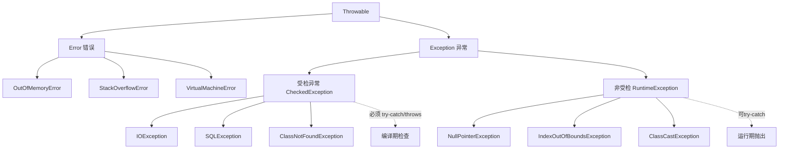

# Exception（异常）是什么？

Java 异常层次结构主要分为 **Error** 和 **Exception**。

### 1. Error（错误）
- **定义**：表示 Java 运行时系统的内部错误和资源耗尽错误。
- **特点**：属于 JVM 层面的问题，程序本身无法处理。
- **常见示例**：
  - `OutOfMemoryError`：内存溢出。
  - `StackOverflowError`：栈溢出。
  - `VirtualMachineError`：JVM 运行错误。

### 2. Exception（异常）
异常分为两大类：

#### (1) RuntimeException（运行时异常 / 非受检异常）
- **定义**：程序逻辑错误导致的异常，编译器不要求强制处理。
- **特点**：是程序自身的问题，通常可以通过修改代码避免。
- **常见示例**：
  - `NullPointerException`：空指针异常。
  - `ArrayIndexOutOfBoundsException`：数组越界。
  - `ClassCastException`：类型转换错误。
  - `ArithmeticException`：除零错误。

#### (2) 非运行时异常（编译时异常 / 受检异常）
- **定义**：程序本身没有逻辑问题，但因外部环境（如 I/O、网络）导致的异常。
- **特点**：编译器强制要求程序必须捕获或声明，否则无法通过编译。
- **常见示例**：
  - `IOException`：如 `FileNotFoundException`（文件未找到）。
  - `SQLException`：数据库异常。

### 3. 异常处理机制
Java 使用 `try-catch-finally` 块来处理异常：
- **try**：包裹可能抛出异常的代码块。
- **catch**：捕获并处理特定类型的异常。可以有多个 catch 块，需遵循“由小到大”（子类到父类）的顺序。
- **finally**：无论是否发生异常，都会执行的代码块（常用于资源释放）。唯一不执行的情况是 `System.exit(0)` 或 try 块中线程死亡。

### 4. 关键关键字细节
- **throw**：手动抛出一个异常对象（位于方法体内）。
- **throws**：声明方法可能抛出的异常列表（位于方法签名上），由调用者处理。

```text
                 Throwable
            /              \
         Error            Exception
                          /        \
            (Checked)   RuntimeException (Unchecked)
            (IOException, NPE, ClassCastException
             SQLException,  IndexOutOfBounds...)
```

> **注意**：“编译时异常”是指在编译阶段被检查，而非在编译阶段发生。所有的 Error 和 Exception 都是在程序运行时产生的。

- **实战案例**：在进行文件 IO 操作时，如果不使用 `try-with-resources`，开发人员常忘记在 finally 块中关闭流。在高并发场景下，这会导致“文件句柄耗尽”，服务器无法创建新的文件连接。强制使用 `AutoCloseable` 接口可以有效规避此类资源泄露。

### 代码示例（自定义业务异常）
```java
// 自定义受检异常（通常用于可恢复的业务错误）
public class InsufficientFundsException extends Exception {
    public InsufficientFundsException(String message) {
        super(message);
    }
}

// 自定义运行时异常（通常用于程序逻辑错误，如参数校验）
public class InvalidParameterException extends RuntimeException {
    public InvalidParameterException(String message) {
        super(message);
    }
}
```

| 特性 | 受检异常 | 非受检异常 |
| :--- | :--- | :--- |
| **处理要求** | 编译器强制捕获或声明 | 不强制，可选择性处理 |
| **代表异常** | IOException, SQLException | NullPointerException, IllegalArgumentException |
| **恢复预期** | 程序可尝试恢复（如重试） | 通常需修改代码修复 Bug |
| **代码整洁度** | 容易导致繁琐的 try-catch 嵌套 | 代码更简洁，但容易漏掉错误处理 |

## 常见考点
1. **finally 的执行顺序**：如果 try 块中有 return 语句，finally 代码块会在 return 之前执行。如果 finally 中也有 return，则会覆盖 try 中的返回值。
2. **常见受检与非受检异常的区别**：为什么 Java 设计受检异常？（为了强制开发者处理可恢复的错误，如文件不存在）。
3. **try-with-resources**：JDK 7 引入的语法糖，用于自动关闭实现了 `AutoCloseable` 接口的资源，替代繁琐的 `finally` 关闭流操作。


## 核心架构图


## 记忆要点

- 异常分受检异常（编译时强制try-catch，如IO异常）和非受检异常（运行时异常如空指针，不强制处理）
- Error 是 JVM 严重错误（如OOM），程序自身无法处理；Exception 是程序逻辑或外部异常
- throws 用于声明可能抛出的异常，而 throw 用于在方法体内手动抛出具体异常对象

## 结构化回答

**30 秒电梯演讲：** 程序运行问题的分类：致命错误vs可恢复异常。打个比方，Error是绝症（系统崩了），Exception是生病（能治）。

**展开框架：**
1. **异常分受检异常** — 如IO异常）和非受检异常（运行时异常如空指针，不强制处理）
2. **Error 是 JVM 严重错误（如OOM）** — 程序自身无法处理；Exception 是程序逻辑或外部异常
3. **throws 用于声明可能抛出的异常** — 而 throw 用于在方法体内手动抛出具体异常对象

**收尾：** 我在项目里踩过坑——// 自定义受检异常（通常用于可恢复的业务错误）。您想深入聊哪一段：原理、避坑还是对比选型？

## 视频脚本

> 预计时长：2 分钟 | 由浅入深

| 时间 | 画面/字幕 | 口播台词 | 讲解要点 |
|------|----------|----------|----------|
| 0:00 | 标题卡：Exception（异常）是什么 | "Exception（异常）是什么？一句话——Error是绝症（系统崩了），Exception是生病（能治）。" | 开场钩子 |
| 0:40 | 概念动画/示意图 | "程序运行问题的分类：致命错误vs可恢复异常——Error是绝症（系统崩了），Exception是生病（能治）" | 核心定义 |
| 1:20 | 要点1图解示意 | "如IO异常）和非受检异常（运行时异常如空指针，不强制处理）" | 要点1 |
| 2:00 | 总结卡 | "记住这几条，面试不慌。下期讲进阶追问。" | 收尾 |
