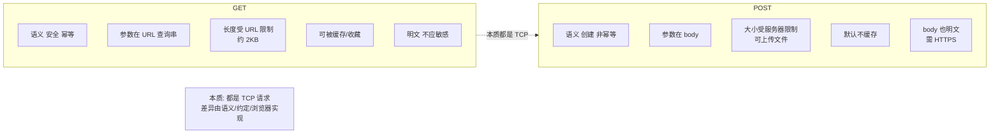
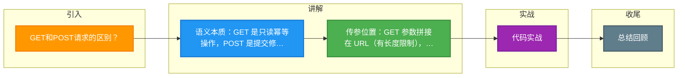

# GET和POST请求的区别？

### 1. 语义和功能
- **GET**：用于**请求获取**资源，是只读操作，不对服务器资源进行修改。
- **POST**：用于**提交数据**，通常会导致服务器状态发生改变（如新建或更新资源）。

### 2. 参数传递位置
- **GET**：参数通过 **URL** 拼接传递（Query String），直接暴露在浏览器地址栏。
- **POST**：参数通常放在 **请求体** 中传输，不在 URL 中显示。

### 3. 数据长度限制
- **GET**：URL 长度受限。虽然 HTTP 协议本身未规定限制，但浏览器和服务器对 URL 长度有限制（通常几 KB），因此传输数据量较小。
- **POST**：请求体没有长度限制，适合传输大量数据或文件。

### 4. 数据类型
- **GET**：只允许 ASCII 字符。
- **POST**：支持任意数据类型（如二进制、图片、JSON 等）。

### 5. 安全性和幂等性
- **安全性**：
  - GET 是安全的，因为它不修改服务器资源。
  - POST 是不安全的，因为它会修改服务器资源。
- **幂等性**：
  - GET 是幂等的，多次请求结果与一次相同。
  - POST 通常是不幂等的，多次提交可能创建多条记录。

### 6. 缓存机制
- **GET**：请求会被浏览器主动缓存，参数会保留在历史记录和书签中。
- **POST**：默认不会被缓存，参数不会保留在历史记录中，无法保存为书签。

### 7. TCP 数据包发送（底层细节）
- **GET**：浏览器通常会把 header 和 data 一起发送，TCP 只产生一个数据包（有时两个）。
- **POST**：浏览器通常先发送 header，服务器响应 `100 Continue` 后，再发送 body，TCP 会产生至少两个数据包（取决于数据量）。但对于现代浏览器和服务器，这个差异在性能优化下可能不明显。

### 实战案例
在做支付回调接口设计时，必须使用 POST。曾遇到第三方支付使用 GET 回调，导致带有敏感金额和签名的参数直接暴露在网关日志和浏览器历史记录中，存在严重的安全泄露风险；此外，GET URL 长度限制导致部分长订单号被截断，造成回调失败。

### 代码示例

```javascript
// 场景：前端发送携带复杂检索条件的请求
// 错误示范：GET 传参可能导致 URL 过长或编码错误
fetch(`/api/search?query=${encodeURIComponent(longComplexJson)}`); 

// 正确做法：使用 POST Body 传输，无长度限制且支持复杂 JSON
fetch('/api/search', {
  method: 'POST',
  headers: { 'Content-Type': 'application/json' },
  body: JSON.stringify({ filter: longComplexJson, page: 1 })
});
```

### 对比表格

| 维度 | GET | POST |
| :--- | :--- | :--- |
| **用途** | 获取/读取资源 | 提交/修改资源 |
| **参数位置** | URL (Query String) | Request Body |
| **安全性** | 较低（参数可见于历史/日志） | 较高（参数在 Body 中） |
| **幂等性** | 幂等（多次请求副作用一致） | 非幂等（多次提交可能产生多次副作用） |
| **缓存** | 默认可被缓存 | 默认不缓存（除非显式设置） |
| **数据量** | 受限于 URL 长度（几KB） | 理论无限制 |
| **TCP包数** | 通常 1 个（发送快） | 通常 2 个+（先 Header 后 Body） |

## 常见考点
1. **GET 比 POST 更快吗？**：理论上 GET 因为只发一个包可能略快，且更容易缓存，但在实际高并发场景下，差异主要取决于带宽、延迟和服务器处理逻辑，而非单纯的方法名。
2. **POST 能不能缓存？**：POST 请求默认不缓存，但可以通过设置 Header（如 `Cache-Control`）来允许缓存（如计算结果不变的 POST 请求）。
3. **如何实现文件上传？**：通常使用 POST 请求，设置 `Content-Type: multipart/form-data`。


## 核心架构图



## 记忆要点

- 语义本质：GET 是只读幂等操作，POST 是提交修改操作通常非幂等
- 传参位置：GET 参数拼接在 URL（有长度限制），POST 放在 Request Body（无大小限制）
- GET 参数暴露且默认能被浏览器缓存，POST 相对安全且默认不缓存

## 结构化回答

**30 秒电梯演讲：** HTTP请求方法，主要区别在语义与参数位置。打个比方，GET像明信片（内容写在上面），POST像信封（内容在里面）。

**展开框架：**
1. **语义本质** — GET 是只读幂等操作，POST 是提交修改操作通常非幂等
2. **传参位置** — GET 参数拼接在 URL（有长度限制），POST 放在 Request Body（无大小限制）
3. **GET 参数暴露且默认能被浏览器缓存** — POST 相对安全且默认不缓存

**收尾：** 我在项目里踩过坑——在做支付回调接口设计时，必须使用 POST。您想深入聊哪一段：原理、避坑还是对比选型？

## 视频脚本

> 预计时长：2 分钟 | 由浅入深

| 时间 | 画面/字幕 | 口播台词 | 讲解要点 |
|------|----------|----------|----------|
| 0:00 | 标题卡：GET和POST请求的区别 | "GET和POST请求的区别？一句话——GET像明信片（内容写在上面），POST像信封（内容在里面）。" | 开场钩子 |
| 0:40 | 概念动画/示意图 | "HTTP请求方法，主要区别在语义与参数位置——GET像明信片（内容写在上面），POST像信封（内容在里面）" | 核心定义 |
| 1:20 | 语义本质示意 | "GET 是只读幂等操作，POST 是提交修改操作通常非幂等" | 要点1 |
| 2:00 | 总结卡 | "记住这几条，面试不慌。下期讲进阶追问。" | 收尾 |

### 视频流程图



