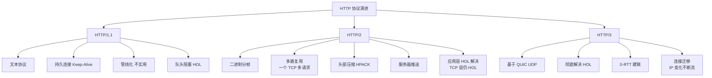

# HTTP/2.0和HTTP1.1有什么区别？

### HTTP/2.0 与 HTTP/1.1 的主要区别

#### 1. 传输格式：二进制 vs 文本
- **HTTP/1.1**：基于**文本**解析，解析效率较低，健壮性差。
- **HTTP/2.0**：采用**二进制**格式（分帧），解析更高效，且更健壮（不易出错）。

#### 2. 多路复用
- **HTTP/1.1**：虽然支持长连接（Keep-Alive），但请求必须串行发送（即使是管线化，响应也需按序返回），存在 **队头阻塞 (HOL)** 问题。
- **HTTP/2.0**：所有的请求都在一个 TCP 连接上并发进行，通过 **Stream ID** 区分请求和响应，解决了 HTTP 层面的队头阻塞，大幅提升性能。

```text
HTTP/1.1 (串行/管线化):
Request 1  ---> |Wait| ---> Response 1
Request 2  ---------------> |Wait| ---> Response 2
(若响应1慢，响应2被阻塞)

HTTP/2.0 (多路复用):
Stream 1: | Frame1 | Frame2 | ... |
Stream 3: | Frame1 | ... (交错传输) |
Stream 5: | Frame1 | Frame2 | ... |
(同一连接，无阻塞，靠Stream ID重组)
```

#### 3. Header 压缩
- **HTTP/1.1**：Header 包含大量重复信息（如 Cookie），且每次请求都必须携带，浪费带宽。
- **HTTP/2.0**：引入 **HPACK** 算法，对 Header 进行压缩。客户端和服务端维护一份静态/动态字典，重复的 Header 仅需传输索引号，大大减小了传输体积。

#### 4. 服务端推送
- **HTTP/1.1**：客户端请求一个资源，服务端返回该资源，若客户端需要关联资源（如 CSS），必须再次发起请求。
- **HTTP/2.0**：服务端可以**主动推送**客户端尚未请求的资源（如 HTML 请求时顺带推送 CSS），减少往返延迟。

#### 5. 流量控制
- HTTP/2.0 在 Stream 和 Connection 两个级别都支持流量控制，机制基于滑动窗口，更精细化。

#### 6. 请求优先级
- 由于所有请求都在一个连接中复用，HTTP/2.0 允许客户端在发送帧时标记优先级（依赖关系和权重），确保关键资源（如 CSS/JS）优先被传输和渲染。

#### 7. 应用层队头阻塞 (HTTP/3.0 引入)
- 虽然 HTTP/2.0 解决了 HTTP 层的队头阻塞，但如果发生 TCP 丢包，整个 TCP 连接的所有请求都会受影响（TCP 层队头阻塞）。这是后续 HTTP/3.0 (基于 QUIC/UDP) 解决的问题。

### 实战案例
在电商大促页面接入 HTTP/2 后，首屏加载时间（FCP）显著降低。但曾遇到移动端弱网环境下的 TCP 丢包导致整个页面白屏问题，因为 HTTP/2 多路复用基于单 TCP 连接，一旦丢包触发 TCP 重传，所有流都阻塞。这促使我们引入了 HTTP/3 (QUIC) 的灰度测试以解决 TCP 层阻塞。

### 代码示例

```nginx
# Nginx 配置开启 HTTP/2 简单示例
server {
    listen 443 ssl http2; # 关键：在 listen 指令后添加 http2
    server_name example.com;
    
    ssl_certificate /path/to/cert.pem;
    ssl_certificate_key /path/to/key.pem;
    
    # HPACK 压缩通常由浏览器和服务器自动处理
    # 可以通过 gzip 进一步压缩响应体
    gzip on;
}
```

### 对比表格

| 特性 | HTTP/1.1 | HTTP/2.0 |
| :--- | :--- | :--- |
| **传输格式** | 文本 (ASCII) | 二进制 (Binary Frames) |
| **多路复用** | 不支持 (串行/管线化) | 支持 (单连接并发) |
| **头部压缩** | 无 (纯文本重复传输) | HPACK 算法 (静态/动态字典) |
| **服务端推送** | 不支持 | 支持 (Server Push) |
| **连接数** | 每个域名需要 6-8 个 TCP 连接 | 每个域名仅需 1 个 TCP 连接 |
| **队头阻塞** | HTTP 层阻塞 | HTTP 层解决，TCP 层仍阻塞 |

## 常见考点
1. **HTTP/2.0 的多路复用为何解决了 HTTP 层的队头阻塞？**：因为通过二进制分帧和 Stream ID，数据帧可以乱序发送，接收端根据 ID 重组，无需等待前一个请求完成。
2. **HTTP/2.0 中的帧有哪些类型？**：DATA、HEADERS、PRIORITY、RST_STREAM（用于取消发送）、SETTINGS、PUSH_PROMISE 等。
3. **为什么还需要 HTTP/3.0？**：HTTP/2.0 虽然解决了 HTTP 层阻塞，但基于 TCP，一旦丢包，TCP 重传机制会导致整个连接阻塞，无法利用剩余带宽。HTTP/3.0 基于 UDP (QUIC)，彻底解决了传输层的队头阻塞。


## 核心架构图


## 记忆要点

- 传输格式：HTTP/1.1是文本而2.0是二进制分帧，解析更快更健壮
- 并发连接：1.1串行存在队头阻塞，2.0单TCP连接多路复用解决HTTP层阻塞
- 头部优化：1.1重复发送，2.0使用HPACK算法建立字典压缩头部
- 新增特性：2.0支持服务端主动推送资源，减少请求往返延迟
- 隐患限制：2.0虽解决HTTP层阻塞，但单TCP连接一旦丢包会阻塞所有流

## 结构化回答

**30 秒电梯演讲：** HTTP协议升级，从文本串行到二进制并发。打个比方，1.1是单车道排队，2.0是多车道高速立交。

**展开框架：**
1. **传输格式** — HTTP/1.1是文本而2.0是二进制分帧，解析更快更健壮
2. **并发连接** — 1.1串行存在队头阻塞，2.0单TCP连接多路复用解决HTTP层阻塞
3. **头部优化** — 1.1重复发送，2.0使用HPACK算法建立字典压缩头部

**收尾：** 我在项目里踩过坑——在电商大促页面接入 HTTP/2 后，首屏加载时间（FCP）显著降低。您想深入聊哪一段：原理、避坑还是对比选型？

## 视频脚本

> 预计时长：2 分钟 | 由浅入深

| 时间 | 画面/字幕 | 口播台词 | 讲解要点 |
|------|----------|----------|----------|
| 0:00 | 标题卡：HTTP/2.0和HTTP1.1有什… | "HTTP/2.0和HTTP1.1有什么区别？一句话——1.1是单车道排队，2.0是多车道高速立交。" | 开场钩子 |
| 0:40 | 概念动画/示意图 | "HTTP协议升级，从文本串行到二进制并发——1.1是单车道排队，2.0是多车道高速立交" | 核心定义 |
| 1:20 | 传输格式示意 | "HTTP/1.1是文本而2.0是二进制分帧，解析更快更健壮" | 要点1 |
| 2:00 | 总结卡 | "记住这几条，面试不慌。下期讲进阶追问。" | 收尾 |
