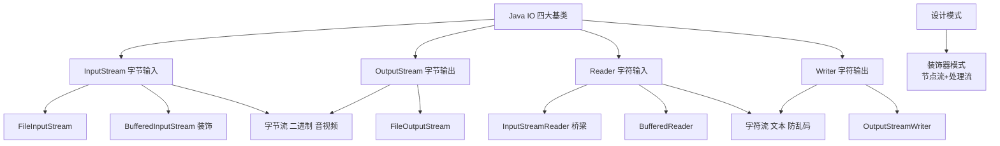
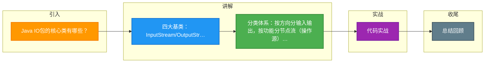

# Java IO包的核心类有哪些？

Java IO 包的核心类主要按照**流** 和**数据类型**进行分类，基于字节流（8 bit）和字符流（16 bit），以及输入/输出方向划分。

### 1. 基础抽象基类
- **字节流**：
  - `InputStream`：所有字节输入流的超类。
  - `OutputStream`：所有字节输出流的超类。
- **字符流**：
  - `Reader`：所有字符输入流的超类。
  - `Writer`：所有字符输出流的超类。

### 2. 常用节点流（直接操作数据源）
- 文件流：`FileInputStream` / `FileOutputStream`, `FileReader` / `FileWriter`。
- 数组流：`ByteArrayInputStream` / `ByteArrayOutputStream`。
- 管道流：`PipedInputStream` / `PipedOutputStream`（用于线程间通信）。

### 3. 常用处理流（包装节点流提供额外功能）
- **缓冲流**：`BufferedInputStream` / `BufferedOutputStream`, `BufferedReader` / `BufferedWriter`（提高 IO 性能，减少磁盘 I/O 次数）。
- **转换流**：`InputStreamReader` / `OutputStreamWriter`（字节流与字符流之间的桥梁，指定编码，解决乱码问题）。
- **对象流**：`ObjectInputStream` / `ObjectOutputStream`（对象的序列化与反序列化，对象需实现 `Serializable` 接口）。
- **数据流**：`DataInputStream` / `DataOutputStream`（读写 Java 基本数据类型，保持机器无关性）。

```text
InputStream           Reader
    |                    |
FileInputStream    FileReader
ByteArrayInputStr  StringReader
    |                    |
BufferedInputStr  BufferedReader
    |
DataInputStream
    |
ObjectInputStream
```

### 4. Java NIO 核心
Java 1.4 引入了 NIO（New IO），核心组件包括：
- **Buffer**（缓冲区）：数据的容器，核心属性包括 capacity（容量）、limit（界限）、position（位置）。常用实现如 `ByteBuffer`。
- **Channel**（通道）：双向数据传输通道，如 `FileChannel`, `SocketChannel`, `ServerSocketChannel`。不同于 Stream，Channel 是全双工的。
- **Selector**（选择器）：用于实现多路复用 IO，可以同时监控多个 Channel 的事件（如 Connect, Accept, Read, Write），是 Netty 等高性能框架的基础。

### 5. IO 与 NIO 的区别
- **阻塞与非阻塞**：传统 IO 是阻塞的（线程读写时挂起）；NIO 支持**非阻塞模式**（无数据时立即返回）和**多路复用**（单线程管理多连接）。
- **面向流 vs 面向缓冲**：IO 是面向流的（单向）；NIO 是面向缓冲区的（数据读写通过 Buffer）。

### 实战案例
在处理大文件（GB级）上传时，曾直接使用 `FileInputStream` 逐字节读取，导致 CPU 占用过高且 IO 吞吐量低。优化后改用 `BufferedInputStream` 包装 `FileInputStream`，并设置较大的 buffer（如 8KB），性能提升接近 10 倍。若追求更高性能，可进一步采用 NIO 的 `FileChannel` + `transferTo` 实现**零拷贝**。

### 代码示例 (Try-with-resources 资源释放)

```java
// 标准的 Java IO 读取文件写法，自动关闭流，防止内存泄漏
try (BufferedReader reader = new BufferedReader(
        new InputStreamReader(
        new FileInputStream("data.txt"), StandardCharsets.UTF_8))) {
    String line;
    while ((line = reader.readLine()) != null) {
        // 处理每一行
        System.out.println(line);
    }
} catch (IOException e) {
    e.printStackTrace();
}
```

### 对比表格

| 特性 | 传统 IO (BIO) | NIO (New IO) |
| :--- | :--- | :--- |
| **核心概念** | 流 | 缓冲区 + 通道 + 选择器 |
| **通信方式** | 阻塞式 (Blocking) | 非阻塞 + 多路复用 | 
| **方向** | 单向流 (读/写分开) | 双向通道 | 
| **性能** | 适合连接数少、高并发吞吐低 | 适合高连接数、高并发场景 |
| **零拷贝** | 不支持 | 支持 | 

## 常见考点
1. **装饰器模式**：Java IO 大量使用了装饰器模式。通过 `new BufferedReader(new InputStreamReader(new FileInputStream("file.txt")))` 这种层层包装的方式，动态地给原始流增加功能（缓冲、编码转换等）。
2. **字符流与字节流的转换**：为什么需要 `InputStreamReader`？因为文件本质是字节流，如果是文本文件，需要指定编码（如 UTF-8）解码为字符，否则可能乱码。
3. **NIO 的 Buffer 读写原理**：Buffer 写模式：limit=capacity, position 随写入增加。Flip 操作：读模式，limit 设为当前 position，position 设为 0。Clear/Compact：重置 Buffer 为写模式。


## 核心架构图



## 记忆要点

- 四大基类：InputStream/OutputStream操作字节，Reader/Writer操作字符
- 分类体系：按方向分输入输出，按功能分节点流（操作源）和处理流（增强功能）
- 缓冲流提效：因为BufferedStream自带缓冲区减少磁盘IO，所以性能大幅提升
- 转换流桥接：InputStreamReader指定编码，是字节流转字符流的唯一桥梁
- NIO核心对比：BIO单向阻塞面向流，NIO双向非阻塞面向Buffer+Channel

## 结构化回答

**30 秒电梯演讲：** IO库按流（输入/输出）和数据类型（字节/字符）分类。打个比方，水管系统：源头是水龙头，中间有过滤器（处理流），接通不同容器。

**展开框架：**
1. **四大基类** — InputStream/OutputStream操作字节，Reader/Writer操作字符
2. **分类体系** — 按方向分输入输出，按功能分节点流（操作源）和处理流（增强功能）
3. **缓冲流提效** — 因为BufferedStream自带缓冲区减少磁盘IO，所以性能大幅提升

**收尾：** 我在项目里踩过坑——// 标准的 Java IO 读取文件写法，自动关闭流，防止内存泄漏。您想深入聊哪一段：原理、避坑还是对比选型？

## 视频脚本

> 预计时长：2 分钟 | 由浅入深

| 时间 | 画面/字幕 | 口播台词 | 讲解要点 |
|------|----------|----------|----------|
| 0:00 | 标题卡：Java IO包的核心类有哪些 | "Java IO包的核心类有哪些？一句话——水管系统：源头是水龙头，中间有过滤器（处理流），接通不同容器。" | 开场钩子 |
| 0:40 | 概念动画/示意图 | "IO库按流（输入/输出）和数据类型（字节/字符）分类——水管系统：源头是水龙头，中间有过滤器（处理流），接通不同容器" | 核心定义 |
| 1:20 | 四大基类示意 | "InputStream/OutputStream操作字节，Reader/Writer操作字符" | 要点1 |
| 2:00 | 总结卡 | "记住这几条，面试不慌。下期讲进阶追问。" | 收尾 |

### 视频流程图



