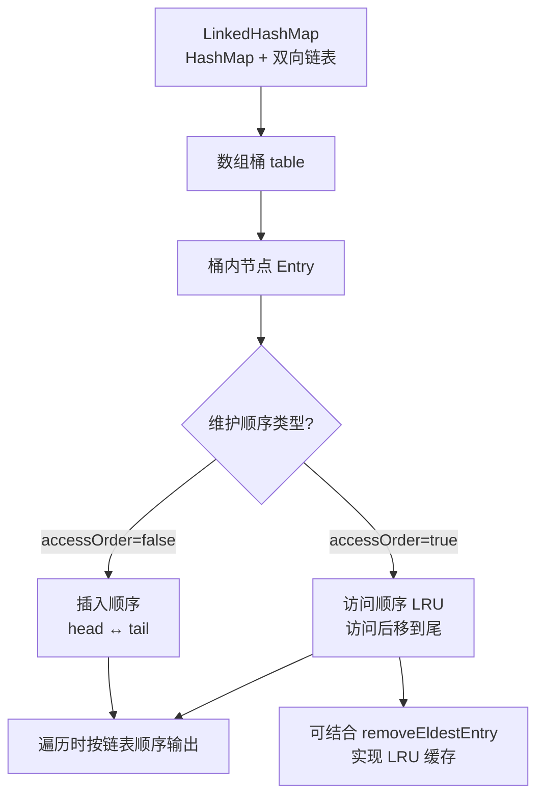

# LinkHashMap（记录插入顺序）是什么？

### LinkedHashMap
**LinkedHashMap** 是 `HashMap` 的一个子类，它在 HashMap 的基础上，增加了一个**双向链表**来维护键值对的顺序。

### 1. 核心特点
- **保留插入顺序**：默认情况下，遍历 LinkedHashMap 时，元素的顺序与它们被插入的顺序一致。
- **支持访问顺序**：可以通过构造函数 `accessOrder` 参数设置为 `true`，将顺序改为“访问顺序”（LRU，最近最少使用）。一旦某个 key 被访问，它就会被移动到链表的末尾。

### 2. 数据结构
- 底层仍然是 **数组 + 链表/红黑树**（与 HashMap 相同）。
- 额外维护了一个 **双向链表**，将所有 Entry 串联起来。该链表定义了迭代顺序，而不影响 HashMap 内部的哈希结构。

### 3. 结构图解
```text
HashMap 结构:
数组桶[0] -> Entry(Node) A -> Entry(Node) B (红黑树)
数组桶[1] -> Entry(Node) C

LinkedHashMap 增加的双向链表:
Head <==> Entry A <==> Entry C <==> Entry B <==> Tail

(注：Entry A 在 HashMap 中通过 next 指针指向 B，
     在双向链表中通过 before/after 指针维护顺序)
```

### 4. 应用场景
- **需要保持插入顺序的 Map**：如配置解析、构建 JSON 对象保持字段顺序。
- **实现 LRU 缓存**：通过设置 `accessOrder=true`，并在重写 `removeEldestEntry` 方法，可以很容易地实现一个最近最少使用淘汰策略的缓存。

---
### 深化内容

#### 实战案例
在实际开发中，我们曾遇到一个**接口签名验证**的 Bug：为了保证签名一致性，要求请求参数按字典序或固定顺序拼接。原代码使用 `HashMap` 导致参数顺序随机变化，偶发性签名失败。将 `HashMap` 替换为 `LinkedHashMap` 后，固定了插入顺序，彻底解决了偶发验签错误的问题。

#### 代码示例（Java：手写简易 LRU 缓存）
```java
// 设置 accessOrder=true 开启 LRU 模式，容量设为 100
Map<String, String> lruCache = new LinkedHashMap<String, String>(16, 0.75f, true) {
    @Override
    protected boolean removeEldestEntry(Map.Entry<String, String> eldest) {
        // 当节点数超过 100 时，移除最久未使用的节点（链表头部）
        return size() > 100;
    }
};

lruCache.put("key1", "value1");
String val = lruCache.get("key1"); // 访问后，key1 会移至链表尾部
```

#### 对比表格：HashMap vs LinkedHashMap vs TreeMap

| 特性 | HashMap | LinkedHashMap | TreeMap |
| :--- | :--- | :--- | :--- |
**底层结构** | 数组 + 链表/红黑树 | 数组 + 链表/红黑树 + **双向链表** | 红黑树 |
**迭代顺序** | 无序（完全随机） | **有序**（插入顺序或访问顺序） | **排序**（自然顺序或 Comparator）|
**时间复杂度** | O(1) | O(1) (多维护链表开销) | O(log N) |
**适用场景** | 快速查询，不关心顺序 | 需要保留插入历史或实现 LRU | 需要按 Key 动态排序 |

## 常见考点
1. **LRU 实现原理**：为什么 `accessOrder=true` 就是 LRU？`afterNodeAccess` 方法做了什么？（答案：get/put 时会将节点移到链表尾部；链表头部即为最久未使用，重写 `removeEldestEntry` 判断是否移除头部）。
2. **与 HashMap 性能对比**：LinkedHashMap 比 HashMap 慢吗？为什么？（答案：稍慢，因为需要维护双向链表指针，空间开销也略大，增加了 `before` 和 `after` 指针）。
3. **线程安全性**：LinkedHashMap 是线程安全的吗？如何实现并发 LRU？（答案：非线程安全；并发场景可用 `Collections.synchronizedMap` 或 `ConcurrentHashMap` 配合双重检查锁，或使用 Caffeine/Guava Cache）。


## 核心架构图


## 核心知识点图


## 记忆要点

- 底层结构：HashMap子类，额外维护双向链表记录数据顺序
- 两种顺序：默认保持插入顺序，设accessOrder=true则变为访问顺序
- LRU神器：因为访问会移至链表尾，所以重写removeEldestEntry即可实现LRU缓存
- 性能对比：查询复杂度同为O(1)，但LinkedHashMap因维护链表略慢于HashMap

## 结构化回答

**30 秒电梯演讲：** HashMap的子类，用链表维护键值对插入或访问顺序。打个比方，像排队买票，HashMap是乱序插队，LinkedHashMap是按顺序排号。

**展开框架：**
1. **底层结构** — HashMap子类，额外维护双向链表记录数据顺序
2. **两种顺序** — 默认保持插入顺序，设accessOrder=true则变为访问顺序
3. **LRU神器** — 因为访问会移至链表尾，所以重写removeEldestEntry即可实现LRU缓存

**收尾：** 我在项目里踩过坑——在实际开发中，我们曾遇到一个接口签名验证的 Bug：为了保证签名一致性，要求请求参数按字典序或固定顺序拼接。您想深入聊哪一段：原理、避坑还是对比选型？

## 视频脚本

> 预计时长：2 分钟 | 由浅入深

| 时间 | 画面/字幕 | 口播台词 | 讲解要点 |
|------|----------|----------|----------|
| 0:00 | 标题卡：LinkHashMap（记录插入顺序… | "LinkHashMap（记录插入顺序）是什么？一句话——像排队买票，HashMap是乱序插队，LinkedHashMap是按顺序排号。" | 开场钩子 |
| 0:40 | 概念动画/示意图 | "HashMap的子类，用链表维护键值对插入或访问顺序——像排队买票，HashMap是乱序插队，LinkedHashMap是按顺序排号" | 核心定义 |
| 1:20 | 底层结构示意 | "HashMap子类，额外维护双向链表记录数据顺序" | 要点1 |
| 2:00 | 总结卡 | "记住这几条，面试不慌。下期讲进阶追问。" | 收尾 |
