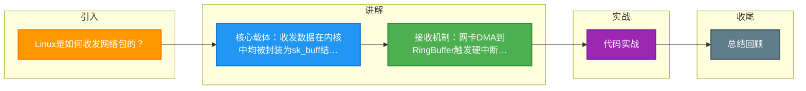

# Linux是如何收发网络包的？

Linux 收发网络包涉及从用户空间到内核空间，再到硬件驱动的完整流程。

### 1. 发送流程
1. **用户态调用**：应用程序调用 `write` 或 `send` 等系统调用。
2. **Socket 缓冲区**：数据从用户态内存拷贝到内核态的 **Socket 发送缓冲区**。
3. **协议栈处理**：内核网络协议栈逐层封装：
   - **传输层**：添加 TCP/UDP 头部，计算校验和。
   - **网络层**：添加 IP 头部，路由查询，分片（若 MTU 过小）。
   - **数据链路层**：添加 MAC 头部（通过 ARP 获取目标 MAC）。
4. **驱动程序**：封装好的数据包（`sk_buff`）被放入网卡的发送队列（QDisc，排队规则）。
5. **DMA 传输**：网卡驱动通过 DMA 将数据包从内存拷贝到网卡硬件缓存。
6. **物理传输**：网卡将数字信号转换为电信号/光信号发送出去。

**实战案例**：在高并发场景下，如果发送队列（QDisc）配置不当（如队列过长），会导致产生大量 `TX-DRD` 丢包，且应用层 `write` 调用成功但数据实际未发出去，造成业务延迟抖动。可通过 `tc` 命令调整 `fq` 队列长度优化。

**代码示例（C/Socket发送）**：
```c
int sockfd = socket(AF_INET, SOCK_STREAM, 0);
// 设置 TCP_CORK 允许应用层攒包（如 HTTP 头+Body 一起发），减少小包传输
int flag = 1;
setsockopt(sockfd, IPPROTO_TCP, TCP_CORK, &flag, sizeof(flag));
write(sockfd, buffer, len);
// 发送完毕后清除标志，迫使立即发送
flag = 0;
setsockopt(sockfd, IPPROTO_TCP, TCP_CORK, &flag, sizeof(flag));
```

### 2. 接收流程
1. **硬件中断**：网卡接收到网络包，通过 DMA 写入内核内存的 **Ring Buffer**（环形缓冲区），并触发硬件中断通知 CPU。
2. **软中断**：为了处理高性能网络，Linux 使用 **NAPI**（混合中断/轮询）机制：
   - 硬件中断处理函数仅做最少的工作（关闭中断，登记软中断），然后屏蔽中断，触发软中断（下半部）。
   - 软中断（`NET_RX_SOFTIRQ`）通过 **轮询** 方式快速处理 Ring Buffer 中的多个数据包，避免中断风暴。
3. **协议栈解包**：内核从 Ring Buffer 取出 `sk_buff`，逐层解包：
   - 链路层：检查 MAC 地址，剥离帧头。
   - 网络层：检查 IP 校验和，剥离 IP 头，路由判断。
   - 传输层：根据四元组找到对应的 Socket，将数据放入 **Socket 接收缓冲区**。
4. **应用读取**：应用程序从内核 Socket 接收缓冲区读取数据到用户态内存。

**实战案例**：曾遇 CPU `si`（软中断）飙高导致业务卡顿。经查是因为单核处理软中断能力已达瓶颈，通过开启 `RPS`（Receive Packet Steering）将软中断分发到多核处理，问题解决。

### 3. 发送与接收数据流图
```text
发送:
[用户空间] write()
     | (拷贝)
     v
[内核空间] Socket Send Buffer
     | (封装 sk_buff)
     v
TCP/IP Stack
     | (交给驱动)
     v
[Driver] Ring Buffer (QDisc)
     | (DMA 拷贝)
     v
[NIC Hardware] 物理线路

接收:
[NIC Hardware] 物理线路
     | (DMA 写入)
     v
[NIC Ring Buffer] (内核内存)
     | (中断通知)
     v
[Driver] 软中断 -> 轮询
     | (构建 sk_buff)
     v
TCP/IP Stack (校验/路由)
     | (放入缓冲区)
     v
[内核空间] Socket Receive Buffer
     | (拷贝/唤醒)
     v
[用户空间] read()
```

## 常见考点
1. **零拷贝**：在收发过程中，如何减少 CPU 拷贝次数？（答案：Sendfile、mmap、splice 等，直接在内核态或 DMA 间传输数据，避免用户态与内核态的来回拷贝）。
2. **NAPI 优势**：为什么在高流量下 NAPI 比纯中断效率高？（答案：高流量下纯中断会导致 CPU 陷入中断上下文无法自拔（中断风暴），NAPI 改为轮询，批量处理，降低上下文切换开销）。
3. **Ring Buffer**：如果 Ring Buffer 满了会发生什么？（答案：丢包。接收丢包会增加 `rx_dropped` 计数器；发送丢包通常在 QDisc 层统计）。


## 核心架构图

```mermaid
flowchart TD
    classDef start fill:#4CAF50,color:#fff
    classDef process fill:#2196F3,color:#fff
    classDef decision fill:#FF9800,color:#fff
    classDef special fill:#9C27B0,color:#fff
    classDef error fill:#f44336,color:#fff
    classDef info fill:#607D8B,color:#fff
    class A start
    class B process
    class Btrfs decision
    class C special
    class D error
    class E info
    class F start
    class G process
    class H decision
    class I special
    class J error
    class K info
    class Kernel start
    class L process
    class Linux decision
    class M special
    class N error
    class O info
    class P start
    class Q process
    class R decision
    class S special
    class Socket error
    class Space info
    class T start
    class U process
    class User decision
    class VFS special
    class XFS error
    class brk info
    class eBPF start
    class exec process
    class ext4 decision
    class fork special
    class glibc error
    class iostat info
    class ltrace start
    class mmap process
    class netstat decision
    class open special
    class perf error
    class read info
    class ring start
    class strace process
    class vmstat decision
    class wait special
    class write error
    A[Linux 系统核心] --> B[用户空间 User Space]
    A --> C[内核空间 Kernel Space]
    B --> D[应用程序 ring 3]
    B --> E[glibc/系统调用封装]
    C --> F[进程/内存/文件子系统]
    C --> G[设备驱动/网络栈]
    H[系统调用] --> I[read/write/open]
    H --> J[fork/exec/wait]
    H --> K[mmap/brk]
    L[进程间通信] --> M[管道/信号/消息队列]
    L --> N[共享内存/信号量/Socket]
    O[文件系统] --> P[VFS 抽象层]
    O --> Q[ext4/XFS/Btrfs]
    R[性能工具] --> S[strace/ltrace]
    R --> T[perf/eBPF]
    R --> U[vmstat/iostat/netstat]
```



## 记忆要点

- 核心载体：收发数据在内核中均被封装为sk_buff结构进行传递
- 接收机制：网卡DMA到RingBuffer触发硬中断，NAPI轮询机制防止中断风暴
- 发送流程：系统调用将数据拷贝至Socket缓冲区，逐层加TCP/IP头交由网卡发送
- 零拷贝优化：sendfile或mmap可避免用户态与内核态之间的数据拷贝

## 结构化回答

**30 秒电梯演讲：** 数据从用户应用经内核协议栈到网卡驱动的传输过程。打个比方，发快递：用户填单（socket），经分拣中心（协议栈），装车（网卡），收货反向操作。

**展开框架：**
1. **核心载体** — 收发数据在内核中均被封装为sk_buff结构进行传递
2. **接收机制** — 网卡DMA到RingBuffer触发硬中断，NAPI轮询机制防止中断风暴
3. **发送流程** — 系统调用将数据拷贝至Socket缓冲区，逐层加TCP/IP头交由网卡发送

**收尾：** 我在项目里踩过坑——在高并发场景下，如果发送队列（QDisc）配置不当（如队列过长），会导致产生大量 `TX-DRD` 丢包，且应用层 `write` 调用成功但数据实际未发出去，造成业务延迟抖动。您想深入聊哪一段：原理、避坑还是对比选型？

## 视频脚本

> 预计时长：2 分钟 | 由浅入深

| 时间 | 画面/字幕 | 口播台词 | 讲解要点 |
|------|----------|----------|----------|
| 0:00 | 标题卡：Linux是如何收发网络包的 | "Linux是如何收发网络包的？一句话——发快递：用户填单（socket），经分拣中心（协议栈），装车（网卡），收货反向操作。" | 开场钩子 |
| 0:40 | 概念动画/示意图 | "数据从用户应用经内核协议栈到网卡驱动的传输过程——发快递：用户填单（socket），经分拣中心（协议栈），装车（网卡），收货反向操作" | 核心定义 |
| 1:20 | 核心载体示意 | "收发数据在内核中均被封装为sk_buff结构进行传递" | 要点1 |
| 2:00 | 总结卡 | "记住这几条，面试不慌。下期讲进阶追问。" | 收尾 |

### 视频流程图



