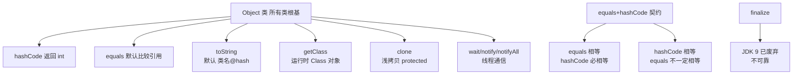

# Object类的常见方法有哪些是什么？

### Object类的常见方法

**1. toString()**
返回一个由类名和该对象的哈希码组成的字符串。通常重写这个方法以提供更有用的对象信息。

**2. equals(Object obj)**
比较对象的引用是否相等。通常重写该方法以比较对象的内容是否相等。

**3. hashCode()**
返回对象的哈希码值，哈希码用于在使用哈希表的集合类中快速查找对象。如果重写了 `equals` 方法，通常也必须重写 `hashCode` 方法，以保持一致性。

**4. getClass()**
返回对象的运行时类，用于获取对象的类信息（如类名、方法、字段等）。

**5. clone()**
创建并返回对象的浅拷贝。要使用此方法，类需要实现 `Cloneable` 接口，否则会抛出 `CloneNotSupportedException`。

**实战案例**：曾遇到生产环境 `ConcurrentHashMap` 的 `key` 是自定义对象且未重写 `hashCode`，导致数据被重复存储（不同实例但内容相同的对象哈希值不同）。重写 `hashCode` 后问题解决。

**代码示例（重写 equals 和 hashCode）**：
```java
public class User {
    private String name;
    private int age;
    @Override
    public boolean equals(Object o) {
        if (this == o) return true;
        if (o == null || getClass() != o.getClass()) return false;
        User user = (User) o;
        return age == user.age && Objects.equals(name, user.name);
    }
    @Override
    public int hashCode() { return Objects.hash(name, age); }
}
```

**6. finalize()**
垃圾回收器确定对象没有被更多引用时调用。该方法已过时，不推荐依赖它进行资源释放。

**7. 线程通信相关方法**
这些方法主要用于线程之间的同步和通信：
- `wait()`：使当前线程等待，直到被唤醒（通常通过 `notify` 或 `notifyAll`）。
- `wait(long timeout)` / `wait(long timeout, int nanos)`：使当前线程等待，直到被唤醒或超时。
- `notify()`：唤醒在此对象监视器上等待的单个线程。
- `notifyAll()`：唤醒在此对象监视器上等待的所有线程。

**代码示例（标准生产者消费者）**：
```java
synchronized (lock) {
    while (queue.size() == MAX_SIZE) { // 防止虚假唤醒
        lock.wait();
    }
    queue.add(data);
    lock.notifyAll(); // 唤醒消费者
}
```

## 常见考点
1. **equals 和 hashCode 的契约**：为什么两个对象 equals 相等，hashCode 必须相等？（答案：在 HashMap 等集合中，先通过 hashCode 定位桶，再通过 equals 比较。若相等但 hashCode 不同，会导致逻辑上相等的对象被存放在不同位置，破坏集合语义）。
2. **深拷贝与浅拷贝**：Object.clone() 实现的是深拷贝还是浅拷贝？如何实现深拷贝？（答案：浅拷贝。深拷贝通常需要重写 clone() 方法并手动拷贝引用类型字段，或者使用序列化/反序列化方式）。
3. **wait/notify 的锁要求**：调用 wait/notify 方法的前提条件是什么？（答案：必须在 synchronized 方法或代码块中，且必须获得该对象的 Monitor 锁，否则抛出 IllegalMonitorStateException）。
4. **protected 方法**：Object 的 clone() 方法是 protected 的，有什么影响？（答案：意味着只有子类（且在同包下）或自身可以调用，外部类无法直接调用 `obj.clone()`，通常需要重写为 public）。


## 核心架构图


## 记忆要点

- 比较契约：重写equals必须重写hashCode，因为HashMap需保证相等对象哈希值一致
- 对象信息：默认toString打印全类名与哈希码，业务类通常需重写此方法
- 克隆机制：clone()提供浅拷贝，深拷贝需手动复制引用或使用序列化
- 线程通信：wait/notify底层依赖Monitor锁，必须在synchronized代码块中调用

## 结构化回答

**30 秒电梯演讲：** Java所有类的根类，定义了对象的基础行为和通用方法。打个比方，就像商品的“通用说明书模板”，所有产品都必须包含品牌、型号等基本信息。

**展开框架：**
1. **比较契约** — 重写equals必须重写hashCode，因为HashMap需保证相等对象哈希值一致
2. **对象信息** — 默认toString打印全类名与哈希码，业务类通常需重写此方法
3. **克隆机制** — clone()提供浅拷贝，深拷贝需手动复制引用或使用序列化

**收尾：** 我在项目里踩过坑——曾遇到生产环境 `ConcurrentHashMap` 的 `key` 是自定义对象且未重写 `hashCode`，导致数据被重复存储（不同实例但内容相同的对象哈希值不同）。您想深入聊哪一段：原理、避坑还是对比选型？

## 视频脚本

> 预计时长：2 分钟 | 由浅入深

| 时间 | 画面/字幕 | 口播台词 | 讲解要点 |
|------|----------|----------|----------|
| 0:00 | 标题卡：Object类的常见方法有哪些是什么 | "Object类的常见方法有哪些是什么？一句话——就像商品的“通用说明书模板”，所有产品都必须包含品牌、型号等基本信息。" | 开场钩子 |
| 0:40 | 概念动画/示意图 | "Java所有类的根类，定义了对象的基础行为和通用方法——就像商品的“通用说明书模板”，所有产品都必须包含品牌、型号等基本信息" | 核心定义 |
| 1:20 | 比较契约示意 | "重写equals必须重写hashCode，因为HashMap需保证相等对象哈希值一致" | 要点1 |
| 2:00 | 总结卡 | "记住这几条，面试不慌。下期讲进阶追问。" | 收尾 |
