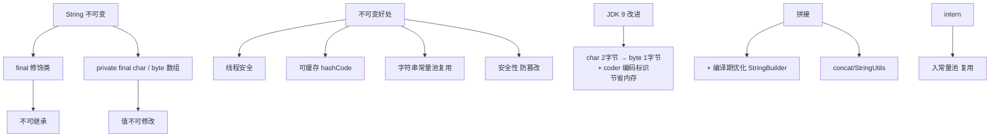
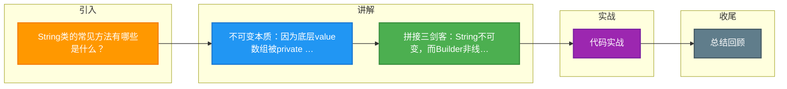

# String类的常见方法有哪些是什么？

### String类的常见方法有哪些

#### 1. String 为什么是不可变的？
String 的不可变性主要依赖于其底层的实现设计和 Java 语言规范：
1.  **底层存储修饰**：JDK 9 之前，String 内部使用 `char value[]` 数组存储字符；JDK 9 及以后改为 `byte[]` 以节省空间。该数组被 `final` 修饰，且引用是私有的，这意味着一旦初始化，引用地址无法改变。
2.  **无公开修改方法**：String 类没有暴露任何可以直接修改内部数组内容的方法（如 append、delete 等）。任何看似修改的操作（如 `substring`, `replace`）实际上都是返回了新的 String 对象。
3.  **类被 final 修饰**：String 类被声明为 `final`，禁止被继承。这防止了恶意子类覆盖父类行为从而破坏不可变性（例如子类重写 `charAt` 方法返回变化的值）。

**实战案例**：在进行大量字符串拼接（如构建 SQL 语句）时，若在循环中使用 `+` 拼接 String，会导致内存中产生大量临时 String 对象，引发 Young GC 频繁。改用 `StringBuilder` 后，GC 次数降低 90%。

#### 2. String/StringBuffer/StringBuilder 的区别

这三者的区别主要体现在**可变性**、**线程安全**和**性能**上。

| 特性 | String | StringBuffer | StringBuilder |
| :--- | :--- | :--- | :--- |
| **可变性** | 不可变 | 可变 | 可变 |
| **线程安全** | 线程安全（不可变对象天生线程安全） | 线程安全（方法带有 `synchronized` 锁） | 非线程安全 |
| **性能** | 低（修改操作产生新对象，导致内存开销） | 较低（由于同步锁，有性能损耗） | 高（无锁，最优性能） |
| **适用场景** | 少量修改、常量定义、作为 HashMap 的 Key | 多线程环境下大量的字符串拼接操作 | 单线程环境下大量的字符串拼接操作 |

**原理细节补充**：
- **String**：每次修改（如 `+` 号拼接）都会在堆内存（或字符串常量池）中创建新对象，旧对象等待 GC 回收，容易引发内存抖动。
- **StringBuilder/StringBuffer**：继承自 `AbstractStringBuilder`，内部维护一个可扩容的 `char[]`（默认大小 16），扩容策略通常是 `newCapacity = (oldCapacity << 1) + 2`，避免了频繁创建对象。

**代码示例（性能对比）**：
```java
// 反编译后实际是：
// new StringBuilder().append("a").append("b").append("c").toString();
String s = "a" + "b" + "c"; 

// 循环中必须显式使用 StringBuilder
StringBuilder sb = new StringBuilder();
for (int i = 0; i < 1000; i++) {
    sb.append(i); 
}
```

#### 3. String 类的常见方法

以下是面试中高频且需要关注细节的方法：

- **`char charAt(int index)`**：返回指定索引处的 `char` 值。索引范围从 0 到 `length() - 1`。若越界抛出 `IndexOutOfBoundsException`。
- **`String substring(int beginIndex, int endIndex)`**：
    - 返回从 `beginIndex` 开始到 `endIndex`（不包含）的子串。
    - **注意**：JDK 6 与 JDK 7+ 实现不同。JDK 7+ 是复制数组到新对象，不会再共享原数组，避免内存泄漏。
- **`boolean equals(Object anObject)`**：
    - 比较字符串的**内容**是否相同。
    - 区别于 `==`（比较内存地址）。先比较引用，再比较类型，最后逐字符比较。
- **`boolean contains(CharSequence s)`**：判断是否包含指定的字符序列，底层实际上调用的是 `indexOf(s) > -1`。
- **`int indexOf(String str)`**：返回指定子字符串第一次出现的索引，若未找到返回 -1。支持重载 `indexOf(String str, int fromIndex)`。
- **`String replace(char oldChar, char newChar)`**：替换字符串中所有出现的 `oldChar` 为 `newChar`。若 `oldChar` 不存在，返回原 String 对象（体现了不变性优化）。
- **`String[] split(String regex)`**：
    - 根据给定的正则表达式拆分字符串。
    - **注意**：如果 regex 是 `.` 或 `|` 等正则元字符，需要转义（`\.`）。末尾空串可能会被丢弃。
- **`String trim()`**：返回去除字符串**首尾**空白字符的副本。注意不包含中间的空白。


## 核心架构图



## 记忆要点

- 不可变本质：因为底层value数组被private final修饰且类被final修饰
- 拼接三剑客：String不可变，而Builder非线程安全高性能，Buffer线程安全低性能
- 扩容机制：StringBuilder/StringBuffer初始容量16，底层按左移1位加2进行扩容
- 高频方法：indexOf查索引，substring截取子串（注意JDK7后为新建数组防泄漏）

## 结构化回答

**30 秒电梯演讲：** 不可变字符序列，通过连接池优化内存，线程安全。打个比方，像写死的书法作品，一旦完成不能修改，想改只能写张新的。

**展开框架：**
1. **不可变本质** — 因为底层value数组被private final修饰且类被final修饰
2. **拼接三剑客** — String不可变，而Builder非线程安全高性能，Buffer线程安全低性能
3. **扩容机制** — StringBuilder/StringBuffer初始容量16，底层按左移1位加2进行扩容

**收尾：** 我在项目里踩过坑——在进行大量字符串拼接（如构建 SQL 语句）时，若在循环中使用 `+` 拼接 String，会导致内存中产生大量临时 String 对象，引发 Young GC 频繁。您想深入聊哪一段：原理、避坑还是对比选型？

## 视频脚本

> 预计时长：2 分钟 | 由浅入深

| 时间 | 画面/字幕 | 口播台词 | 讲解要点 |
|------|----------|----------|----------|
| 0:00 | 标题卡：String类的常见方法有哪些是什么 | "String类的常见方法有哪些是什么？一句话——像写死的书法作品，一旦完成不能修改，想改只能写张新的。" | 开场钩子 |
| 0:40 | 概念动画/示意图 | "不可变字符序列，通过连接池优化内存，线程安全——像写死的书法作品，一旦完成不能修改，想改只能写张新的" | 核心定义 |
| 1:20 | 不可变本质示意 | "因为底层value数组被private final修饰且类被final修饰" | 要点1 |
| 2:00 | 总结卡 | "记住这几条，面试不慌。下期讲进阶追问。" | 收尾 |

### 视频流程图



