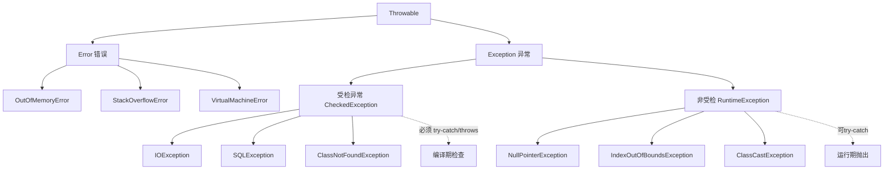

# Throw和throws的区别？

### throw 和 throws 的区别

**1. 作用位置不同**
*   **`throws`**：用在**方法签名（声明）**上，位于参数列表之后。后面跟的是**异常类名**（可以是多个，用逗号分隔），表示该方法可能抛出这些异常。
    ```java
    public void readFile(String path) throws IOException, FileNotFoundException {
        // 方法体
    }
    ```
*   **`throw`**：用在**方法体内部**，通常写在具体的逻辑代码行。后面跟的是**异常对象实例**，表示代码运行到这里显式地抛出一个异常。
    ```java
    if (path == null) {
        throw new IllegalArgumentException("路径不能为空");
    }
    ```

**2. 功能含义不同**
*   **`throws` (声明异常)**：一种**承诺**或**警告**。它告诉方法的调用者：“调用我这个方法是有风险的，你需要处理（捕获）或者继续向上抛出这些可能发生的异常”。它处理的是异常的可能性。
*   **`throw` (抛出异常)**：一种**动作**。它是手动制造一个异常事件，打断当前程序的正常执行流程，将异常对象抛出到调用栈。它处理的是异常的实际发生。

**3. 处理方式不同**
*   **`throws`**：仅仅是声明，并不真正处理异常。它将异常的处理责任**甩锅（委托）**给方法的调用者（JVM 最终处理会打印堆栈并退出）。
*   **`throw`**：实际上是产生了异常，必须有对应的处理机制（try-catch 捕获，或者当前方法用 throws 声明继续向上抛），否则编译器会报错（针对受检异常）。

**4. 与异常类型的关系**
*   `throws` 可以声明 `Exception` 及其子类（包括 `RuntimeException`，虽然通常不强制声明非受检异常）。
*   `throw` 可以抛出任何 `Throwable` 及其子类的实例。

### 5. 实战案例

*   **自定义异常**：在构建 Spring Boot 统一异常处理机制时，我们会在 Service 层校验参数，如果业务逻辑不满足（如“余额不足”），直接 `throw new BusinessException(ErrorCode.NOT_ENOUGH_BALANCE)`，然后由全局 `@ControllerAdvice` 捕获并统一返回 JSON 错误码，避免污染 Controller 层代码。
*   **事务回滚**：在 Spring 声明式事务中，默认只对 `RuntimeException` 和 `Error` 进行回滚。如果你在方法中 `throw` 了一个 checked Exception（如 `throw new Exception("error")`）且未在 `@Transactional(rollbackFor = Exception.class)` 中指定，事务将不会回滚，导致数据不一致的严重 Bug。

### 对比表格

| 维度 | throw | throws |
| :--- | :--- | :--- |
| **位置** | 方法体内部 | 方法签名上 |
| **后面跟的内容** | 异常对象实例 | 异常类名 |
| **作用** | 手动抛出异常 | 声明可能抛出的异常类型 |
| **数量** | 一次只能抛出一个 | 可声明多个异常（逗号分隔） |
| **对调用方影响** | 程序中断，进入异常处理流程 | 调用方必须处理或继续声明 |

## 技术原理

`throw` 和 `throws` 是 Java 异常机制的两个互补语义——**`throws` 是编译期契约，`throw` 是运行期动作**。两者配合实现了"异常处理责任的显式传递"，这是 Java 受检异常（Checked Exception）机制的核心。

- **throws 的编译期检查机制**：Java 编译器对受检异常（`Exception` 的子类但非 `RuntimeException`）做强校验——方法体内如果可能抛出某个受检异常（直接 throw 或调用了声明该异常的方法），方法签名必须用 `throws` 声明，否则编译失败。这是" Checked Exception"的强制契约：要么 catch，要么 declare，不能假装看不见。`RuntimeException` 和 `Error` 不受此约束（非受检），因为它们是"程序员错误"（空指针、数组越界），强制声明会让代码充满 `throws NullPointerException` 的噪音。
- **throw 的运行期行为**：`throw` 是 JVM 指令 `athrow`，执行时创建异常对象并打断当前执行栈，沿调用栈向上查找匹配的 catch 块。如果到栈顶都没匹配，交给默认 `UncaughtExceptionHandler`（打印堆栈并终止线程）。异常对象在创建时（`new XxxException()`）会捕获当前栈快照，这是堆栈追踪的来源——所以"异常构造代价高"主要高在栈快照采集（`fillInStackTrace`）。
- **两者的配合关系**：`throws` 是契约声明，`throw` 是契约履行。方法签名 `throws IOException` 告诉调用方"我可能 throw 这个异常，你要负责"。调用方要么 try-catch 处理，要么继续 throws 向上传递，形成异常责任链。最终在某个层（通常是 Controller 的全局异常处理器）被 catch。
- **受检 vs 非受检的设计哲学争议**：受检异常强制开发者处理，减少遗漏；但实践中常被滥用（catch 后不处理或 throws Exception 通配），导致代码冗余。Spring/JDK 新 API 倾向非受检异常（如 JDBC 把 `SQLException` 转成 `DataAccessException`），把处理责任交给开发者而不是编译器。

## 代码示例

```java
// 1. throws 声明 + throw 抛出的配合使用
public class UserService {

    // throws 声明：告诉调用者"我可能抛出受检异常"
    public User findById(Long id) throws UserNotFoundException {
        if (id == null || id <= 0) {
            // throw 动作：参数非法，立即抛出非受检异常
            throw new IllegalArgumentException("id 不能为空或非正数");
        }
        User user = userDao.selectById(id);
        if (user == null) {
            // throw 动作：业务异常，抛出受检异常
            throw new UserNotFoundException("用户不存在: " + id);
        }
        return user;
    }
}

// 自定义受检异常
public class UserNotFoundException extends Exception {
    public UserNotFoundException(String msg) { super(msg); }
}

// 调用方：必须处理受检异常（try-catch 或继续 throws）
public class UserController {
    public User getUser(Long id) {
        try {
            return userService.findById(id);   // 调用声明 throws 的方法
        } catch (UserNotFoundException e) {
            throw new ApiException(404, e.getMessage());  // 转换后抛给全局处理器
        }
    }
}
```

```java
// 2. Spring 事务回滚陷阱：throws 与 rollbackFor 的关系
@Service
public class TransferService {

    // 陷阱：默认只回滚 RuntimeException，checked 异常不回滚
    @Transactional
    public void transfer(Long from, Long to, BigDecimal amount) throws Exception {
        accountDao.deduct(from, amount);
        accountDao.add(to, amount);
        if (someCondition) {
            throw new Exception("业务失败");   // 不回滚！数据已扣款
        }
    }

    // 正确做法1：显式指定 rollbackFor
    @Transactional(rollbackFor = Exception.class)
    public void transferSafe(Long from, Long to, BigDecimal amount) throws Exception {
        // 现在受检异常也会回滚
    }

    // 正确做法2：抛 RuntimeException（默认回滚）
    @Transactional
    public void transferSafe2(Long from, Long to, BigDecimal amount) {
        throw new BusinessException("业务失败");  // BusinessException extends RuntimeException
    }
}
```

```java
// 3. 全局异常处理器：throws 责任链的终点
@RestControllerAdvice
public class GlobalExceptionHandler {

    @ExceptionHandler(BusinessException.class)   // 捕获自定义业务异常
    public ResponseEntity<ApiResult> handleBusiness(BusinessException e) {
        return ResponseEntity.ok(new ApiResult(e.getCode(), e.getMessage()));
    }

    @ExceptionHandler(IllegalArgumentException.class)   // 捕获参数非法
    public ResponseEntity<ApiResult> handleArg(IllegalArgumentException e) {
        return ResponseEntity.badRequest().body(new ApiResult(400, e.getMessage()));
    }

    @ExceptionHandler(Exception.class)   // 兜底：捕获所有未处理异常
    public ResponseEntity<ApiResult> handleAll(Exception e) {
        log.error("未处理异常", e);
        return ResponseEntity.status(500).body(new ApiResult(500, "服务异常"));
    }
}
```

## 对比选型

| 维度 | throw | throws | try-catch |
| :--- | :--- | :--- | :--- |
| **位置** | 方法体内 | 方法签名上 | 方法体内 |
| **作用** | 实际抛出异常对象 | 声明可能抛出的类型 | 捕获并处理异常 |
| **执行时机** | 运行期（执行到该行） | 编译期（签名检查） | 运行期（异常发生时） |
| **数量** | 一次一个对象 | 可声明多个类名 | 可 catch 多个类型 |
| **职责** | 制造异常 | 转嫁责任 | 承担责任 |
| **配合关系** | 配合 throws/catch 使用 | 配合 throw 的方法声明 | 处理 throw 的异常 |

## 常见坑

- **Spring 事务默认只回滚 RuntimeException**：这是最经典的事故源——`throw new Exception()` 默认不回滚，导致转账扣款成功但加款失败时数据不一致。务必用 `@Transactional(rollbackFor = Exception.class)` 或抛 `RuntimeException`。
- **catch 后空处理是代码异味**：`catch (Exception e) {}` 吞掉异常会导致问题被掩盖，定位困难。至少要 `log.error` 记录，或重新抛出。
- **异常构造的栈快照代价**：`new Exception()` 会调用 `fillInStackTrace` 采集整个调用栈，高频路径（如循环内）滥用异常控制流程会严重拖慢性能。用 `Throwable` 的子类时可在构造里 `setStackTrace(EMPTY)` 优化（Netty 的 `StacklessException` 就是这思路）。
- **finally 块的 return 会吞掉异常**：`try { throw e; } finally { return x; }` 会丢失异常，因为 finally 的 return 优先。finally 里不要 return。
- **throws 通配 `throws Exception` 是反模式**：声明 `throws Exception` 让编译器检查失效，调用方不知道具体异常类型，无法精准处理。应声明具体的异常类。
- **受检异常在 Lambda 中很难用**：`Function<T, R>` 等函数接口的 `apply` 不声明受检异常，Lambda 内 throw 受检异常会编译失败。实践上要么包装成 RuntimeException，要么用 `throwing-function` 之类的工具库。


## 核心架构图



## 记忆要点

- 位置差异：throws在方法签名上，throw在方法体内部。
- 跟随内容：throws后跟异常类名（可多个），throw后跟异常对象（仅一个）。
- 职责区分：throws是声明警告（甩锅给调用者），throw是执行动作（真实抛出中断）。
- 实战避坑：Spring声明式事务默认只对throw的RuntimeException回滚。

## 结构化回答

**30 秒电梯演讲：** throws声明风险，throw制造事故。打个比方，throws是“小心地滑”的警示牌，throw是真扔了一个香蕉皮。

**展开框架：**
1. **位置差异** — throws在方法签名上，throw在方法体内部。
2. **跟随内容** — throws后跟异常类名（可多个），throw后跟异常对象（仅一个）。
3. **职责区分** — throws是声明警告（甩锅给调用者），throw是执行动作（真实抛出中断）。

**收尾：** 我在项目里踩过坑——自定义异常：在构建 Spring Boot 统一异常处理机制时，我们会在 Service 层校验参数，如果业务逻辑不满足（如“余额不足”），直接 `throw new BusinessException(ErrorCode.NOT_ENOUGH_BALANCE)`，然后由全局 `@ControllerAdvice` 捕获并统一返回 JSON 错误码，避免污染 Controller 层代码。您想深入聊哪一段：原理、避坑还是对比选型？

## 视频脚本

> 预计时长：2 分钟 | 由浅入深

| 时间 | 画面/字幕 | 口播台词 | 讲解要点 |
|------|----------|----------|----------|
| 0:00 | 标题卡：Throw和throws的区别 | "Throw和throws的区别？一句话——throws是“小心地滑”的警示牌，throw是真扔了一个香蕉皮。" | 开场钩子 |
| 0:40 | 概念动画/示意图 | "throws声明风险，throw制造事故——throws是“小心地滑”的警示牌，throw是真扔了一个香蕉皮" | 核心定义 |
| 1:20 | 位置差异示意 | "throws在方法签名上，throw在方法体内部。" | 要点1 |
| 2:00 | 总结卡 | "记住这几条，面试不慌。下期讲进阶追问。" | 收尾 |
