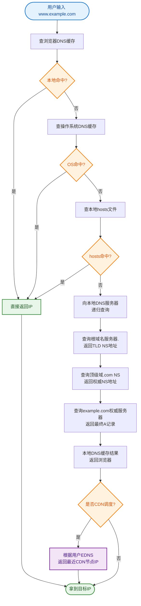

# 什么是DNS解析过程？

DNS解析是将域名转换为IP地址的过程。整个流程涉及浏览器、操作系统、本地DNS服务器以及各级权威DNS服务器的交互。以下是详细的解析步骤：

1. **浏览器缓存检查**：
   浏览器首先检查自身的DNS缓存（Memory Cache & Disk Cache），是否有该域名对应的IP地址。如果找到且未过期，解析结束。

2. **系统缓存检查（Hosts文件）**：
   若浏览器缓存未命中，浏览器会调用操作系统接口，读取系统本地的 `Hosts` 文件（Windows下路径为 `C:\Windows\System32\drivers\etc\hosts`）。若存在映射，则直接使用该IP。

3. **本地DNS服务器查询（递归查询）**：
   如果Hosts中也没有，操作系统会将请求发送给本地DNS服务器（通常是路由器或ISP分配的DNS，如114.114.114.114或8.8.8.8）。本地DNS服务器负责代替客户端进行后续的迭代查询，直到拿到结果并返回给客户端，这一过程称为递归查询。

4. **根域名服务器查询（迭代查询开始）**：
   本地DNS服务器若没有缓存记录，会向全球13组根域名服务器发起请求。根服务器不直接解析域名，但能返回顶级域名服务器的IP地址。

5. **顶级域名服务器查询**：
   本地DNS服务器根据根服务器的指引，向对应的顶级域名服务器发起查询。

6. **权威域名服务器查询**：
   顶级域名服务器返回该域名所属的权威DNS服务器地址。本地DNS服务器向权威DNS服务器发起最终查询。权威服务器存储了具体的域名IP映射，将结果返回给本地DNS服务器。

7. **返回结果并缓存**：
   本地DNS服务器将IP地址返回给客户端，同时在本地缓存该结果，TTL（Time To Live）控制缓存时间。

8. **建立连接**：
   浏览器获得IP地址后，通过TCP三次握手与服务器建立连接。

**解析流程架构图**：
```
客户端                        本地DNS (ISP)              根/顶级/权威DNS
  │                              │                            │
  ├─ 1. 检查浏览器缓存          │                            │
  ├─ 2. 检查Hosts文件          │                            │
  │      未命中                 │                            │
  ├────────────────────────────>│                            │
  │    3. 查询                  │                            │
  │                              │                            │
  │                              ├───────────────────────────>│
  │                              │  4. 迭代查询               │
  │                              │<───────────────────────────┤
  │                              │                            │
  │<────────────────────────────┤  7. 返回IP                 │
  │    8. 接收IP                 │                            │
  │                              │                            │
```

**关键细节补充**：
- **递归 vs 迭代**：客户端向本地DNS发送的是递归查询（我要结果，你搞定）；本地DNS向根/顶级/权威DNS发送的是迭代查询（给我个下家地址，我自己去问）。
- **负载均衡**：权威DNS可能配置了同一个域名对应多个IP，DNS解析时可能会轮询返回不同的IP，实现简单的负载均衡。

## 常见考点
1. **DNS劫持与污染**：如何防范？（如使用DoH/DoT，HTTPDNS）
2. **TTL的作用**：TTL过期后如何处理？
3. **递归查询和迭代查询的区别**：分别在什么阶段发生？
4. **DNS解析为什么使用UDP**：虽然也支持TCP（主要用在区域传送），但普通查询主要用UDP是因为包小、速度快。


## 核心流程图


## 记忆要点

- 本地排查：先查浏览器缓存和系统Hosts文件，未命中找本地DNS。
- 递归查询：客户端向本地DNS发起递归查询（本地DNS负责跑腿拿结果）。
- 迭代查询：本地DNS向根、顶级、权威服务器逐级发起迭代查询（只指路不给结果）。
- 缓存与负载：解析结果受TTL控制进行各级缓存，权威DNS可通过返回多IP实现负载均衡。

## 结构化回答

**30 秒电梯演讲：** 将域名翻译为IP地址的分布式查询系统。打个比方，像查电话簿，先翻本地通讯录，没有再问查号台（服务器）。

**展开框架：**
1. **本地排查** — 先查浏览器缓存和系统Hosts文件，未命中找本地DNS。
2. **递归查询** — 客户端向本地DNS发起递归查询（本地DNS负责跑腿拿结果）。
3. **迭代查询** — 本地DNS向根、顶级、权威服务器逐级发起迭代查询（只指路不给结果）。

**收尾：** 这三点都能配合实战聊。您想深入聊原理、对比还是避坑？

## 视频脚本

> 预计时长：2 分钟 | 由浅入深

| 时间 | 画面/字幕 | 口播台词 | 讲解要点 |
|------|----------|----------|----------|
| 0:00 | 标题卡：什么是DNS解析过程 | "什么是DNS解析过程？一句话——像查电话簿，先翻本地通讯录，没有再问查号台（服务器）。" | 开场钩子 |
| 0:40 | 概念动画/示意图 | "将域名翻译为IP地址的分布式查询系统——像查电话簿，先翻本地通讯录，没有再问查号台（服务器）" | 核心定义 |
| 1:20 | 本地排查示意 | "先查浏览器缓存和系统Hosts文件，未命中找本地DNS。" | 要点1 |
| 2:00 | 总结卡 | "记住这几条，面试不慌。下期讲进阶追问。" | 收尾 |
