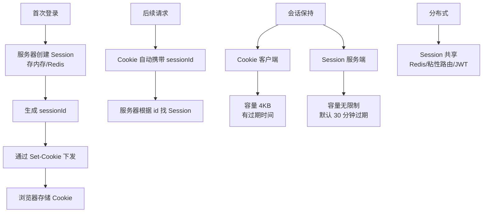

# 什么是HTTP常见字段？

例如：HTTP/1.1 200 OK
2、响应头部： 响应头部也是以键值对的形式提供的额外信息，类似于请求头部，用于告
知客户端有关响应的详细信息。一些常⻅的响应头部字段包括：
Content-Type：指定响应主体的MIME类型。
Content-Length：指定响应主体的长度（字节数）。
Server：指定服务器的信息。
Location：在重定向时指定新的资源位置。
Set-Cookie：在响应中设置Cookie。
3、空行： 空行是响应头部和响应主体之间的空行，用于分隔响应头部和响应主体。
4、响应主体： 响应主体包含服务器返回给客户端的实际数据。例如，当请求一个网页时，
响应主体将包含HTML内容。响应主体的存在与否取决于请求的性质以及服务器的处理结果。
一个完整的HTTP响应报文示例如下：
HTTP常⻅字段
 
 
HTTP/1.1 200 OK
Content-Type: text/html; charset=UTF-8
Content-Length: 1234
Server: Apache/2.4.38 (Unix)
Set-Cookie: session_id=abcd1234; Expires=Wed, 11 Aug 2023 00:00:00 GMT
HTTP/1.1 200 OK
Content-Type: text/html; charset=UTF-8
Content-Length: 1234
Server: Apache/2.4.38 (Unix)
Set-Cookie: session_id=abcd1234; Expires=Wed, 11 Aug 2023 00:00:00 GMT
<!DOCTYPE html>
<html>
<head>
  <title>Example Page</title>
</head>
<body>
  <h1>Hello, World!</h1>
</body>
</html>

**实战案例**：在排查一次前端跨域失败（CORS）问题时，发现后端虽然返回了数据，但浏览器拦截了响应，原因是 `Access-Control-Allow-Origin` 字段缺失或配置不当。同时也需注意 `Access-Control-Allow-Credentials` 对 Cookie 的影响。

**代码示例**：
```nginx
# Nginx 配置常见安全与响应头
server {
    listen 80;
    server_name api.example.com;
    
    location / {
        # 防止点击劫持
        add_header X-Frame-Options "SAMEORIGIN";
        # 防止 MIME 类型嗅探
        add_header X-Content-Type-Options "nosniff";
        # XSS 防护
        add_header X-XSS-Protection "1; mode=block";
        # CORS 配置
        add_header Access-Control-Allow-Origin "https://www.example.com";
        
        proxy_pass http://backend_upstream;
    }
}
```

**常见字段分类对比**：

| 分类 | 典型字段 | 主要作用 |
| :--- | :--- | :--- |
| **实体内容** | Content-Type, Content-Length, Content-Encoding | 描述响应体的数据类型、长度、压缩方式 |
| **缓存控制** | Cache-Control, ETag, Expires | 控制客户端或代理服务器的缓存行为 |
| **安全与认证** | Set-Cookie, WWW-Authenticate, Strict-Transport-Security | 会话管理、身份验证、强制 HTTPS |
| **连接管理** | Connection, Transfer-Encoding (chunked) | 控制连接是保持还是断开，数据分块传输 |
| **重定向** | Location | 指引客户端跳转到新的 URL |
| **协商与信息** | Server, Date, Accept-Ranges | 服务器信息、时间戳、是否支持断点续传 |


## 核心架构图


## 记忆要点

- 实体三剑客：Content-Type定类型、Length定长度、Encoding定压缩
- 缓存与安全：Cache-Control管缓存策略，CORS头防跨域拦截
- 重定向指引：配合3xx状态码，Location字段指引客户端跳转新URL
- 分块传输：Transfer-Encoding为chunked时用于动态大文件流式传输

## 结构化回答

**30 秒电梯演讲：** HTTP头字段是传递元信息的键值对。打个比方，快递单上的备注，告诉你这是什么、发给谁、怎么处理。

**展开框架：**
1. **实体三剑客** — Content-Type定类型、Length定长度、Encoding定压缩
2. **缓存与安全** — Cache-Control管缓存策略，CORS头防跨域拦截
3. **重定向指引** — 配合3xx状态码，Location字段指引客户端跳转新URL

**收尾：** 我在项目里踩过坑——在排查一次前端跨域失败（CORS）问题时，发现后端虽然返回了数据，但浏览器拦截了响应，原因是 `Access-Control-Allow-Origin` 字段缺失或配置不当。您想深入聊哪一段：原理、避坑还是对比选型？

## 视频脚本

> 预计时长：2 分钟 | 由浅入深

| 时间 | 画面/字幕 | 口播台词 | 讲解要点 |
|------|----------|----------|----------|
| 0:00 | 标题卡：什么是HTTP常见字段 | "什么是HTTP常见字段？一句话——快递单上的备注，告诉你这是什么、发给谁、怎么处理。" | 开场钩子 |
| 0:40 | 概念动画/示意图 | "HTTP头字段是传递元信息的键值对——快递单上的备注，告诉你这是什么、发给谁、怎么处理" | 核心定义 |
| 1:20 | 实体三剑客示意 | "Content-Type定类型、Length定长度、Encoding定压缩" | 要点1 |
| 2:00 | 总结卡 | "记住这几条，面试不慌。下期讲进阶追问。" | 收尾 |
