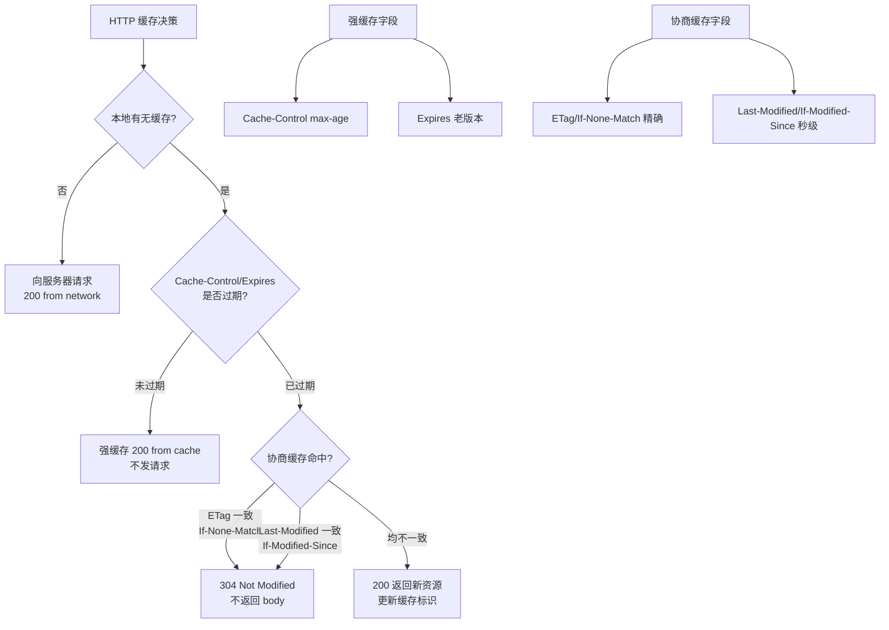

# 什么是HTTP缓存有几种？

HTTP 缓存机制将资源（如网页、图像、脚本等）的副本存储在客户端或中间代理服务器上，以便将来的请求可以直接从缓存中获取，而不必重新从服务器下载资源。这有助于减少网络延迟，提高页面加载速度，并减轻服务器的负担。

**缓存解决的问题**：
1. 减少不必要的网络传输，节约带宽，降低用户流量消耗。
2. 更快的加载页面，提升用户体验（FCP/LCP 指标优化）。
3. 减少服务器负载，避免服务过载的情况出现。

**HTTP 缓存分类**：

### 1. 强制缓存
浏览器判断请求的目标资源是否有效命中强缓存，如果命中，则可以直接从内存中读取目标资源，无需与服务器做任何通讯（状态码通常为 200 OK (from disk cache/memory cache)）。

- **Expires** (HTTP/1.0)
  - 设置一个绝对的强缓存时间点（如：`Expires: Wed, 21 Oct 2025 07:28:00 GMT`）。
  - **缺点**：依赖客户端本地时间，如果客户端时间被修改，缓存判断会失效。

- **Cache-Control** (HTTP/1.1，优先级高于 Expires)
  - **max-age**：设置资源在缓存中的最长有效时间，单位是秒。例如，`Cache-Control: max-age=3600` 表示资源在缓存中保留 3600 秒。
  - **no-cache**：跳过强缓存，直接进入协商缓存。
  - **no-store**：禁止缓存，每次都要从服务器下载。
  - **public/private**：public 表示客户端和代理服务器都可以缓存；private 表示只有客户端可以缓存。

### 2. 协商缓存
与强制缓存不同，协商缓存依赖于客户端和服务器之间的交互。当强缓存失效后，浏览器会携带缓存标识向服务器发起请求，服务器验证资源是否修改，若未修改返回 304 Not Modified，浏览器使用本地缓存；若已修改返回 200 和新资源。

下面是常用于协商缓存的一些头部字段：

- **ETag 和 If-None-Match**（优先级高，精确）
  - **ETag**：服务器为资源生成的唯一标识符，通常是文件内容的 hash 值（如 md5 或 etag 值）。只要内容变化，ETag 就会变。
  - **If-None-Match**：客户端在后续请求头中携带上次响应的 ETag 值。
  - **流程**：服务器比较 `If-None-Match` 与当前资源的 `ETag`，如果一致，返回 304；不一致，返回 200 和新资源及新 ETag。

- **Last-Modified 和 If-Modified-Since**（优先级低，以秒为单位）
  - **Last-Modified**：资源的最后修改时间（精确到秒）。
  - **If-Modified-Since**：客户端在请求头中携带上次响应的 Last-Modified 值。
  - **流程**：服务器比较 `If-Modified-Since` 与资源最后修改时间，如果未过期，返回 304；否则返回 200。
  - **缺点**：
    1. 如果文件在 1 秒内被多次修改（例如秒级编辑），服务器无法感知到变化。
    2. 如果文件改变了但内容没变（如修改注释），会导致缓存失效，效率低。

**实战案例**：
在静态资源发布场景中，常采用"Hash文件名"策略（如 `app.a1b2.js`）。此时将 `Cache-Control` 设置为 `max-age=31536000`（一年）。由于文件名包含内容哈希，内容更新即文件名变更，旧缓存自动失效，无需协商缓存，能极大减轻服务器压力。

**代码示例 (Nginx 配置)**：
```nginx
# 对带 Hash 的静态资源强制缓存一年
location ~* \.(js|css|png|jpg|jpeg|gif|ico|svg|woff2?)$ {
    expires 1y;
    add_header Cache-Control "public, immutable";
}

# 对 HTML 文件协商缓存，确保总是能获取最新入口
location ~* \.html$ {
    add_header Cache-Control "no-cache";
}
```

**强缓存 vs 协商缓存对比**：

| 特性 | 强制缓存 | 协商缓存 |
| :--- | :--- | :--- |
| **状态码** | 200 (from disk/memory cache) | 304 Not Modified |
| **网络请求** | 无（完全走本地） | 有（需发请求验证） |
| **时效性** | 取决于 max-age/Expires | 实时验证（看文件是否变动） |
| **服务器负载** | 极低 | 低（仅传输 Header） |
| **典型应用** | 静态资源 (JS/CSS/Image Hash) | HTML 文件 / 频繁更新的 API |

**HTTP 缓存决策流程图**：
```
                    ┌─────────────────┐
                    │ 浏览器请求资源   │
                    └────────┬────────┘
                             │
                             ▼
                    ┌─────────────────┐    NO     ┌───────────────┐
                    │ 查找本地缓存     ├──────────►│ 发送网络请求  │
                    └────────┬────────┘           └───────┬───────┘
                             │ YES                        │
                             ▼                            ▼
                    ┌───────


## 核心架构图


## 核心知识点图


## 记忆要点

- 两大分类：强制缓存(不发请求，状态码200)与协商缓存(发请求验证，状态码304)
- 强缓字段：1.0用Expires(绝对时间)，1.1用Cache-Control的max-age(相对秒数，优先级高)
- 协商字段：Last-Modified/If-Modified-Since(秒级精度低)，ETag/If-None-Match(Hash精度高，优先)
- 经典落地：带Hash的静态资源(如JS/CSS)用长强缓存，入口HTML文件用协商缓存

## 结构化回答

**30 秒电梯演讲：** 通过存储副本减少网络传输，提升加载速度。打个比方，口袋里有线索，直接问路人，不用每次都打电话问总部。

**展开框架：**
1. **两大分类** — 强制缓存(不发请求，状态码200)与协商缓存(发请求验证，状态码304)
2. **强缓字段** — 1.0用Expires(绝对时间)，1.1用Cache-Control的max-age(相对秒数，优先级高)
3. **协商字段** — Last-Modified/If-Modified-Since(秒级精度低)，ETag/If-None-Match(Hash精度高，优先)

**收尾：** 我在项目里踩过坑——在静态资源发布场景中，常采用"Hash文件名"策略（如 `app.a1b2.js`）。您想深入聊哪一段：原理、避坑还是对比选型？

## 视频脚本

> 预计时长：2 分钟 | 由浅入深

| 时间 | 画面/字幕 | 口播台词 | 讲解要点 |
|------|----------|----------|----------|
| 0:00 | 标题卡：什么是HTTP缓存有几种 | "什么是HTTP缓存有几种？一句话——口袋里有线索，直接问路人，不用每次都打电话问总部。" | 开场钩子 |
| 0:40 | 概念动画/示意图 | "通过存储副本减少网络传输，提升加载速度——口袋里有线索，直接问路人，不用每次都打电话问总部" | 核心定义 |
| 1:20 | 两大分类示意 | "强制缓存(不发请求，状态码200)与协商缓存(发请求验证，状态码304)" | 要点1 |
| 2:00 | 总结卡 | "记住这几条，面试不慌。下期讲进阶追问。" | 收尾 |
