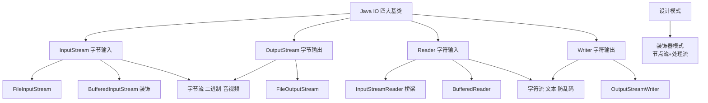
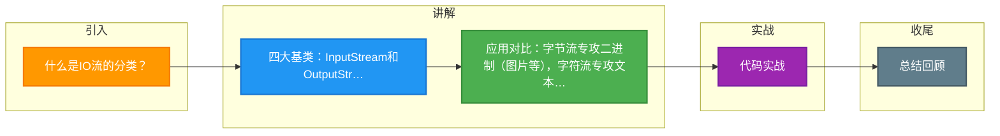

# 什么是IO流的分类？

### IO流的分类

#### 1. 按流向分
- **输入流**：将外部数据（磁盘、网络等）读取到程序（内存）中。
- **输出流**：将程序（内存）中的数据写入到外部设备（磁盘、网络等）。

#### 2. 按处理数据单位分
- **字节流**：每次读取/写入一个字节（8 bit）。适合处理二进制数据（图片、音频），处理文本时若编码不当可能乱码。
- **字符流**：每次读取/写入一个字符（通常16 bit，2字节）。专门用于处理文本数据，解决中文乱码问题。
  - **原理细节**：字符流底层也是基于字节流操作，增加了字节到字符的转换桥梁（InputStreamReader/OutputStreamWriter），默认使用系统编码，建议显式指定 UTF-8。

#### 3. 按角色分
- **节点流**：直接与数据源（如文件、内存）相连的流。如 `FileInputStream`。
- **处理流（包装流）**：对已存在的流进行封装，提供额外功能（如缓冲）。如 `BufferedReader`。构造方法需传入另一个流对象。
  - **设计模式**：采用了**装饰器设计模式**，通过组合而非继承来动态增强功能。

#### 4. 四大抽象基类
- 输入字节流：`InputStream`
- 输出字节流：`OutputStream`
- 输入字符流：`Reader`
- 输出字符流：`Writer`

所有其他流均继承自这四大基类。

**实战案例**：
在开发"文件导出"功能时，若直接使用 `FileWriter` 写入 CSV 且包含中文字符，在 Windows 服务器上可能乱码，因为 Windows 默认编码可能是 GBK。**解决方案**：使用 `OutputStreamWriter` 包装 `FileOutputStream`，并显式指定编码为 `StandardCharsets.UTF_8`，确保跨平台一致性。对于下载大文件，务必使用缓冲流 `BufferedOutputStream`，否则 OutputStream 每次 write 都会触发磁盘 I/O，导致 CPU 飙升且下载极慢。

**代码示例 (指定 UTF-8 编码)**：
```java
try (OutputStreamWriter osw = new OutputStreamWriter(
        new FileOutputStream("data.csv"), StandardCharsets.UTF_8);
     BufferedWriter bw = new BufferedWriter(osw)) {
    
    // 写入 BOM (Byte Order Mark) 让 Excel 正确识别 UTF-8
    bw.write("\uFEFF"); 
    bw.write("姓名,年龄\n");
    bw.write("张三,30\n");
}
```

**IO 流分类对比表**：

| 分类维度 | 类型 | 核心类 | 适用场景 | 特点 |
| :--- | :--- | :--- | :--- | :--- |
| **数据单位** | 字节流 | InputStream, OutputStream | 图片、视频、ZIP包 | 最底层流，不涉及编码转换 |
| | 字符流 | Reader, Writer | 文本文件 (TXT, CSV, JSON) | 自动处理字符编码，避免乱码 |
| **流的角色** | 节点流 | FileInputStream, FileReader | 直接操作数据源 | 低级流，提供基础读写能力 |
| | 处理流 | BufferedInputStream, PrintStream | 需要缓冲或转换时 | 高级流，提供性能优化或格式化 |

#### IO 流体系架构图
```text
                   ┌─────────────┐
                   │  字节流      │
                   │ InputStream │
                   │ OutputStream │
                   └──────┬──────┘
                          │ 实现
        ┌─────────────────┼─────────────────┐
        ▼                 ▼                 ▼
  ┌──────────┐     ┌──────────┐     ┌──────────┐
  │FileInputStream│   │ByteArrayInputStream│ ... (节点流)
  └──────────┘     └──────────┘     └──────────┘
        ▲                 ▲
        │ 包装           │ 包装
  ┌─────┴─────┐     ┌─────┴─────┐
  │BufferedInputStream│  (处理流) │
  └──────────┘     └──────────┘

                   ┌─────────────┐
                   │  字符流      │
                   │    Reader   │
                   │    Writer   │
                   └──────┬──────┘
                          │ (桥接转换)
          ┌───────────────┴───────────────┐
          ▼                               ▼
   ┌────────────────┐            ┌────────────────┐
   │ InputStreamReader│  (字节->字符) │  FileWriter    │
   └────────────────┘            └────────────────┘
```

#### 常见考点
1. **为什么字符流不叫 16 bit 流？**：虽然 Java char 是 16 bit，但在读取 UTF-8 文本时，一个字符可能由 3 个字节组成，Reader 负责处理这种多字节到字符的解码。
2. **缓冲流的核心优势？**：减少了底层系统调用的次数（如磁盘读写），通过内部字节数组缓冲区（默认 8KB）批量处理数据。
3. **flush() 的作用？**：在输出流（特别是缓冲流）中，数据可能先在内存缓冲区，调用 `flush()` 强制将缓冲区数据写入目标，防止断电丢失。close() 方法通常会自动调用 flush()。


## 核心架构图



## 记忆要点

- 四大基类：InputStream和OutputStream(字节)，Reader和Writer(字符)
- 应用对比：字节流专攻二进制(图片等)，字符流专攻文本(防中文乱码)
- 架构模式：节点流直接连数据源，处理流用装饰器模式包装并增强功能(如缓冲)
- 防乱码：因为系统默认编码各异，所以用转换流时需显式指定UTF-8

## 结构化回答

**30 秒电梯演讲：** 按流向、单位、角色三维分类的抽象数据传输管道。打个比方，就像快递运输，分寄出/收到（流向），散装/箱装（单位），快递员/中转站（角色）。

**展开框架：**
1. **四大基类** — InputStream和OutputStream(字节)，Reader和Writer(字符)
2. **应用对比** — 字节流专攻二进制(图片等)，字符流专攻文本(防中文乱码)
3. **架构模式** — 节点流直接连数据源，处理流用装饰器模式包装并增强功能(如缓冲)

**收尾：** 这三点都能配合实战聊。您想深入聊原理、对比还是避坑？

## 视频脚本

> 预计时长：2 分钟 | 由浅入深

| 时间 | 画面/字幕 | 口播台词 | 讲解要点 |
|------|----------|----------|----------|
| 0:00 | 标题卡：什么是IO流的分类 | "什么是IO流的分类？一句话——就像快递运输，分寄出/收到（流向），散装/箱装（单位），快递员/中转站（角色）。" | 开场钩子 |
| 0:40 | 概念动画/示意图 | "按流向、单位、角色三维分类的抽象数据传输管道——就像快递运输，分寄出/收到（流向），散装/箱装（单位），快递员/中转站（角色）" | 核心定义 |
| 1:20 | 四大基类示意 | "InputStream和OutputStream(字节)，Reader和Writer(字符)" | 要点1 |
| 2:00 | 总结卡 | "记住这几条，面试不慌。下期讲进阶追问。" | 收尾 |

### 视频流程图



