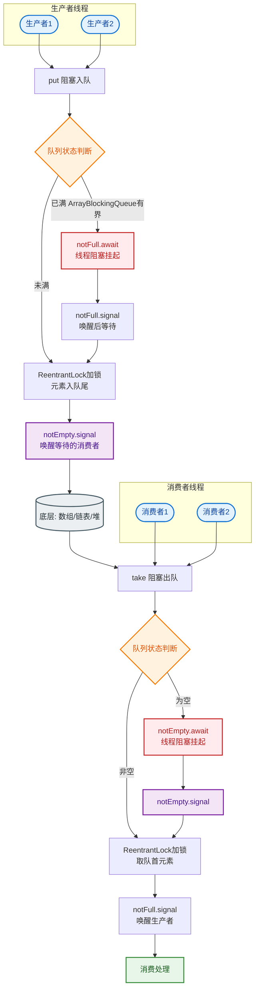

# 什么是Java中的阻塞队列？

### Java 中的阻塞队列

阻塞队列（BlockingQueue）是一个支持两个附加操作的队列：
1. 当队列为空时，获取元素的线程会等待队列变为非空。
2. 当队列满时，存储元素的线程会等待队列出现可用空间。

#### 常用方法
- **抛出异常**：`add()`（满时抛异常），`remove()`（空时抛异常），`element()`（空时抛异常）。
- **返回特殊值**：`offer()`（满时返回false），`poll()`（空时返回null），`peek()`。
- **一直阻塞**：`put()`（满时阻塞），`take()`（空时阻塞）。
- **超时退出**：`offer(e, time, unit)`，`poll(time, unit)`。

#### Java 中的七种主要阻塞队列
1. **ArrayBlockingQueue**：由数组结构组成的有界阻塞队列。
2. **LinkedBlockingQueue**：由链表结构组成的有界（默认Integer.MAX_VALUE）阻塞队列。
3. **PriorityBlockingQueue**：支持优先级排序的无界阻塞队列。
4. **DelayQueue**：使用优先级队列实现的无界阻塞队列，元素只有在延迟期满时才能从中提取。
5. **SynchronousQueue**：不存储元素的阻塞队列，每个插入操作必须等待另一个线程的移除操作。
6. **LinkedTransferQueue**：由链表结构组成的无界阻塞队列，实现了TransferQueue接口。
7. **LinkedBlockingDeque**：由链表结构组成的双向阻塞队列。

#### 生产者-消费者模型示例流程
```text
生产者线程              阻塞队列             消费者线程
   │                     │                     │
   ├─ put(data) ────────>│                     │
   │                     │ (队列满时阻塞)      │
   │                     │                     │
   │                     ├─ take() ───────────>│
   │                     │ (队列空时阻塞)      │
   │<────────────────────┤                     │
   │  通知唤醒/存入成功   │                     │
```

#### 核心实现原理（以 ArrayBlockingQueue 为例）
- **锁机制**：使用 `ReentrantLock` 保证线程安全。
- **Condition 通知机制**：使用 `notEmpty`（非空条件）和 `notFull`（未满条件）来实现精细化的线程挂起和唤醒，避免锁的无效争抢。

#### 常见考点
1. **SynchronousQueue 的应用场景？**：它是 Executors.newCachedThreadPool() 默认使用的队列。它不存储数据，直接将生产者的任务递交给消费者，因此极高的吞吐量，但要求消费者处理速度足够快。
2. **LinkedBlockingQueue 与 ArrayBlockingQueue 的区别？**：
   - 链表vs数组：链表天然支持无界（易OOM），数组通常有界；
   - 锁实现：链表队列读写锁分离（take 和 put 可并行），数组队列读写共用一把锁。
3. **PriorityBlockingQueue 如何保证顺序？**：内部使用二叉小顶堆结构，元素必须实现 Comparable 接口或提供 Comparator。

#### 实战案例
在高并发秒杀系统中，曾因使用默认无界的 `LinkedBlockingQueue` 作为线程池任务队列，导致下游数据库宕机时任务在队列中疯狂堆积，最终引发服务 OOM（内存溢出）。后改用 `ArrayBlockingQueue` 并严格限制队列容量，配合 `RejectedExecutionHandler` 策略实现了熔断降级。

#### 关键代码示例（Java）
```java
// 使用 ArrayBlockingQueue 创建容量为 100 的生产者-消费者模型
BlockingQueue<Task> queue = new ArrayBlockingQueue<>(100);

// 生产者：队列满时会阻塞，防止内存溢出
new Thread(() -> {
    try {
        queue.put(new Task("data")); 
    } catch (InterruptedException e) {
        Thread.currentThread().interrupt();
    }
}).start();

// 消费者：队列空时会阻塞，避免无效 CPU 空转
new Thread(() -> {
    try {
        Task task = queue.take(); // 阻塞直到有元素
        task.execute();
    } catch (InterruptedException e) {
        Thread.currentThread().interrupt();
    }
}).start();
```

#### 核心队列选型对比

| 特性 | ArrayBlockingQueue | LinkedBlockingQueue | SynchronousQueue |
| :--- | :--- | :--- | :--- |
| **底层结构** | 数组 | 链表 | 栈/队列（不存储） |
| **队列长度** | 必须显式指定，有界 | 默认 Integer.MAX_VALUE（有风险） | 无（容量为0） |
| **锁机制** | 一把锁（读写互斥） | 两把锁（读锁、写锁分离） | CAS 算法（无锁） |
| **性能特点** | 存取性能一般，内存占用小 | 高并发下吞吐量较高，但节点对象多内存开销大 | 极高吞吐量（直接传递） |
| **适用场景** | 内存敏感、需要严格限流的场景 | 高并发吞吐、任务量不可预估的场景 | 异步任务快速交接（如 CachedThreadPool） |


## 核心流程图


## 记忆要点

- 核心特性：队列空时取阻塞，队列满时存阻塞，天然解耦生产者与消费者
- 四组API：抛异常(add)、返特殊值(offer)、一直阻塞(put/take)、超时退出
- 选型对比：ArrayBlockingQueue共用单锁有界，LinkedBlockingQueue双锁分离(默认无界易OOM)
- 底层实现：基于ReentrantLock配notEmpty和notFull两个Condition实现精准唤醒

## 结构化回答

**30 秒电梯演讲：** 支持阻塞存取的线程安全队列，用于生产者-消费者模式。打个比方，像传送带，满了暂停生产，空了暂停消费。

**展开框架：**
1. **核心特性** — 队列空时取阻塞，队列满时存阻塞，天然解耦生产者与消费者
2. **四组API** — 抛异常(add)、返特殊值(offer)、一直阻塞(put/take)、超时退出
3. **选型对比** — ArrayBlockingQueue共用单锁有界，LinkedBlockingQueue双锁分离(默认无界易OOM)

**收尾：** 我在项目里踩过坑——在高并发秒杀系统中，曾因使用默认无界的 `LinkedBlockingQueue` 作为线程池任务队列，导致下游数据库宕机时任务在队列中疯狂堆积，最终引发服务 OOM（内存溢出）。您想深入聊哪一段：原理、避坑还是对比选型？

## 视频脚本

> 预计时长：2 分钟 | 由浅入深

| 时间 | 画面/字幕 | 口播台词 | 讲解要点 |
|------|----------|----------|----------|
| 0:00 | 标题卡：什么是Java中的阻塞队列 | "什么是Java中的阻塞队列？一句话——像传送带，满了暂停生产，空了暂停消费。" | 开场钩子 |
| 0:40 | 概念动画/示意图 | "支持阻塞存取的线程安全队列，用于生产者-消费者模式——像传送带，满了暂停生产，空了暂停消费" | 核心定义 |
| 1:20 | 核心特性示意 | "队列空时取阻塞，队列满时存阻塞，天然解耦生产者与消费者" | 要点1 |
| 2:00 | 总结卡 | "记住这几条，面试不慌。下期讲进阶追问。" | 收尾 |

---

## 延伸：JAVA阻塞队列原理是什么？

> 合并自 `core-155`（相似度 74%）

阻塞队列（BlockingQueue）是一个支持两个附加操作的队列：
1. 当队列为空时，获取元素的线程会**等待**队列变为非空。
2. 当队列满时，存储元素的线程会**等待**队列出现可用空间。

### 核心原理
主要使用 `ReentrantLock` 和 `Condition`（条件变量）来实现线程的阻塞和唤醒。它利用经典的“生产者-消费者”模型。

**阻塞队列工作流程图：**
```text
    生产者线程                       阻列队列                         消费者线程
       │                             │                                  │
       ├──── put(e) ────────────────>│                                  │
       │                             │  lock.lock()                    │
       │                             │  if (count == capacity)         │
       │                             │      notFull.await()  ◄─────────┤ (挂起)
       │                             │                                  │
       │                             │  enqueue(e)                     │
       │                             │  count++                        │
       │                             │  notEmpty.signal() ─────────────>┤ (唤醒)
       │                             │  lock.unlock()                  │
       │                             │                                  │
       │<──── (返回) ◄────────────────│                                  │
       │                             │                                  │
       │                             │<───── take() ◄──────────────────┤
       │◄──── notFull.signal() ──────│  lock.lock()                    │
       │ (唤醒生产者)                 │  if (count == 0)                │
       │                             │      notEmpty.await() ◄────────┤ (挂起)
       │                             │  dequeue()                      │
       │                             │  count--                        │
       │                             │  lock.unlock()                  │
       │                             ├─────────── e ───────────────────>┤
```

- **生产者**：调用 `put` 时获取锁，如果队列满，调用 `notFull.await()` 释放锁并挂起；插入成功后调用 `notEmpty.signal()` 唤醒消费者。
- **消费者**：调用 `take` 时获取锁，如果队列空，调用 `notEmpty.await()` 释放锁并挂起；取出成功后调用 `notFull.signal()` 唤醒生产者。

### 代码示例 (ArrayBlockingQueue 核心逻辑)
```java
public void put(E e) throws InterruptedException {
    final ReentrantLock lock = this.lock;
    lock.lockInterruptibly();
    try {
        while (count == items.length)
            notFull.await(); // 队列满，挂起当前线程
        enqueue(e);
    } finally {
        lock.unlock();
    }
}

private void enqueue(E x) {
    items[putIndex] = x;
    if (++putIndex == items.length) putIndex = 0;
    count++;
    notEmpty.signal(); // 唤醒消费者
}
```

### 实战案例
在异步日志打印框架中，使用 `LinkedBlockingQueue` 作为日志缓冲区。当后台线程处理过慢导致队列满时，`put` 操作会阻塞业务线程，起到“背压”作用，防止系统 OOM，但也需注意设置合理的容量以避免阻塞太久。

## 记忆要点

- 一句话定义：支持阻塞的队列，空时取等待，满时存等待
- 底层机制：依赖Reentrant锁，配合notEmpty和notFull两个Condition实现挂起与唤醒
- 生产者存：获取锁，若满则await挂起；成功存入后signal唤醒消费者
- 消费者取：获取锁，若空则await挂起；成功取出后signal唤醒生产者
- 模型应用：天然解决生产者-消费者问题，解耦并实现异步削峰

## 结构化回答

**30 秒电梯演讲：** 利用锁和条件变量实现生产者-消费者模型的阻塞容器。打个比方，像传送带，没货了工人等着（阻塞），货满了搬运工等着，自动协调生产和消费。

**展开框架：**
1. **一句话定义** — 支持阻塞的队列，空时取等待，满时存等待
2. **底层机制** — 依赖Reentrant锁，配合notEmpty和notFull两个Condition实现挂起与唤醒
3. **生产者存** — 获取锁，若满则await挂起；成功存入后signal唤醒消费者

**收尾：** 我在项目里踩过坑——在异步日志打印框架中，使用 `LinkedBlockingQueue` 作为日志缓冲区。您想深入聊哪一段：原理、避坑还是对比选型？

## 视频脚本

> 预计时长：3 分钟 | 由浅入深

| 时间 | 画面/字幕 | 口播台词 | 讲解要点 |
|------|----------|----------|----------|
| 0:00 | 标题卡：JAVA阻塞队列原理是什么 | "JAVA阻塞队列原理是什么？一句话——像传送带，没货了工人等着（阻塞），货满了搬运工等着，自动协调生产和消费。" | 开场钩子 |
| 0:45 | 概念动画/示意图 | "利用锁和条件变量实现生产者-消费者模型的阻塞容器——像传送带，没货了工人等着（阻塞），货满了搬运工等着，自动协调生产和消费" | 核心定义 |
| 1:30 | 一句话定义示意 | "支持阻塞的队列，空时取等待，满时存等待" | 要点1 |
| 2:15 | 底层机制示意 | "依赖Reentrant锁，配合notEmpty和notFull两个Condition实现挂起与唤醒" | 要点2 |
| 3:00 | 总结卡 | "记住这几条，面试不慌。下期讲进阶追问。" | 收尾 |
