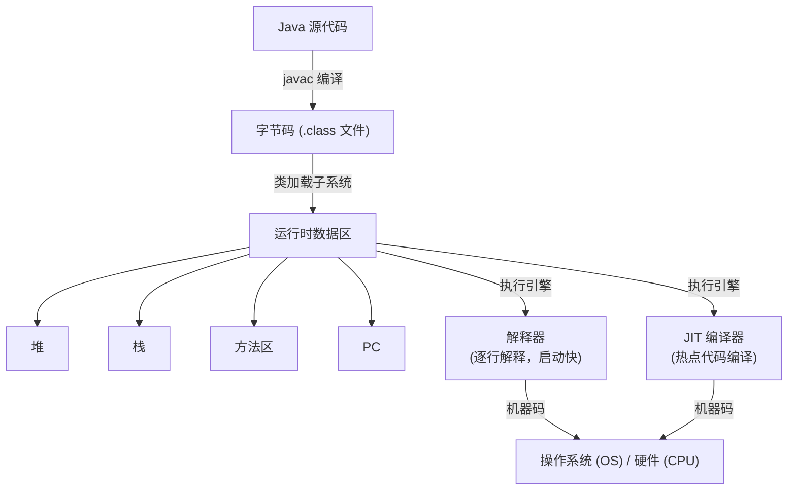

# 什么是Java代码执行与编译？

### Java 代码执行与编译

#### 机器码与指令集
- **机器码**：由0和1组成的二进制代码，CPU可以直接读取运行，速度最快，但不可读。
- **指令集**：不同硬件平台（如x86, ARM）支持的机器指令集合。

#### 汇编语言
- 用助记符代替机器操作码，用符号代替地址。汇编语言需通过汇编器转换为机器指令，仍依赖于特定硬件平台。

#### 字节码
- 一种中间状态的二进制代码（.class文件），比机器码更抽象，需要解释器或编译器转译后才能运行。
- **目的**：实现跨平台（Write Once, Run Anywhere）。编译器将源码编译为字节码，JVM将字节码解释或编译为对应平台能识别的机器指令。

#### Java 执行流程
1. **源代码**：编写`.java`文件。
2. **编译（前端编译）**：通过`javac`编译器将源码编译成字节码（`.class`文件）。
3. **类加载**：JVM将字节码加载到内存。
4. **解释与编译（JIT）**：
   - **解释器**：逐行解释字节码，启动快但执行慢。
   - **即时编译器（JIT）**：将热点代码编译成本地机器码，提高执行效率。

#### JVM 整体架构与执行流


#### 关键补充：JIT 编译优化细节
- **热点代码**：JVM 通过计数器统计方法调用次数和循环体执行次数。超过阈值触发 JIT 编译（C1 编译器客户端优化，C2 编译器服务端激进优化）。
- **逃逸分析**：分析对象的作用域。如果对象只在方法内使用，可能会在栈上分配（消除 GC 压力）或进行标量替换（拆解为基本类型）。
- **栈上替换**：在循环执行过程中，如果检测到循环体是热点，JIT 会在循环执行过程中直接将栈帧中的解释执行切换为编译后的代码执行。

#### 实战场景：GraalVM 与 AOT
在 Serverless 或云原生场景中，JIT 的预热时间会导致冷启动延迟。我们曾将微服务迁移至 GraalVM，利用 AOT（Ahead-of-Time）编译将字节码提前转换为原生机器码。这虽然消除了 JIT 预热开销，使得启动时间从秒级降至毫秒级，但也失去了运行时动态优化的能力，导致长稳态吞吐量下降了约 15%。

#### 代码示例：查看 JIT 编译详情
```bash
# JVM 参数开启 JIT 编译日志
java -XX:+PrintCompilation -XX:+PrintGCDetails com.example.MyApp

# 输出示例
# 123    1       3       java.lang.String::hashCode (55 bytes)
# 124    2       3       java.util.HashMap::hash (18 bytes)
# %     3       4       java.lang.String::charAt (33 bytes)   (made not entrant)
```

#### 常见考点
1. **什么是 AOT 编译？**：Ahead-of-Time 编译，在程序运行前将字节码编译为机器码。
2. **解释器与 JIT 的共存？**：JVM 采用混合模式，启动时解释器快速响应，热点代码触发 JIT 编译后替换执行，达到性能平衡。
3. **C1 与 C2 编译器的区别？**：C1 关注编译速度（Client编译器），C2 关注极致性能（Server编译器），分层编译利用两者优势。


## 记忆要点

- 核心流程：源码经javac编译为字节码，JVM类加载后，解释器与JIT共同执行转为机器码
- 执行引擎对比：解释器逐行执行启动快，JIT编译热点代码执行快
- 跨平台原因：因为底层屏蔽硬件指令集差异，统一编译为中间字节码，所以实现一次编写到处运行
- JIT优化：热点代码触发即时编译，通过逃逸分析进行栈上分配或标量替换
- 云原生对比：AOT提前编译启动极快，而JIT运行时动态优化长稳态吞吐量高

## 结构化回答

**30 秒电梯演讲：** 源码转字节码实现跨平台，JVM解释/编译执行字节码。打个比方，像翻译官，先翻译成通用语（字节码），再现场翻译成当地话（机器码）。

**展开框架：**
1. **核心流程** — 源码经javac编译为字节码，JVM类加载后，解释器与JIT共同执行转为机器码
2. **执行引擎对比** — 解释器逐行执行启动快，JIT编译热点代码执行快
3. **跨平台原因** — 因为底层屏蔽硬件指令集差异，统一编译为中间字节码，所以实现一次编写到处运行

**收尾：** 这三点都能配合实战聊。您想深入聊原理、对比还是避坑？

## 视频脚本

> 预计时长：2 分钟 | 由浅入深

| 时间 | 画面/字幕 | 口播台词 | 讲解要点 |
|------|----------|----------|----------|
| 0:00 | 标题卡：什么是Java代码执行与编译 | "什么是Java代码执行与编译？一句话——像翻译官，先翻译成通用语（字节码），再现场翻译成当地话（机器码）。" | 开场钩子 |
| 0:40 | 概念动画/示意图 | "源码转字节码实现跨平台，JVM解释/编译执行字节码——像翻译官，先翻译成通用语（字节码），再现场翻译成当地话（机器码）" | 核心定义 |
| 1:20 | 核心流程示意 | "源码经javac编译为字节码，JVM类加载后，解释器与JIT共同执行转为机器码" | 要点1 |
| 2:00 | 总结卡 | "记住这几条，面试不慌。下期讲进阶追问。" | 收尾 |

---

## 延伸：Java 编译过程

> 合并自 `dsl-010`（相似度 73%）

### Java 编译与执行过程
```text
  Source Code (.java)
       │
       ▼
  ┌───────────┐
  │ Front-end │ (Lexical Analysis, Parsing)
  │ Compiler  │ ──> Bytecode (.class)
  └───────────┘
       │
       ▼
  ┌───────────┐
  │  Class    │ (Loading, Linking, Initializing)
  │  Loader   │ ──> Runtime Data Areas
  └───────────┘
       │
       ▼
  ┌───────────────────────┐
  │    Execution Engine   │
  ├───────────┬───────────┤
  │ Interpreter│   JIT     │
  │  (Startup) │ (Hotspot) │
  └───────────┴───────────┘
       │                 │
       └────────> CPU <──┘
```

1.  **前端编译**：
    -   `javac` 将 `.java` 源码编译成 `.class` 字节码。
    -   字节码是一种中间态指令集，与平台无关，包含操作码和操作数。
2.  **类加载**：
    -   类加载器（Bootstrap, Extension, Application）将字节码加载到 JVM 的方法区。
    -   链接阶段：验证 -> 准备（分配静态变量内存） -> 解析（符号引用转直接引用）。
3.  **执行引擎**：
    -   **解释器**：逐行解释字节码为机器码并执行。启动快，但执行效率低。
    -   **JIT 编译器**：Just-In-Time，将热点代码编译成本地机器码并缓存。编译耗时，但执行极快。

**实战案例**：
微服务冷启动时间过长（超过 10s），导致 K8s 滚动更新时流量丢失。通过调整 JVM 参数开启分层编译并设置 `TieredStopAtLevel=1`（仅使用 C1 编译），牺牲部分峰值性能换取 50% 启动速度提升。

### 为什么解释器与 JIT 共存？
-   **解释器**：在程序启动初期，代码还没有被识别为热点，解释器可以立即响应执行，省去编译时间，降低启动延迟。
-   **JIT**：随着程序运行，JIT 通过性能采样识别出“热点代码”，将其编译成高度优化的本地机器码。对于非热点代码，解释器继续执行，避免编译浪费。

### 混合模式
JVM 默认采用混合模式，平衡启动速度和执行效率。
-   **分层编译**：HotSpot JVM 通常采用分层编译（Tiered Compilation）：
    -   C0 层：解释器执行，收集 profiling 信息。
    -   C1 层：Client Compiler，生成简单的优化代码。
    -   C2 层：Server Compiler，生成深度优化的代码（基于 C1 收集的信息）。

### AOT 编译 (Ahead-Of-Time)
-   **概念**：直接将字节码在编译期间（运行前）编译成机器码。
-   **应用**：GraalVM，Java 9 引入的 `jaotc`。
-   **优缺点**：启动速度极快（省去解释和 JIT 开销），但牺牲了平台无关性和部分运行时优化能力（如内联缓存）。

**代码示例（查看 JIT 编译日志）**：
```bash
# 开启 JIT 编译日志，用于分析热点方法
java -XX:+PrintCompilation -XX:+UnlockDiagnosticVMOptions -XX:+LogCompilation com.example.Main

# 输出示例：
# 123    1       3       java.lang.String::hashCode (55 bytes)
```

## 常见考点
1.  **JIT 编译器触发条件**：方法被多次调用（由 `-XX:CompileThreshold` 决定，默认 C2 是 10000 次）或循环体回边次数达到阈值。
2.  **类加载机制**：双亲委派模型及其破坏（如 Tomcat、JDBC）。
3.  **字节码技术**：ASM、Javassist、CGLIB 动态代理在编译期或运行期修改字节码的原理。

### 对比表格：编译模式对比

| 模式 | 原理 | 启动速度 | 峰值性能 | 内存占用 | 适用场景 |
| :--- | :--- | :--- | :--- | :--- | :--- |
| **纯解释模式** (-Xint) | 逐行解释字节码 | 快 | 低 | 低 | 调试、简单脚本
| **纯编译模式** (-Xcomp) | 启动时全量编译 | 极慢 | 高 | 高 | 嵌入式设备、长期运行服务（罕见） |
| **混合模式** (默认) | 解释 + JIT (热点编译) | 较快 | 极高 | 中等 | 通用服务端应用 |
| **AOT 编译** | 运行前生成机器码 | 极快 | 中等 | 低 | Serverless、微服务、CLI 工具 |

## 记忆要点

- 两阶段编译：前端javac统一编译成与平台无关的字节码，后端JVM通过类加载机制执行
- 解释与JIT共存：解释器负责启动快慢预热，JIT负责探测热点代码并编译为本地机器码保障峰值性能
- 编译模式对比：混合模式为默认平衡策略，AOT编译牺牲跨平台性与运行时优化换取极致启动速度

## 结构化回答

**30 秒电梯演讲：** Java源码先编为字节码，JVM通过解释器启动和JIT编译优化执行。打个比方，像做菜，解释器是现炒现卖（慢），JIT是预制菜（慢准备，吃的时候快），混合模式就是刚开始现炒，火了就做预制菜。

**展开框架：**
1. **两阶段编译** — 前端javac统一编译成与平台无关的字节码，后端JVM通过类加载机制执行
2. **解释与JIT共存** — 解释器负责启动快慢预热，JIT负责探测热点代码并编译为本地机器码保障峰值性能
3. **编译模式对比** — 混合模式为默认平衡策略，AOT编译牺牲跨平台性与运行时优化换取极致启动速度

**收尾：** 我在项目里踩过坑——微服务冷启动时间过长（超过 10s），导致 K8s 滚动更新时流量丢失。您想深入聊哪一段：原理、避坑还是对比选型？

## 视频脚本

> 预计时长：4 分钟 | 由浅入深

| 时间 | 画面/字幕 | 口播台词 | 讲解要点 |
|------|----------|----------|----------|
| 0:00 | 标题卡：Java 编译过程 | "Java 编译过程？一句话——像做菜，解释器是现炒现卖（慢），JIT是预制菜（慢准备，吃的时候快），混合模式就是刚开始现炒，火了就做预制菜。" | 开场钩子 |
| 0:48 | 概念动画/示意图 | "Java源码先编为字节码，JVM通过解释器启动和JIT编译优化执行——像做菜，解释器是现炒现卖（慢），JIT是预制菜（慢准备，吃的时候快），混合模式就是刚开始现炒，火了就做预制菜" | 核心定义 |
| 1:36 | 两阶段编译示意 | "前端javac统一编译成与平台无关的字节码，后端JVM通过类加载机制执行" | 要点1 |
| 2:24 | 解释与JIT共存示意 | "解释器负责启动快慢预热，JIT负责探测热点代码并编译为本地机器码保障峰值性能" | 要点2 |
| 3:12 | 编译模式对比示意 | "混合模式为默认平衡策略，AOT编译牺牲跨平台性与运行时优化换取极致启动速度" | 要点3 |
| 4:00 | 总结卡 | "记住这几条，面试不慌。下期讲进阶追问。" | 收尾 |
