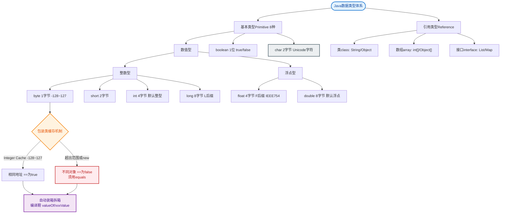
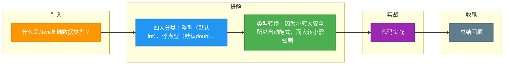

# 什么是Java基础数据类型？

### Java 基础数据类型

#### 八种基本数据类型
1. **整型**：`byte` (1字节), `short` (2字节), `int` (4字节, 默认), `long` (8字节)。
2. **浮点型**：`float` (4字节), `double` (8字节, 默认)。
3. **字符型**：`char` (2字节)。
4. **布尔型**：`boolean` (未明确指定大小)。

#### 对应包装类
基本类型都有对应的包装类，位于`java.lang`包：`Byte`, `Short`, `Integer`, `Long`, `Float`, `Double`, `Character`, `Boolean`。

#### 类型转换
- **自动类型转换（隐式）**：从小容量类型自动转换为大容量类型。如 `byte -> short -> int -> long -> float -> double`。
- **强制类型转换（显式）**：从大容量类型转换为小容量类型，可能损失精度。如 `int a = (int)3.14;`。
- **特殊运算符**：`++`, `--`, `+=` 等运算符内部自动包含强制类型转换，无需手动强转（不会报错）。

#### 基本类型 vs 包装类型
- **存储方式**：基本类型直接存储数值（栈）；包装类型是对象，存储引用（堆）。
- **默认值**：基本类型有默认值（如int为0）；包装类型默认为`null`。
- **比较方式**：基本类型用`==`比较值；包装类型建议用`equals`比较内容（注意缓存问题）。
- **自动拆装箱**：Java 5+支持基本类型和包装类之间的自动转换。

#### 内存结构对比
```text
栈内存                        堆内存
┌────────────────┐
│ int a = 10     │ <--- 直接存储值
└────────────────┘

┌────────────────┐         ┌────────────────┐
│ Integer b      │ ───────>│  对象头        │
│ (引用地址)      │         │  value = 10    │
└────────────────┘         │  ...           │
                          └────────────────┘
```

#### 深入细节：浮点数实现
- **存储原理**：`float` 和 `double` 遵循 IEEE 754 标准，由 符号位 + 指数位 + 尾数位 组成。
- **精度丢失**：二进制浮点数无法精确表示 0.1 等十进制小数（如同 1/3 无法用十进制有限位表示）。涉及金额计算时，应使用 `BigDecimal`。

#### 深入细节：Integer 缓存机制
- **范围**：`IntegerCache` 默认缓存 `-128` 到 `127` 之间的对象。
- **原理**：自动装箱时，如果值在此范围内，直接返回数组中的引用；否则 new 新对象。
- **配置**：最大值可通过 JVM 参数 `-XX:AutoBoxCacheMax=size` 调整。

#### 实战场景：NPE 空指针陷阱
在定义数据库查询的返回结果时，若使用 `Integer` 作为映射字段，当数据库中对应字段为 `NULL`，反序列化会得到 `null`。若后续代码将其作为基本类型 `int` 进行运算（如 `int total = count + 1`），JVM 自动拆箱时会抛出 `NullPointerException`。这在高并发接口中极难排查，建议 POJO 类中所有可能为空的数值字段强制使用包装类，并在业务层判空。

#### 代码示例：浮点数精度处理
```java
// 错误：浮点数运算丢失精度
System.out.println(0.1 + 0.2); // 输出 0.30000000000000004

// 正确：使用 BigDecimal
BigDecimal a = new BigDecimal("0.1");
BigDecimal b = new BigDecimal("0.2");
System.out.println(a.add(b)); // 输出 0.3
```

#### 常见考点
1. **Long 类型缓存吗？**：`Long` 也是缓存 -128 到 127，但 `Long` 的自动装箱在 Java 高版本中直接取值，不存在手动 new 的情况。`Character` 缓存 0-127。`Byte, Short, Integer` 均缓存 -128-127。`Float, Double` 不会缓存。
2. **为什么 float 赋值要加 f？**：Java 中小数字面量默认是 `double` 类型。将 `double` 赋值给 `float` 属于大容量转小容量，必须强制转型 `float f = 3.14f;`，否则编译报错（可能损失精度）。
3. **switch 支持哪些类型？**：Java 5 起支持 enum；Java 7 起支持 String；仅支持 byte, short, char, int 及其包装类（会自动拆箱），不支持 long, float, double。


## 核心流程图


## 记忆要点

- 四大分类：整型(默认int)、浮点型(默认double)、字符型(2字节)、布尔型
- 类型转换：因为小转大安全所以自动隐式，而大转小需强制显式可能丢精度
- 基础vs包装：基础存栈且有默认值，而包装存堆且默认为null
- Integer缓存：因为Cache机制，所以-128到127范围内的自动装箱会复用对象
- 精度避坑：二进制无法精确表示十进制小数，金额计算必须用BigDecimal

## 结构化回答

**30 秒电梯演讲：** 存储原始数据的八种内置类型，非对象，栈内存分配。打个比方，像乐高基础块，形状固定，直接拼插；不像高级组件（对象）还要包装。

**展开框架：**
1. **四大分类** — 整型(默认int)、浮点型(默认double)、字符型(2字节)、布尔型
2. **类型转换** — 因为小转大安全所以自动隐式，而大转小需强制显式可能丢精度
3. **基础vs包装** — 基础存栈且有默认值，而包装存堆且默认为null

**收尾：** 这三点都能配合实战聊。您想深入聊原理、对比还是避坑？

## 视频脚本

> 预计时长：2 分钟 | 由浅入深

| 时间 | 画面/字幕 | 口播台词 | 讲解要点 |
|------|----------|----------|----------|
| 0:00 | 标题卡：什么是Java基础数据类型 | "什么是Java基础数据类型？一句话——像乐高基础块，形状固定，直接拼插；不像高级组件（对象）还要包装。" | 开场钩子 |
| 0:40 | 概念动画/示意图 | "存储原始数据的八种内置类型，非对象，栈内存分配——像乐高基础块，形状固定，直接拼插；不像高级组件（对象）还要包装" | 核心定义 |
| 1:20 | 四大分类示意 | "整型(默认int)、浮点型(默认double)、字符型(2字节)、布尔型" | 要点1 |
| 2:00 | 总结卡 | "记住这几条，面试不慌。下期讲进阶追问。" | 收尾 |

### 视频流程图



