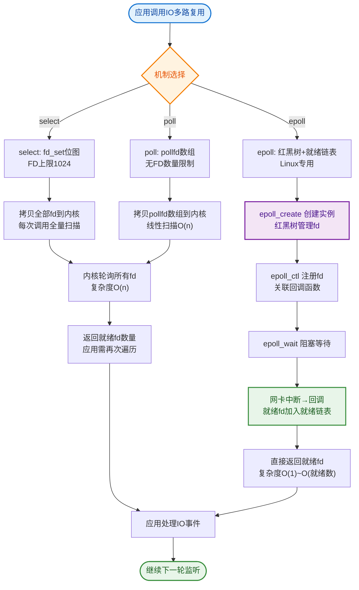

# 什么是Linux网络？

### Linux 网络模型（I/O 多路复用）

#### 1. Select
- **机制**：使用位图存储文件描述符。
- **缺点**：
  - 有最大连接数限制（通常1024）。
  - 每次调用都需要将 fd 集合从用户态拷贝到内核态。
  - 采用轮询方式检查就绪事件，时间复杂度 O(n)。

#### 2. Poll
- **机制**：使用链表/数组存储 fd，解决了数量限制问题。
- **缺点**：依然使用轮询，效率随连接数增加而线性下降（O(n)）。

#### 3. Epoll (Linux 特有)
- **机制**：
  - **红黑树存储**：内核使用红黑树管理所有监控的 fd，增删查效率高 O(log n)。
  - **事件驱动**：当 fd 就绪时，通过回调函数将其加入就绪链表。
  - **epoll_wait**：直接返回就绪链表内容，无需遍历所有 fd，效率 O(1)。
  - **共享内存**：内核与用户空间 mmap 共享内存，减少拷贝。

#### 4. Epoll 触发模式
- **水平触发（LT）**：默认模式。只要条件满足（如缓冲区有数据），就会一直通知。
- **边缘触发（ET）**：高效模式。只有在状态变化时（从无到有）通知一次。要求程序必须一次性读完数据，否则可能丢失后续通知。

#### 5. Select 与 Epoll 区别
| 特性 | Select | Epoll |
| :--- | :--- | :--- |
| 底层实现 | 轮询 | 事件驱动回调 |
| 复杂度 | O(n) | O(1) |
| 连接数限制 | 有限制（1024） | 无限制（受限于系统内存） |
| 消息拷贝 | 每次都拷贝 | 仅在初始化时拷贝 (mmap) |
| 适用场景 | 连接数少，活跃度高 | 连接数巨大，活跃度低 |

#### Epoll 工作原理流程图
```text
用户态                    内核态
  │                         │
  │  1. epoll_ctl(add)     │
  ├──────────────────────>│
  │                         │   ┌──────────────┐
  │                         ├──>│  红黑树      │
  │                         │   │ (管理所有fd) │
  │                         │   └──────┬───────┘
  │                         │          │
  │                         │          │ (当 fd 状态变化)
  │                         │          ▼
  │                         │   ┌──────────────┐
  │                         │   │  就绪链表    │
  │                         │   │ (回调函数加入)│
  │                         │   └──────┬───────┘
  │  2. epoll_wait         │          │
  ├──────────────────────>│          │
  │  <─────────────────────┼──────────┘
  │     (返回就绪链表)     │
  │                         │
```

#### 实战场景：C10K 问题与连接上限
在早期的即时通讯系统中，使用 Tomcat 默认的 BIO 模式，并发连接数达到 2000 时线程池耗尽，服务不可用。后来将通讯层替换为基于 Netty（底层 Epoll）重构，单机轻松支撑 10W+ 长连接。但在压测中发现，当并发超过 5W 时，吞吐量反而下降，经排查是由于 `sysctl fs.file-max` 和进程 `ulimit -n` 限制过小，导致“打开文件数过多”的异常，调整系统参数后解决。

#### 代码示例：Java NIO Selector 使用
```java
Selector selector = Selector.open();
ServerSocketChannel serverChannel = ServerSocketChannel.open();
serverChannel.bind(new InetSocketAddress(8080));
serverChannel.configureBlocking(false);
serverChannel.register(selector, SelectionKey.OP_ACCEPT);

while (true) {
    int readyCount = selector.select(); // 阻塞直到有事件就绪
    if (readyCount == 0) continue;
    Set<SelectionKey> selectedKeys = selector.selectedKeys();
    Iterator<SelectionKey> iter = selectedKeys.iterator();
    while (iter.hasNext()) {
        SelectionKey key = iter.next();
        if (key.isAcceptable()) { /* 处理连接 */ }
        iter.remove(); // 必须手动移除
    }
}
```

#### 常见考点
1. **Epoll 惊群现象是什么？**：多个进程/线程阻塞在同一个 epoll_wait 或 accept 上，当连接到来时，所有进程都被唤醒，但只有一个能成功处理，导致资源浪费。Linux 4.5+ 内核通过 `EPOLLEXCLUSIVE` 解决了此问题，Nginx 使用互斥锁解决。
2. **为什么 ET 模式比 LT 模式高效？**：LT 模式内核只要没处理完就会反复通知，导致上下文切换频繁；ET 模式只通知一次，减少了系统调用的次数，但对编程要求高，必须循环 `read` 直到返回 EAGAIN。
3. **Java NIO 对应哪种模型？**：在 Linux 上，Java NIO 的 `Selector` 底层默认使用 Epoll（JDK 1.5 update 10 之后），在 Mac 上使用 Kqueue，实现了对多路复用的跨平台封装。


## 核心流程图


## 记忆要点

- IO多路复用演进：Select有1024上限且轮询，Poll突破限制但依然轮询(O(n))
- Epoll高效原因：因为红黑树管理fd且基于事件回调，所以取出就绪链表复杂度为O(1)
- 触发模式对比：LT水平触发只要满足条件就一直通知，而ET边缘触发仅状态变化通知一次
- 内核交互：Epoll利用mmap共享内存，避免了用户态和内核态间的频繁数据拷贝
- 连接上限瓶颈：突破C10K不仅靠Epoll，还需调整内核参数fs.file-max和ulimit突破文件句柄数限制

## 结构化回答

**30 秒电梯演讲：** 单线程高效监控大量连接的I/O机制，Linux首选epoll。打个比方，快递员（线程）不用每家每户问（select），等客户打电话叫（epoll）。

**展开框架：**
1. **IO多路复用演进** — Select有1024上限且轮询，Poll突破限制但依然轮询(O(n))
2. **Epoll高效原因** — 因为红黑树管理fd且基于事件回调，所以取出就绪链表复杂度为O(1)
3. **触发模式对比** — LT水平触发只要满足条件就一直通知，而ET边缘触发仅状态变化通知一次

**收尾：** 这三点都能配合实战聊。您想深入聊原理、对比还是避坑？

## 视频脚本

> 预计时长：2 分钟 | 由浅入深

| 时间 | 画面/字幕 | 口播台词 | 讲解要点 |
|------|----------|----------|----------|
| 0:00 | 标题卡：什么是Linux网络 | "什么是Linux网络？一句话——快递员（线程）不用每家每户问（select），等客户打电话叫（epoll）。" | 开场钩子 |
| 0:40 | 概念动画/示意图 | "单线程高效监控大量连接的I/O机制，Linux首选epoll——快递员（线程）不用每家每户问（select），等客户打电话叫（epoll）" | 核心定义 |
| 1:20 | IO多路复用演进示意 | "Select有1024上限且轮询，Poll突破限制但依然轮询(O(n))" | 要点1 |
| 2:00 | 总结卡 | "记住这几条，面试不慌。下期讲进阶追问。" | 收尾 |
