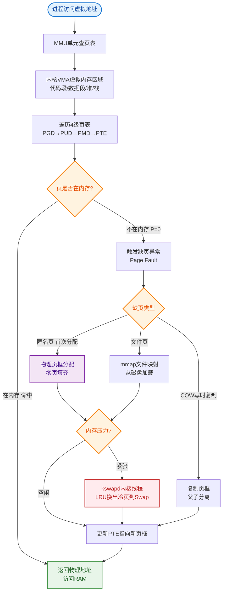

# 什么是Linux虚拟内存？

### Linux 虚拟内存

虚拟内存是操作系统内存管理的一种技术，它给进程造成一种错觉，认为自己独占了一块连续的、巨大的内存空间（如32位系统为4GB）。实际上，这块空间映射到了离散的物理内存和磁盘交换空间。

#### 1. 核心目的
- **隔离性**：进程间内存互不干扰，提高安全性和稳定性。通过页表权限位（R/W/X）实现保护。
- **扩充性**：利用磁盘空间作为补充，突破物理内存限制。
- **效率**：按需加载，提高内存利用率。

#### 2. 地址转换与架构
- **虚拟地址（VA）**：程序看到的逻辑地址。
- **物理地址（PA）**：硬件内存上的真实地址。
- **MMU（内存管理单元）**：硬件负责将虚拟地址快速转换为物理地址，过程中包含 **TLB（Translation Lookaside Buffer）** 缓存，加速页表查询。
- **多级页表**：为了节省页表本身的内存占用，现代OS使用多级页表结构（如Linux常见的4级页表：PGD -> PUD -> PMD -> PTE）。

**地址转换流程图：**
```
CPU (虚拟地址)
  │
  ▼
┌─────────────┐     TLB Miss?      ┌──────────────┐
│     TLB     │ ───────────────▶  │ 多级页表遍历  │
│ (高速缓存)   │                   │ (内存中的页表) │
└──────┬──────┘                   └──────┬───────┘
       │ Hit                             │
       ▼                                 ▼
┌─────────────┐                 ┌──────────────┐
│   物理地址   │                 │   物理地址    │
└─────────────┘                 └──────────────┘
```

#### 3. 分页机制（Paging）
- **页**：虚拟内存被切分成固定大小的块（通常4KB，也支持大页 Huge Page 如 2MB/1GB）。
- **页框**：物理内存被切分成同样大小的块。
- **页表项（PTE）**：包含物理页框号、标志位（Present/Dirty/Accessed/User/Supervisor）。

#### 4. 缺页异常
当进程访问的虚拟页不在物理内存中时（PTE Present 位为 0），触发缺页中断：
1. 操作系统挂起当前进程，内核态处理中断。
2. 在物理内存中寻找空闲页框。
3. 若内存不足，根据置换算法（如 LRU 的近似算法 Clock 算法）选择牺牲页，若该页是“脏页”（Dirty 位为 1）则写回磁盘（换出）。
4. 将所需数据从磁盘（或文件系统/Swap分区）加载到内存（换入）。
5. 更新页表映射，刷新 TLB。
6. 恢复进程执行，重新执行导致异常的指令。

#### 5. 页面淘汰算法细节
- **LRU（最近最少使用）**：性能好但实现成本高。
- **Clock 算法**：LRU 的近似实现。通过一个循环指针和访问位（Reference Bit）来淘汰页面。
- **工作集模型**：防止出现颠簸，保证进程活跃的页面集在内存中。

#### 实战场景：Redis 内存抖动与 Swap
在部署 Redis 节点时，曾遇到偶发性延迟飙升。监控显示此时的 CPU iowait 极高。经排查，物理内存虽未耗尽，但另一个进程发生内存泄漏导致系统开始使用 Swap 分区。Redis 访问的键值对被操作系统换出到磁盘，导致访问时触发缺页中断从磁盘读取数据。解决方案是将 Redis 进程锁定在内存中（`vm.overcommit_memory=1` 并禁用 Swap），确保纯内存操作。

#### 代码示例：Linux 查看缺页中断
```bash
# 使用 ps 查看进程的缺页中断统计（minflt/minor faults, majflt/major faults）
# minflt: 从内存读取（无磁盘IO）
# majflt: 从磁盘读取（有磁盘IO，严重影响性能）
ps -o pid,minflt,majflt,cmd -p <PID>

# 或使用 time 命令查看程序运行时的缺页情况
/usr/bin/time -v java -jar app.jar
# 输出中包含：
# Major (requiring I/O) page faults: 1
# Minor (reclaiming a frame) page faults: 142
```

#### 常见考点
1. **TLB 的作用**：解释为何TLB命中率对性能至关重要，TLB Miss 的开销。
2. **缺页中断处理流程**：区分硬缺页（需读盘）和软缺页（只需映射，如写时复制 COW）。
3. **大页内存**：何时使用大页？减少 TLB Miss，适用于数据库等内存密集型应用。
4. **Swap 分区**：Swap 在何时触发？swappiness 参数的含义。


## 核心流程图


## 记忆要点

- 核心目的：因为提供独立连续的逻辑地址，所以实现了进程间的内存隔离与扩充
- 地址转换：虚拟地址必须经过MMU硬件转换映射为物理地址，TLB缓存用于加速查询
- 缺页中断：当访问的数据不在物理内存(PTE Present=0)时，触发缺页异常并向磁盘换入换出
- 淘汰算法：因为LRU实现成本高，所以Linux底层采用访问位循环扫描的Clock算法近似替代
- Swap陷阱：Redis等高频访问服务若触发Swap换入换出会引发严重延迟，建议锁定物理内存

## 结构化回答

**30 秒电梯演讲：** 将物理内存抽象化，映射到连续虚拟空间，隔离进程。打个比方，像玩拼图，内存碎片拼成逻辑完整的画面，不用的图块暂放仓库。

**展开框架：**
1. **核心目的** — 因为提供独立连续的逻辑地址，所以实现了进程间的内存隔离与扩充
2. **地址转换** — 虚拟地址必须经过MMU硬件转换映射为物理地址，TLB缓存用于加速查询
3. **缺页中断** — 当访问的数据不在物理内存(PTE Present=0)时，触发缺页异常并向磁盘换入换出

**收尾：** 这三点都能配合实战聊。您想深入聊原理、对比还是避坑？

## 视频脚本

> 预计时长：2 分钟 | 由浅入深

| 时间 | 画面/字幕 | 口播台词 | 讲解要点 |
|------|----------|----------|----------|
| 0:00 | 标题卡：什么是Linux虚拟内存 | "什么是Linux虚拟内存？一句话——像玩拼图，内存碎片拼成逻辑完整的画面，不用的图块暂放仓库。" | 开场钩子 |
| 0:40 | 概念动画/示意图 | "将物理内存抽象化，映射到连续虚拟空间，隔离进程——像玩拼图，内存碎片拼成逻辑完整的画面，不用的图块暂放仓库" | 核心定义 |
| 1:20 | 核心目的示意 | "因为提供独立连续的逻辑地址，所以实现了进程间的内存隔离与扩充" | 要点1 |
| 2:00 | 总结卡 | "记住这几条，面试不慌。下期讲进阶追问。" | 收尾 |
