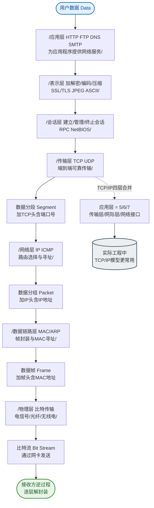

# 什么是OSI 七层参考模型？

### OSI 七层参考模型

OSI（Open System Interconnection）模型是ISO制定的网络通信标准框架，将通信过程从下到上分为七层。

#### 七层模型详解与数据封装
1. **物理层**：
   - 传输比特流（0/1）。
   - 定义电气特性、接口标准（如RJ45网线、光纤、集线器）。
   - **传输单元**：比特。
2. **数据链路层**：
   - 将比特组装成**帧**。
   - 负责MAC寻址（物理地址）、差错检测（CRC）、以太网协议、交换机工作在这一层。
   - **传输单元**：帧。
3. **网络层**：
   - 负责数据包的路由和转发（选择路径）。
   - IP地址寻址（IP协议、ICMP、ARP、路由器）。
   - **传输单元**：数据包。
4. **传输层**：
   - 提供端到端的**可靠**（TCP）或**不可靠**（UDP）传输。
   - 端口寻址，区分进程（复用与分用）。
   - **传输单元**：段或报文。
5. **会话层**：
   - 建立、管理和终止会话。
   - 会话同步与检查点（令牌管理）。
6. **表示层**：
   - 数据格式化、加密/解密、压缩/解压。
   - 确保不同系统应用层发送的数据能被对方读懂（如 JPEG, ASCII）。
7. **应用层**：
   - 直接为用户应用提供服务。
   - 常见协议：HTTP, FTP, SMTP, DNS, SSH。

#### 实战案例
在排查 **ARP 欺骗攻击**时，数据链路层分析至关重要。攻击者伪造虚假的 MAC-IP 映射广播帧，导致网关流量被劫持。通过 `arping` 或交换机端口镜像抓取二层帧，对比源 MAC 地址表，能快速定位攻击源 MAC。

#### 对比表格：OSI 模型与 TCP/IP 模型

| OSI 七层模型 | 对应 TCP/IP 四层模型 | 关键协议/设备 | 主要功能 |
| :--- | :--- | :--- | :--- |
| **应用层**<br>表示层<br>会话层 | **应用层** | HTTP, DNS, SSH | 处理用户数据、加密、会话管理 |
| **传输层** | **传输层** | TCP, UDP | 端到端传输、可靠性控制 |
| **网络层** | **网际层** | IP, ICMP, ARP | 路由选择、逻辑寻址 |
| **数据链路层**<br>物理层 | **网络接口层** | Ethernet, Wi-Fi, MAC | 物理传输、MAC 寻址 |

#### 数据封装与解封流程图
```
发送端 (封装)                  接收端 (解封)
│                             │
┌─────────────┐               ┌─────────────┐
│  应用层    │  DATA         │  应用层    │
└──────┬──────┘               └──────▲──────┘
       │                             │
┌──────▼──────┐  SEGMENT      ┌──────┴──────┐
│  传输层    │ HEAD+DATA     │  传输层    │
└──────┬──────┘               └──────▲──────┘
       │                             │
┌──────▼──────┐  PACKET       ┌──────┴──────┐
│  网络层    │ HEAD+SEGMENT  │  网络层    │
└──────┬──────┘               └──────▲──────┘
       │                             │
┌──────▼──────┐  FRAME        ┌──────┴──────┐
│ 数据链路层  │ HEAD+PACKET   │ 数据链路层  │
└──────┬──────┘               └──────▲──────┘
       │                             │
┌──────▼──────┐  BITS         ┌──────┴──────┐
│  物理层    │ 010101010...  │  物理层    │
└─────────────┘               └─────────────┘
```

#### 口诀
“物数网传会表应”（物理、数据链路、网络、传输、会话、表示、应用）。

## 常见考点
1. **TCP/IP 四层模型 vs OSI 七层模型**：TCP/IP 模型将 OSI 的上三层合并为应用层，下两层合并为网络接口层。
2. **设备所在层级**：集线器、交换机、路由器分别工作在哪一层？
3. **ARP 协议归属**：ARP 属于网络层（工作在 IP 和 MAC 之间），但在很多教材中被视为网络接口层协议。


## 核心流程图


## 记忆要点

- 七层口诀：物数网传会表应（物理、数据链路、网络、传输、会话、表示、应用）
- 单元递进：物理传比特，链路组帧，网络发包，传输提供端到端报文段
- 层级设备：集线器在物理层，交换机在数据链路层，而路由器在网络层
- 模型对比：TCP/IP四层模型将OSI上三层合并为应用层，下两层合并为网络接口层
- ARP归属：ARP虽常被视为网络接口层协议，但因其IP与MAC地址转换职责多归于网络层

## 结构化回答

**30 秒电梯演讲：** 网络通信分层标准，每层解决特定传输问题。打个比方，寄快递流程：打包（应用）、填单（表示）、排队（会话）、发货（传输）、中转（网络）、装车（链路）、上路（物理）。

**展开框架：**
1. **七层口诀** — 物数网传会表应（物理、数据链路、网络、传输、会话、表示、应用）
2. **单元递进** — 物理传比特，链路组帧，网络发包，传输提供端到端报文段
3. **层级设备** — 集线器在物理层，交换机在数据链路层，而路由器在网络层

**收尾：** 我在项目里踩过坑——在排查 ARP 欺骗攻击时，数据链路层分析至关重要。您想深入聊哪一段：原理、避坑还是对比选型？

## 视频脚本

> 预计时长：2 分钟 | 由浅入深

| 时间 | 画面/字幕 | 口播台词 | 讲解要点 |
|------|----------|----------|----------|
| 0:00 | 标题卡：什么是OSI 七层参考模型 | "什么是OSI 七层参考模型？一句话——寄快递流程：打包（应用）、填单（表示）、排队（会话）、发货（传输）、中转（网络）、装车（链路）、上路（物理）。" | 开场钩子 |
| 0:40 | 概念动画/示意图 | "网络通信分层标准，每层解决特定传输问题——寄快递流程：打包（应用）、填单（表示）、排队（会话）、发货（传输）、中转（网络）、装车（链路）、上路（物理）" | 核心定义 |
| 1:20 | 七层口诀示意 | "物数网传会表应（物理、数据链路、网络、传输、会话、表示、应用）" | 要点1 |
| 2:00 | 总结卡 | "记住这几条，面试不慌。下期讲进阶追问。" | 收尾 |
