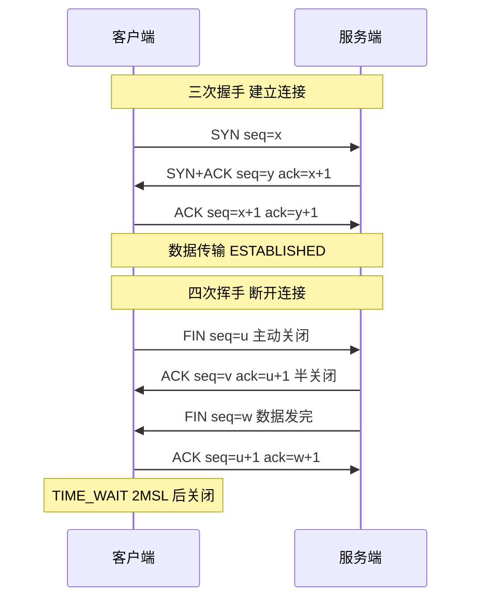

# 什么是TCP 抓包实践？

### TCP 抓包实践

#### 1. 抓包工具
- **Tcpdump**：Linux 命令行抓包工具，适合服务器端抓取并保存数据（.pcap文件）。常用命令：`tcpdump -i eth0 -nn -S host 192.168.1.1 and port 80`。
  - `-nn`：不解析域名和端口名，加快显示速度。
  - `-S`：以绝对序列号显示，方便计算偏移量。
- **Wireshark**：图形化网络分析工具，适合打开 .pcap 文件进行详细分析，强大的过滤表达式（如 `tcp.flags.syn==1`）。

#### 实战案例：排查接口偶发 40ms 延迟
在一次支付接口性能排查中，发现平均 RTT 仅 1ms，但偶发跳变至 40ms。通过 Wireshark 抓包发现，客户端请求包大小 < MSS，且服务端开启了 Delayed ACK，导致触发 **Nagle 算法与延迟确认的交互延迟**。解决方案是在服务端 Socket 开启 `TCP_QUICKACK` 选项或客户端禁用 Nagle 算法。

#### 2. TCP 三次握手异常分析
- **第一次握手 SYN 丢包**：客户端处于 `SYN_SENT` 状态，定时器到期后，指数退避重传 SYN（通常重试 5-6 次，间隔约 1s, 2s, 4s...），最终超时返回错误。
- **第二次握手 SYN+ACK 丢包**：
  - 客户端：未收到 SYN+ACK，重传 SYN。
  - 服务端：处于 `SYN_RCVD` 状态，未收到 ACK，重传 SYN+ACK。
  - 半连接队列：攻击点（SYN Flood 攻击），利用 `SYN Cookies` 防御。
- **第三次握手 ACK 丢包**：
  - 服务端：收到 SYN，建立连接，处于 `ESTABLISHED` 状态，可发送数据。
  - 客户端：未收到 SYN+ACK，认为连接未建立，重传 SYN。
  - 结果：服务端收到重传的 SYN，认为连接重复，发送旧 SYN+ACK（含序列号），客户端收到后发现序列号不对，发送 ACK（带正确确认号），连接恢复。此时服务端可能已存在重复连接（除非连接建立很快被回收）。

#### 3. TCP 快速建立连接
- **TCP Fast Open (TFO)**：
  - 客户端首次连接获取服务端的 Cookie。
  - 后续连接在 SYN 包中携带 Cookie 和应用数据。
  - 服务端验证 Cookie 有效，立即接受数据，将数据传给应用层。
  - 节省：1 个 RTT（原本需要 3 次握手才能传数据）。

#### 4. TCP 流量控制与优化
- **滑动窗口**：接收方通过 TCP 头部窗口大小告知发送方自己的接收缓冲区剩余空间，防止发送过快淹没接收方。
  - 0 窗口探查：当窗口为 0 时，发送方发送零窗口探查报文，防止死锁。
- **Nagle 算法**：
  - 原理：只有满足以下两个条件之一才发送数据：1. 已积累的数据量达到 MSS；2. 收到前一个包的 ACK。
  - 目的：减少小包（如 40 字节载荷+ 54 字节头部）在广域网上的传输，提高利用率。
  - 关闭：通过 `TCP_NODELAY` 选项关闭（如游戏、即时通讯对延迟敏感的场景）。
- **延迟确认**：
  - 原理：接收方不立即回复 ACK，等待一小段时间（Linux 默认 40ms），看是否有数据需回传，捎带 ACK。
  - 目的：减少 ACK 包的数量。

#### 代码示例：Java 禁用 Nagle 算法
```java
Socket socket = new Socket(host, port);
// 禁用 Nagle 算法，关闭缓冲，立即发送小数据包
socket.setTcpNoDelay(true);
```

#### 5. 常见问题
- **Nagle 算法与延迟确认的冲突**：
  - 场景：客户端开启 Nagle，服务端开启 Delayed ACK。
  - 现象：客户端发送请求，等待 ACK（未达到 MSS 或未收到旧 ACK）；服务端收到请求，等待 40ms 延迟 ACK 或数据回传。
  - 结果：往往导致 40ms~200ms 的延迟。解决：客户端关闭 Nagle，或服务端关闭 Delayed ACK。

## 常见考点
1. **常见 TCP 状态**：`TIME_WAIT` 状态产生原因和危害（占用端口资源），以及 `CLOSE_WAIT` 产生原因（程序未关闭 Socket）。
2. **Wireshark 过滤语法**：`tcp.flags.syn == 1 and tcp.flags.ack == 1` 等。
3. **SYN Flood 攻击原理**：如何利用半连接队列耗尽资源，`SYN Cookies` 如何防御。


## 核心架构图


## 记忆要点

- 核心工具：tcpdump常用于服务端命令行抓取底层包，而Wireshark偏向图形化过滤分析.pcap文件
- 经典延迟坑：Nagle算法(攒大数据)遇上Delayed ACK(延迟发送确认)，极易导致偶发40ms延迟
- 握手异常：若第三次握手ACK丢包，客户端会重发SYN，服务端重传确认以恢复连接
- 防御与优化：SYN Cookies防御半连接队列攻击，而TCP Fast Open(TFO)可省去握手RTT
- 滑动窗口：接收方通过TCP头部的窗口大小字段控制发送速率，0窗口探查用于防止死锁

## 结构化回答

**30 秒电梯演讲：** 利用工具抓取网络包，分析协议行为和故障。打个比方，像给血管做造影（抓包），观察血液流动（数据）哪里堵了。

**展开框架：**
1. **核心工具** — tcpdump常用于服务端命令行抓取底层包，而Wireshark偏向图形化过滤分析.pcap文件
2. **经典延迟坑** — Nagle算法(攒大数据)遇上Delayed ACK(延迟发送确认)，极易导致偶发40ms延迟
3. **握手异常** — 若第三次握手ACK丢包，客户端会重发SYN，服务端重传确认以恢复连接

**收尾：** 我在项目里踩过坑——实战案例：排查接口偶发 40ms 延迟。您想深入聊哪一段：原理、避坑还是对比选型？

## 视频脚本

> 预计时长：2 分钟 | 由浅入深

| 时间 | 画面/字幕 | 口播台词 | 讲解要点 |
|------|----------|----------|----------|
| 0:00 | 标题卡：什么是TCP 抓包实践 | "什么是TCP 抓包实践？一句话——像给血管做造影（抓包），观察血液流动（数据）哪里堵了。" | 开场钩子 |
| 0:40 | 概念动画/示意图 | "利用工具抓取网络包，分析协议行为和故障——像给血管做造影（抓包），观察血液流动（数据）哪里堵了" | 核心定义 |
| 1:20 | 核心工具示意 | "tcpdump常用于服务端命令行抓取底层包，而Wireshark偏向图形化过滤分析.pcap文件" | 要点1 |
| 2:00 | 总结卡 | "记住这几条，面试不慌。下期讲进阶追问。" | 收尾 |
