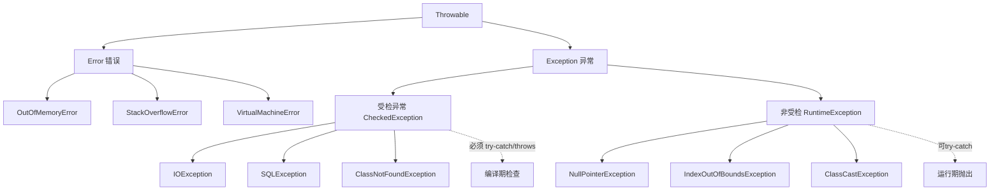

# 什么是Throwable？

### Throwable

`Throwable` 是 Java 语言中所有错误或异常的超类。它只有两个子类：`Error` 和 `Exception`。

#### 主要方法
1. **public String getMessage()**：返回关于发生的异常的详细信息。这个消息在 `Throwable` 类的构造函数中初始化。
2. **public Throwable getCause()**：返回一个 `Throwable` 对象代表异常原因。
3. **public String toString()**：使用 `getMessage()` 的结果返回类的串级名字。
4. **public void printStackTrace()**：打印 `toString()` 结果和栈层次到 `System.err`，即错误输出流。
5. **public StackTraceElement [] getStackTrace()**：返回一个包含堆栈层次的数组。下标为 0 的元素代表栈顶，最后一个元素代表方法调用堆栈的栈底。
6. **public Throwable fillInStackTrace()**：用当前的调用栈层次填充 `Throwable` 对象栈层次，添加到栈层次任何先前信息中。

#### 实战案例：异常链丢失陷阱
在开发中经常需要捕获一个异常并抛出另一个业务异常。如果直接 `throw new BusinessException("msg")` 而不保留原始异常，会导致现场丢失（如数据库连接失败的具体原因）。应使用 `initCause` 或带 cause 的构造函数，例如 `throw new BusinessException("Convert failed", e)`，以便在生产环境日志中追踪 Root Cause。

#### 对比表格：Error, Exception, RuntimeException 区别

| 类型 | 类名 | 特性 | 处理方式 | 典型示例 |
| :--- | :--- | :--- | :--- | :--- |
| **错误** | `Error` | JVM 级别严重问题，不可恢复 | 不建议捕获，程序终止 | `OutOfMemoryError`, `StackOverflowError` |
| **受检异常** | `Exception` (非 Runtime) | 编译期检查，必须处理 | Try-catch 或 Throws | `IOException`, `SQLException` |
| **非受检异常** | `RuntimeException` | 运行时发生，通常逻辑错误 | 可选捕获，往往需修正代码 | `NullPointerException`, `IndexOutOfBoundsException` |

#### 代码示例：自定义异常与异常链
```java
public class ResourceNotFoundException extends RuntimeException {
    public ResourceNotFoundException(String message, Throwable cause) {
        super(message, cause); // 保留原始异常堆栈
    }
}

// 使用示例
try {
    userDao.findById(id);
} catch (SQLException e) {
    // 将底层 SQL 异常包装为业务异常，并向上抛出
    throw new ResourceNotFoundException("User fetch failed", e);
}
```

## 技术原理

**Error 代表 JVM 级严重错误**
`Error` 及其子类（如 `OutOfMemoryError`、`StackOverflowError`、`VirtualMachineError`）表示 JVM 自身出现严重故障，程序通常无法恢复。例如 OOM 说明堆内存耗尽，`StackOverflowError` 说明栈深度超限。这类错误不应该在业务代码中 try-catch 捕获，因为即使捕获也无法保证后续逻辑的正确性，正确做法是让 JVM 终止并重启，或通过 JVM 参数、代码优化从根本上预防。

**Exception 代表程序可处理的异常**
`Exception` 是业务可处理的异常，分为受检异常（Checked Exception，除 RuntimeException 外）和非受检异常（RuntimeException 及其子类）。受检异常在编译期强制要求 try-catch 或 throws，如 `IOException`、`SQLException`，通常表示外部环境问题；非受检异常通常是代码逻辑错误，如 `NullPointerException`、`IllegalArgumentException`，编译器不强制处理，往往需要修正代码而非捕获。

**Throwable 是异常捕获机制的根基**
所有 `throw` 和 `catch` 的对象都必须是 `Throwable` 的子类。它提供了 `getMessage()` 获取错误描述、`getCause()` 获取根因、`printStackTrace()` 打印调用栈、`getStackTrace()` 编程式访问栈帧等核心方法，是 Java 异常处理体系的统一入口。

## 代码示例

```java
// 1. 保留异常链：抛出业务异常时传入原异常
try {
    userDao.findById(id);
} catch (SQLException e) {
    // 错误写法：throw new BusinessException("查询失败") —— 丢失了根因
    // 正确写法：保留原始异常，便于生产排查 Root Cause
    throw new ResourceNotFoundException("用户查询失败, id=" + id, e);
}
```

```java
// 2. 自定义异常体系
public class ResourceNotFoundException extends RuntimeException {
    public ResourceNotFoundException(String message, Throwable cause) {
        super(message, cause);   // 传入 cause 保留异常链
    }
}
// 受检异常则继承 Exception
public class BizCheckedException extends Exception {
    public BizCheckedException(String msg) { super(msg); }
}
```

## 注意事项

- 继承体系：Throwable 是顶级父类，仅有 Error 和 Exception 两个核心子类。
- 异常分类：受检异常必须 try-catch，而 RuntimeException 非受检异常常为代码逻辑错误。
- Error 处理：OOM 等 Error 属于 JVM 严重故障不可恢复，不建议在业务代码中捕获。
- 保留异常链：抛出自定义业务异常时必须传入原异常 e，避免吞掉底层 Root Cause 排查线索。
- 常用 API：getMessage() 获取简述，而 printStackTrace() 常用于直接打印详细调用栈（生产环境建议用日志框架替代）。


## 核心架构图



## 记忆要点

- 继承体系：Throwable是顶级父类，仅有Error和Exception两个核心子类
- 异常分类：受检异常必须try-catch，而RuntimeException非受检异常常为代码逻辑错误
- Error处理：OOM等Error属于JVM严重故障不可恢复，不建议在业务代码中捕获
- 保留异常链：抛出自定义业务异常时必须传入原异常e，避免吞掉底层Root Cause排查线索
- 常用API：getMessage()获取简述，而printStackTrace()常用于直接打印详细调用栈

## 结构化回答

**30 秒电梯演讲：** Java错误与异常体系的顶层父类。打个比方，所有Bug家族的“老祖宗”，分支为Error（不可救）和Exception（可尝试救）。

**展开框架：**
1. **继承体系** — Throwable是顶级父类，仅有Error和Exception两个核心子类
2. **异常分类** — 受检异常必须try-catch，而RuntimeException非受检异常常为代码逻辑错误
3. **Error处理** — OOM等Error属于JVM严重故障不可恢复，不建议在业务代码中捕获

**收尾：** 这三点都能配合实战聊。您想深入聊原理、对比还是避坑？

## 视频脚本

> 预计时长：2 分钟 | 由浅入深

| 时间 | 画面/字幕 | 口播台词 | 讲解要点 |
|------|----------|----------|----------|
| 0:00 | 标题卡：什么是Throwable | "什么是Throwable？一句话——所有Bug家族的“老祖宗”，分支为Error（不可救）和Exception（可尝试救）。" | 开场钩子 |
| 0:40 | 概念动画/示意图 | "Java错误与异常体系的顶层父类——所有Bug家族的“老祖宗”，分支为Error（不可救）和Exception（可尝试救）" | 核心定义 |
| 1:20 | 继承体系示意 | "Throwable是顶级父类，仅有Error和Exception两个核心子类" | 要点1 |
| 2:00 | 总结卡 | "记住这几条，面试不慌。下期讲进阶追问。" | 收尾 |
