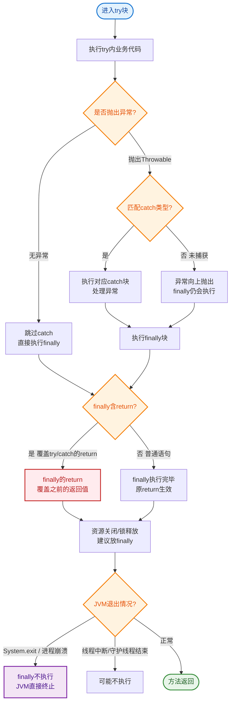

# 什么是finally？

### finally 块

`finally` 块通常跟在 `try` 或 `catch` 块之后，用于执行必须要执行的代码（如资源释放）。无论 `try` 或 `catch` 中是否发生异常，`finally` 中的代码大概率都会执行。

#### 执行机制
编译器会隐式地将 `finally` 块中的逻辑复制并添加到 `try` 和 `catch` 块的所有可能出口路径之后（通过跳转指令实现），以此保证其执行。

```text
┌─────────────────────────────────────────┐
│  Source Code Structure                 │
├─────────────────────────────────────────┤
│  try {                                  │
│      // 业务代码                         │
│      return result;  // (Exit Point 1)  │
│  } catch (Exception e) {                │
│      // 异常处理                         │
│      return result;  // (Exit Point 2)  │
│  } finally {                            │
│      // 清理代码 (必须执行)               │
│  }                                      │
└─────────────────────────────────────────┘
              ↓ 编译期转换
┌─────────────────────────────────────────┐
│  Bytecode Logic (Simplified)           │
├─────────────────────────────────────────┤
│  try {                                  │
│      // 业务代码                         │
│      var tmp = result;                  │
│      goto finally_code;                 │
│  } catch { ... }                        │
│                                         │
│  finally_code:                          │
│      // 清理代码                         │
│      return tmp;                        │
└─────────────────────────────────────────┘
```

#### 不执行的情况
只有在以下极端情况下，`finally` 块不会执行：
1. 在 `try-catch` 块中调用了 `System.exit(int)` 方法，强制终止了虚拟机。
2. 程序所在的线程意外死亡（如调用 `stop` 方法，该方法已废弃）。
3. 发生断电等硬件故障。

#### finally 与 return
1. **finally 中无 return**：`try` 或 `catch` 中的 `return` 语句会将返回值暂存到局部变量表或操作数栈中。`finally` 执行时若修改了该基本变量，不会影响已暂存的返回值（若是引用对象，可修改其属性）。最终返回暂存的值。
2. **finally 中有 return**：`finally` 中的 `return` 会覆盖 `try` 或 `catch` 中的返回值。这会掩盖之前的异常，且通常被视为不良编码习惯。

#### 实战案例
在流处理中，若在 `try` 块中打开文件流并发生异常，`finally` 块必须确保 `close()` 被调用。若在 `finally` 中再次抛出异常（如关闭 IO 异常），则会导致原始的业务异常被“吞掉”，增加排查难度。建议使用 `try-with-resources` 语法自动处理。

#### 代码示例 (Java)
```java
public int getData() {
    try {
        return 1; // 暂存结果 1
    } finally {
        // 即使修改返回值变量（假设是基本类型），最终仍返回 1
        // 但如果执行 return 2; 则最终返回 2，并覆盖 try 的逻辑
        return 2; 
    }
}
```

#### ## 常见考点
1. **执行顺序**：try/catch -> finally -> return。
2. **异常丢失**：在 finally 中抛出异常，或在 finally 中 return，会导致 try/catch 块中的异常被吞掉。
3. **性能影响**：现代 JVM 对 finally 优化很好，一般无需担心性能，但在极端高频路径下可通过代码结构调整优化。


## 核心流程图


## 记忆要点

- 执行机制：编译器会将finally代码块逻辑复制到try/catch的所有正常与异常出口路径
- 唯二不执行：只有虚拟机退出(System.exit)或当前线程意外被杀时，finally才不执行
- return避坑：finally中没有return时，修改基本变量不影响已暂存的返回值
- 异常吞噬：若在finally中return或抛出新异常，会导致掩盖try块中原有的业务异常
- 资源释放：为避免底层IO关闭异常被吞，推荐用try-with-resources替代传统finally手动close

## 结构化回答

**30 秒电梯演讲：** 无论异常与否都会执行的代码块。打个比方，就像出门上班（try）无论顺不顺，回家关门（finally）是必须做的动作。

**展开框架：**
1. **执行机制** — 编译器会将finally代码块逻辑复制到try/catch的所有正常与异常出口路径
2. **唯二不执行** — 只有虚拟机退出(System.exit)或当前线程意外被杀时，finally才不执行
3. **return避坑** — finally中没有return时，修改基本变量不影响已暂存的返回值

**收尾：** 我在项目里踩过坑——在流处理中，若在 `try` 块中打开文件流并发生异常，`finally` 块必须确保 `close()` 被调用。您想深入聊哪一段：原理、避坑还是对比选型？

## 视频脚本

> 预计时长：2 分钟 | 由浅入深

| 时间 | 画面/字幕 | 口播台词 | 讲解要点 |
|------|----------|----------|----------|
| 0:00 | 标题卡：什么是finally | "什么是finally？一句话——就像出门上班（try）无论顺不顺，回家关门（finally）是必须做的动作。" | 开场钩子 |
| 0:40 | 概念动画/示意图 | "无论异常与否都会执行的代码块——就像出门上班（try）无论顺不顺，回家关门（finally）是必须做的动作" | 核心定义 |
| 1:20 | 执行机制示意 | "编译器会将finally代码块逻辑复制到try/catch的所有正常与异常出口路径" | 要点1 |
| 2:00 | 总结卡 | "记住这几条，面试不慌。下期讲进阶追问。" | 收尾 |
