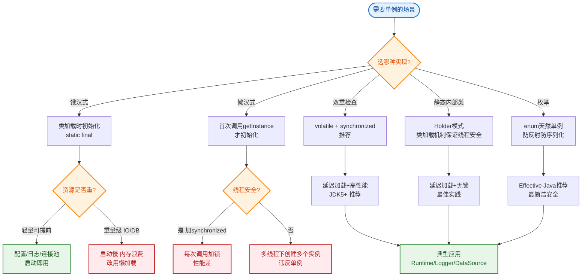

# 什么是单例模式的应用场景？

### 单例模式的应用场景

单例模式确保一个类只有一个实例，并提供一个全局访问点。

#### 核心应用场景
1. **资源共享**：
   - 当多个模块需要共享同一资源（如配置信息、缓存数据）时，使用单例可以避免重复创建和数据不一致。
   - 例如：**配置管理器**、**应用全局缓存**。

2. **控制资源访问**：
   - 对于昂贵或有限的资源，如数据库连接池、线程池，单例模式可以统一管理其生命周期和访问。
   - 例如：**数据库连接池**、**线程池**。

3. **日志记录器**：
   - 全局统一的日志出口，通常设计为单例，确保日志按顺序写入同一个文件或系统。
   - 例如：**Log4j/Slf4j 的 Logger**。

4. **工具类对象**：
   - 例如：**网站计数器**、**序列号生成器**。

#### 单例模式结构图
```text
      ┌───────────────────────────────────┐
      │           Client (调用方)         │
      └──────────────┬────────────────────┘
                     │ 获取实例
                     ▼
      ┌───────────────────────────────────┐
      │       Singleton (单例类)           │
      ├───────────────────────────────────┤
      │ - instance: Singleton (static)    │  <-- 唯一静态引用
      ├───────────────────────────────────┤
      │ - Singleton() (private)           │  <-- 私有构造防止外部new
      │ + getInstance(): Singleton        │  <-- 全局访问点
      └───────────────────────────────────┘
```

#### 反序列化破坏单例及解决方案
- **问题**：通过将单例对象序列化写入磁盘再读回来，会创建一个新的实例，破坏单例性。
- **解决方案**：
  - **枚举单例**：Java 枚举类型天然防止反序列化破坏，是实现单例的最佳实践。
  - **实现 readResolve()**：在单例类中添加 `readResolve()` 方法，返回当前单例实例，反序列化时会使用该方法的返回值替代新建对象。

```java
private Object readResolve() {
    return INSTANCE;
}```

#### 实战案例
在一个 Spring Boot 应用中，若使用双重检查锁（DCL）手动实现单例来管理 Redis 连接，由于 Spring 容器本身管理的 Bean 默认就是单例，手动单例容易导致 Bean 与非 Bean 生命周期管理混乱。最佳实践是直接交由 Spring 容器管理（`@Scope("singleton")`）。

#### 代码示例 (Java - 枚举单例)
```java
public enum EnumSingleton {
    INSTANCE;
    
    public void doSomething() {
        // 业务逻辑
    }
}
// 调用方式：EnumSingleton.INSTANCE.doSomething();
// 优势：不仅线程安全，还能天然防止反序列化和反射攻击破坏单例。
```

## 常见考点
1. **双重检查锁**：为什么要使用 `volatile` 关键字修饰单例实例？（防止指令重排序导致的半初始化对象引用逸出）。
2. **反射破坏单例**：如何通过反射调用私有构造器破坏单例？如何在构造函数中添加防御代码（如判断实例是否已存在，若存在则抛出异常）？
3. **ClassLoader**：不同的类加载器可能会加载同一个类多次，导致单例失效，如何处理？（通常由同一个类加载器加载或指定上下文类加载器）。


## 核心流程图


## 记忆要点

- 核心场景：资源共享(配置/缓存)、资源控制(数据库/线程池)、全局统一(日志)
- 实现要点：私有构造防外部new，静态实例提供全局访问点
- 最佳实践：Java推荐枚举单例，天然防止反射破坏和反序列化重新创建
- 高阶防御：DCL双重锁需配合volatile防指令重排，避免拿到半初始化对象

## 结构化回答

**30 秒电梯演讲：** 确保全局唯一实例的设计模式。打个比方，就像公司只有一位CEO，不管哪位员工要找老板，找到的都是同一个人。

**展开框架：**
1. **核心场景** — 资源共享(配置/缓存)、资源控制(数据库/线程池)、全局统一(日志)
2. **实现要点** — 私有构造防外部new，静态实例提供全局访问点
3. **最佳实践** — Java推荐枚举单例，天然防止反射破坏和反序列化重新创建

**收尾：** 我在项目里踩过坑——在一个 Spring Boot 应用中，若使用双重检查锁（DCL）手动实现单例来管理 Redis 连接，由于 Spring 容器本身管理的 Bean 默认就是单例，手动单例容易导致 Bean 与非 Bean 生命周期管理混乱。您想深入聊哪一段：原理、避坑还是对比选型？

## 视频脚本

> 预计时长：2 分钟 | 由浅入深

| 时间 | 画面/字幕 | 口播台词 | 讲解要点 |
|------|----------|----------|----------|
| 0:00 | 标题卡：什么是单例模式的应用场景 | "什么是单例模式的应用场景？一句话——就像公司只有一位CEO，不管哪位员工要找老板，找到的都是同一个人。" | 开场钩子 |
| 0:40 | 概念动画/示意图 | "确保全局唯一实例的设计模式——就像公司只有一位CEO，不管哪位员工要找老板，找到的都是同一个人" | 核心定义 |
| 1:20 | 核心场景示意 | "资源共享(配置/缓存)、资源控制(数据库/线程池)、全局统一(日志)" | 要点1 |
| 2:00 | 总结卡 | "记住这几条，面试不慌。下期讲进阶追问。" | 收尾 |
