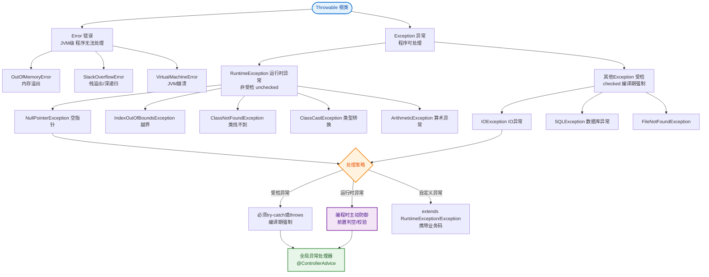

# 什么是异常分类？

### Java 异常分类

Java 异常体系中的顶层类是 `Throwable`，它派生出两个重要的子类：`Error` 和 `Exception`。

#### 异常体系结构图
```text
              ┌───────────┐
              │ Throwable │
              └─────┬─────┘
         ┌──────────┴──────────┐
         ▼                     ▼
    ┌─────────┐          ┌───────────┐
    │  Error  │          │ Exception │
    └────┬────┘          └─────┬─────┘
         │              ┌────────┴────────┐
         │              ▼                 ▼
         │      ┌──────────────┐  ┌──────────────┐
         │      │ Checked Ex.  │  │Runtime Ex.   │
         │      │ (IOException)│  │(NullPointerException)
         │      └──────────────┘  └──────────────┘
         │
         │ VirtualMachineError, StackOverflowError
```

#### 1. Error（错误）
- **定义**：表示 Java 运行时系统的内部错误或资源耗尽错误。
- **特点**：属于 JVM 层面的问题，应用程序无法通过代码捕获或处理。
- **示例**：`VirtualMachineError` (如 `StackOverflowError`, `OutOfMemoryError`)。
- **处理策略**：程序应直接终止，无法恢复。

#### 2. Exception（异常）
- **定义**：程序本身可以处理的异常。分为两大类：

**A. 受检异常**
- **定义**：编译器强制要求处理的异常。
- **特点**：代码中必须显式捕获（`try-catch`）或声明抛出（`throws`），否则编译不通过。
- **示例**：`IOException`, `SQLException`, `ClassNotFoundException`。
- **场景**：通常由外部环境因素引起（如文件不存在、网络中断）。

**B. 运行时异常**
- **定义**：编译器不强制要求处理的异常。
- **特点**：通常是由于编程逻辑错误导致的。可以选择捕获，也可以不处理。
- **示例**：`NullPointerException` (空指针), `ArrayIndexOutOfBoundsException` (数组越界), `ClassCastException` (类型转换), `ArithmeticException` (除零)。
- **场景**：程序逻辑缺陷，应在代码中通过预检查（如 `if (obj != null)`）来避免。

#### Error vs Exception vs 运行时异常
| 分类 | 类型 | 编译器检查 | 处理方式 | 典型场景 |
| :--- | :--- | :--- | :--- | :--- |
| **Error** | 错误 | 不检查 | 不可捕获，系统级崩溃 | 内存溢出、栈溢出 |
| **Checked Exception** | 受检异常 | **强制检查** | 必须捕获或声明抛出 | 文件读写、网络连接 |
| **Runtime Exception** | 运行时异常 | 不检查 | 通常需修正代码逻辑 | 空指针、除零、越界 |

#### 实战案例
在微服务调用中，下游服务返回 HTTP 500 或连接超时，通常封装为自定义的 `BusinessException`（继承 RuntimeException）。若使用受检异常（如 `throws IOException`），会导致所有调用链上层代码都需要处理或声明抛出，污染代码结构。**原则**：业务异常通常使用 RuntimeException，配合全局异常处理器（`@ControllerAdvice`）统一返回错误码。

#### 关键代码示例
```java
// 自定义业务异常（非受检）
public class BizException extends RuntimeException {
    private int code;
    public BizException(String msg, int code) {
        super(msg);
        this.code = code;
    }
}

// 使用 throw new BizException("用户不存在", 40001);
// 上层无需 try-catch，由 GlobalExceptionHandler 统一捕获
```

## 常见考点
1. **`try-catch-finally` 执行顺序**：`try` 块中有 `return`，`finally` 块也会执行吗？如果 `finally` 中也有 `return`，谁覆盖谁？（finally 必定执行，finally 中的 return 会覆盖 try/catch 中的返回值，且会抑制异常）。
2. **异常链**：如何捕获一个异常后抛出另一个异常，同时保留原始异常信息？（使用 `initCause()` 或带 cause 参数的构造函数）。
3. **性能影响**：异常处理对性能有何影响？异常堆栈填充的开销？（创建异常对象和填充堆栈非常耗时，不要用异常控制流程）。


## 核心流程图


## 记忆要点

- 顶层体系：Throwable 分为 Error 和 Exception 两大核心分支
- Error类：系统级错误(如OOM)，程序无法也不应捕获恢复
- 受检异常：编译器强制try-catch或throws，多用于外部依赖(如IO异常)
- 运行时异常：编译器不强制，多因代码逻辑缺陷(如空指针/越界)，可全局拦截

## 结构化回答

**30 秒电梯演讲：** Throwable下分为Error（不可治）和Exception（可治）。打个比方，Error是绝症（系统挂了），Exception是生病；CheckedException是必须去医院看的病，RuntimeException是自己作死引起的病（如空指针）。

**展开框架：**
1. **顶层体系** — Throwable 分为 Error 和 Exception 两大核心分支
2. **Error类** — 系统级错误(如OOM)，程序无法也不应捕获恢复
3. **受检异常** — 编译器强制try-catch或throws，多用于外部依赖(如IO异常)

**收尾：** 这三点都能配合实战聊。您想深入聊原理、对比还是避坑？

## 视频脚本

> 预计时长：2 分钟 | 由浅入深

| 时间 | 画面/字幕 | 口播台词 | 讲解要点 |
|------|----------|----------|----------|
| 0:00 | 标题卡：什么是异常分类 | "什么是异常分类？一句话——Error是绝症（系统挂了），Exception是生病；CheckedException是必须去医院看的病，RuntimeException是自己作死引起的病（如空指针）。" | 开场钩子 |
| 0:40 | 概念动画/示意图 | "Throwable下分为Error（不可治）和Exception（可治）——Error是绝症（系统挂了），Exception是生病；CheckedException是必须去医院看的病，RuntimeException是自己作死引起的病（如空指针）" | 核心定义 |
| 1:20 | 顶层体系示意 | "Throwable 分为 Error 和 Exception 两大核心分支" | 要点1 |
| 2:00 | 总结卡 | "记住这几条，面试不慌。下期讲进阶追问。" | 收尾 |
