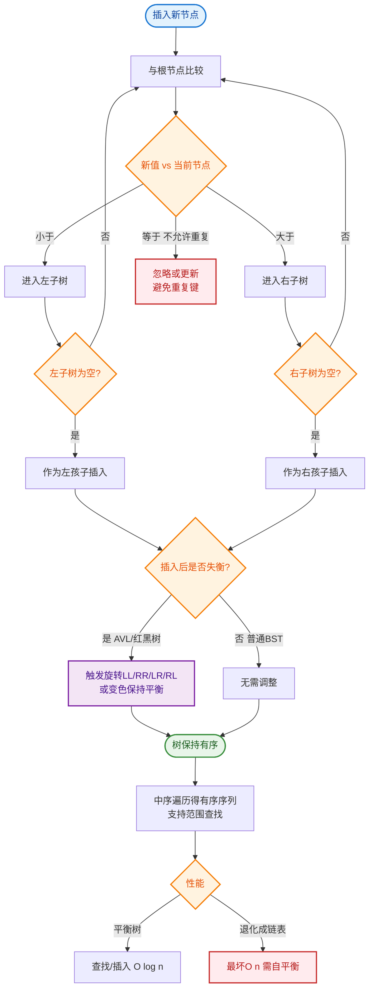

# 什么是排序二叉树？

### 排序二叉树（BST）

二叉排序树（Binary Sort Tree，BST），又称二叉查找树。它或者是一棵空树，或者是具有下列性质的二叉树：

#### 1. 基本性质
- 若左子树不空，则左子树上所有节点的值均小于它的根节点的值；
- 若右子树不空，则右子树上所有节点的值均大于它的根节点的值；
- 左、右子树也分别为二叉排序树。
- **中序遍历**：可以得到一个有序数列。

#### BST 结构示意图
```text
      ┌───── 50 (Root) ─────┐
     │                      │
   ┌─30─┐                ┌─70─┐
   │    │                │    │
 ┌20┐  ┌40┐            ┌60┐  ┌80┐
   │    │                │    │
 10    45               65    90

(所有左节点 < 父节点 < 所有右节点)
```

#### 2. 插入操作
- **流程**：从根节点开始，新节点与当前节点比较。
  - 若小于当前节点，移动到左子树；若左子树为空，则插入作为左子节点。
  - 若大于当前节点，移动到右子树；若右子树为空，则插入作为右子节点。
  - 若等于当前节点，通常不做处理（视具体实现而定）。

#### 3. 删除操作
- **流程**：主要分三种情况。
  1. **无子节点（叶子节点）**：直接删除，父节点对应位置置空。
  2. **只有一个子节点**：用其子节点替换该节点（直接接链）。
  3. **有两个子节点**：找到该节点右子树中的最小节点（后继节点），用该后继节点的值替换当前节点的值，然后删除后继节点。

#### 4. 特殊情况说明
- **退化**：如果插入的序列是有序的（如 1, 2, 3, 4, 5），BST 会退化成链表，查询效率从 O(logN) 退化为 O(N)。这也是引入 **平衡二叉树（AVL）** 或 **红黑树** 的原因。

#### BST vs 堆 vs 哈希表
| 数据结构 | 查找效率 | 插入/删除效率 | 是否有序 | 典型应用 |
| :--- | :--- | :--- | :--- | :--- |
| **二叉搜索树 (BST)** | 平均 O(logN), 最坏 O(N) | 同查找 | **是** (中序) | 简单的查找表 |
| **平衡二叉树 (AVL/红黑树)** | O(logN) | O(logN) (旋转耗时) | **是** | `TreeMap`, 数据库索引 |
| **二叉堆** | O(1) (只看堆顶) | O(logN) | 否 (仅堆顶有序) | 优先级队列 (`PriorityQueue`) |
| **哈希表** | O(1) | O(1) | 否 | `HashMap`, 快速查找 |

#### 实战案例
在实现范围查询功能时（如查找价格在 100~200 之间的商品），普通的 HashMap 无法高效支持范围扫描。**改进**：使用基于 BST 或红黑树实现的索引结构（如 SQL 的 B+树索引或 Java 的 `TreeMap`），利用其有序性，找到起始点后进行中序遍历，效率远高于全表扫描。

#### 关键代码示例 (Java)
```java
class TreeNode {
    int val;
    TreeNode left, right;
    TreeNode(int x) { val = x; }

    // BST 查找
    public TreeNode search(TreeNode root, int target) {
        if (root == null || root.val == target) return root;
        return target < root.val ? search(root.left, target) : search(root.right, target);
    }
}
```

## 常见考点
1. **查找复杂度**：理想情况下的查找复杂度是 O(logN)，最坏情况（退化成链表）是 O(N)。
2. **与堆的区别**：二叉搜索树（BST）满足左<根<右，用于查找；堆（通常大顶堆/小顶堆）满足父>子或父<子，用于优先级队列排序，不一定是完全二叉搜索树。
3. **平衡二叉树**：请简述 AVL 树或红黑树是如何通过旋转来维持平衡的？（LL, RR, LR, RL 旋转）。


## 核心流程图


## 记忆要点

- 核心性质：左子树严格小于根，右子树严格大于根，且左右子树同为BST
- 遍历特性：中序遍历二叉搜索树必定得到一个严格递增的有序序列
- 性能瓶颈：插入有序数据易退化为链表，查询复杂度由 O(logN) 降至 O(N)
- 引申结构：为解决退化问题，引入平衡二叉树(AVL)或红黑树保证效率

## 结构化回答

**30 秒电梯演讲：** 左小右大的二叉树结构，支持高效动态查找。打个比方，像二分查找的动态版本，比小的往左走，比大的往右走。

**展开框架：**
1. **核心性质** — 左子树严格小于根，右子树严格大于根，且左右子树同为BST
2. **遍历特性** — 中序遍历二叉搜索树必定得到一个严格递增的有序序列
3. **性能瓶颈** — 插入有序数据易退化为链表，查询复杂度由 O(logN) 降至 O(N)

**收尾：** 我在项目里踩过坑——在实现范围查询功能时（如查找价格在 100~200 之间的商品），普通的 HashMap 无法高效支持范围扫描。您想深入聊哪一段：原理、避坑还是对比选型？

## 视频脚本

> 预计时长：2 分钟 | 由浅入深

| 时间 | 画面/字幕 | 口播台词 | 讲解要点 |
|------|----------|----------|----------|
| 0:00 | 标题卡：什么是排序二叉树 | "什么是排序二叉树？一句话——像二分查找的动态版本，比小的往左走，比大的往右走。" | 开场钩子 |
| 0:40 | 概念动画/示意图 | "左小右大的二叉树结构，支持高效动态查找——像二分查找的动态版本，比小的往左走，比大的往右走" | 核心定义 |
| 1:20 | 核心性质示意 | "左子树严格小于根，右子树严格大于根，且左右子树同为BST" | 要点1 |
| 2:00 | 总结卡 | "记住这几条，面试不慌。下期讲进阶追问。" | 收尾 |
