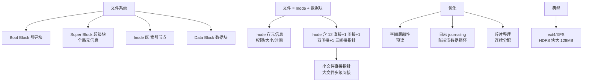

# 什么是文件系统的管理和优化？

**文件系统的管理和优化**

文件系统负责在存储设备上高效、可靠地组织和管理文件数据。

### 1. 磁盘空间管理

- **块大小**：
  - 文件系统将磁盘划分为固定大小的块（Block/Cluster）。常见大小为 4KB。
  - **权衡**：块越大，大文件读写效率越高（减少寻道），但小文件会产生严重的**内部碎片**（Internal Fragmentation，即文件尾部未占用的空间）。块越小，碎片少，但大文件需要更多的 I/O 操作和元数据管理。

- **空闲块管理**：
  - **位图法**：
    - 使用一个 bit 串表示磁盘块的状态，`1` 代表空闲，`0` 代表占用。
    - **优点**：查找连续空闲块效率高，占用空间小（N 个块只需 N/8 字节）。
  - **链表法**：
    - 所有空闲块通过指针链接成一个链表。
    - **缺点**：查找连续块需要遍历链表，效率低。
  - **分组链表 / 成组链接法（Linux Ext 系列类似机制）**：
    - 将空闲块分成组，每组第一块记录下一组空闲块的索引和数量。结合了链表和索引的优点。

- **磁盘配额**：
  - 限制用户或用户组可使用的 inode 数量（文件数）和数据块数量，防止单个用户耗尽资源。

### 2. 文件系统一致性

文件系统涉及元数据和实际数据的修改。如果在“读-改-写”过程中系统崩溃，会导致数据不一致：
- **不一致类型**：
  - **重复块**：多个文件指向同一个数据块。
  - **空指针块**：文件标记为已使用，但对应的数据块在空闲表中。
  - **孤儿 inode**：文件存在但未被任何目录项引用。

- **修复工具**：
  - **fsck (File System Check)**：在系统启动前挂载文件系统为只读模式，扫描并修复上述不一致问题。
  - **日志文件系统**：如 Ext4, XFS。先将修改操作写入日志，再更新实际数据。崩溃后只需重放日志即可恢复，避免了全盘扫描。

### 3. 文件系统优化

- **预读**：
  - 系统检测到顺序读取时，提前将后续数据块读入内存缓存，减少 I/O 等待。

- **延迟写**：
  - 数据写入时先不立即落盘，而是写入内存缓冲区，标记为“脏页”。积累一定量或超时后批量写入，减少磁盘 I/O 次数（风险是断电数据丢失，需配合 write-through/sync 策略）。

- **磁盘碎片整理**：
  - 定期将分散的文件块移动到连续的物理空间，提高顺序读写速度。

### 实战案例：解决“No space left on device”但磁盘有空间的问题
在运维日志采集服务时，曾遇到磁盘空间剩余 50% 但无法创建新文件的报错。经排查是因为大量小文件耗尽了 inode 数量（Ext4 默认 inode 比例固定）。解决方法是使用 `mkfs.ext4 -N large_number` 重新格式化分区以增加 inode 密度，或改用 XFS/Btrfs 等动态分配 inode 的文件系统。

### 关键配置示例 (Linux tuned)
```bash
# /sys/block/sda/queue/read_ahead_kb
# 调整预读大小为 128KB 以优化大文件顺序读取性能
echo 128 > /sys/block/sda/queue/read_ahead_kb

# 使用 xfs_io 调整文件系统预分配策略，防止碎片
xfs_io -c 'resbsp 1048576' /path/to/large_file
```

### 常见考点
1. **inode 与 data block 的区别**：理解元数据和数据的分离存储，以及 inode 耗尽（即使磁盘空间未满）无法创建新文件的问题。
2. **软链接与硬链接**：硬链接指向 inode，软链接指向路径；删除原文件后硬链接仍可访问，软链接失效。
3. **日志文件系统的优势**：简述 JFS/XFS/Ext4 如何通过日志保证数据一致性并加快开机速度。
4. **RAID 对文件系统的影响**：RAID 0/1/5/10 如何在不同层面（性能、冗余）影响文件系统的表现。


## 核心架构图



## 记忆要点

- 空间管理：块大提升大文件性能但增内部碎片，空闲块多用位图法管理
- 一致性：日志文件系统(如Ext4)先写日志再改数据，崩溃靠重放避免全盘扫
- 读写优化：顺序预读减少IO等待，延迟写(脏页)批量落盘提升吞吐量
- 经典异常：inode节点耗尽会导致磁盘有空间但报 No space left on device

## 结构化回答

**30 秒电梯演讲：** 高效分配存储空间并保证数据一致性的机制。打个比方，像图书馆管理员管理书架，记录空位、修补损坏的目录并防止一人占满书架。

**展开框架：**
1. **空间管理** — 块大提升大文件性能但增内部碎片，空闲块多用位图法管理
2. **一致性** — 日志文件系统(如Ext4)先写日志再改数据，崩溃靠重放避免全盘扫
3. **读写优化** — 顺序预读减少IO等待，延迟写(脏页)批量落盘提升吞吐量

**收尾：** 我在项目里踩过坑——实战案例：解决“No space left on device”但磁盘有空间的问题。您想深入聊哪一段：原理、避坑还是对比选型？

## 视频脚本

> 预计时长：2 分钟 | 由浅入深

| 时间 | 画面/字幕 | 口播台词 | 讲解要点 |
|------|----------|----------|----------|
| 0:00 | 标题卡：什么是文件系统的管理和优化 | "什么是文件系统的管理和优化？一句话——像图书馆管理员管理书架，记录空位、修补损坏的目录并防止一人占满书架。" | 开场钩子 |
| 0:40 | 概念动画/示意图 | "高效分配存储空间并保证数据一致性的机制——像图书馆管理员管理书架，记录空位、修补损坏的目录并防止一人占满书架" | 核心定义 |
| 1:20 | 空间管理示意 | "块大提升大文件性能但增内部碎片，空闲块多用位图法管理" | 要点1 |
| 2:00 | 总结卡 | "记住这几条，面试不慌。下期讲进阶追问。" | 收尾 |
