# 什么是文档注释？

**文档注释**

JDK 自带的 `javadoc` 工具用于根据源代码中的特殊注释生成 HTML 格式的 API 文档。这是 Java 生态系统保持文档与代码同步的重要机制。

### 使用规范

1.  **语法结构**：
    - 以 `/**` 开始，以 `*/` 结束。
    - 通常置于类、接口、方法、字段或包的定义之前。

2.  **常用标签**：
    - `@param <name> <description>`：描述方法的参数。
    - `@return <description>`：描述返回值。
    - `@throws <ClassName> <description>` 或 `@exception`：描述可能抛出的异常。
    - `@author <name>`：作者信息。
    - `@since <version>`：起始版本。
    - `@deprecated`：标记已过时，通常配合 `@see` 或 `{@link}` 指向替代方案。

3.  **HTML 支持**：
    注释内容中可以使用标准 HTML 标签（如 `<p>`, `<ul>`, `<code>`）进行排版。

### 补充：包与类路径机制

- **包**：
  - 使用 `package com.example;` 语句定义类的命名空间，防止命名冲突。
  - 包名通常对应文件系统的目录结构。

- **类路径**：
  - JVM 查找 `.class` 文件的路径列表。
  - 包含当前目录（`.`）、ZIP/JAR 文件或具体目录。
  - 通过 `-cp` 或 `-classpath` 参数设置。

- **JAR 文件**：
  - Java Archive，基于 ZIP 格式，用于打包编译后的类文件、资源文件和元数据。
  - 必须包含 `META-INF/MANIFEST.MF` 清单文件，可定义主类（`Main-Class`）、Classpath 等属性。

### 实战案例：利用 {@code} 避免文档解析错误
在编写涉及泛型或 `<` `>` 符号的文档时（如 `List<String>`），若直接写在注释中会被 HTML 解析器误判为标签。踩坑后统一使用 `{@code List<String>}` 标签，既解决了转义问题，又保持了代码样式的统一。

### 代码示例 (Java)
```java
/**
 * 计算折扣后的价格。
 *
 * @param originalPrice 原始价格，必须大于 0
 * @param discountRate 折扣率 (0.0 - 1.0)，例如 {@code 0.2} 代表 8 折
 * @return 折扣后的价格
 * @throws IllegalArgumentException 如果参数为负数
 * @see java.math.BigDecimal#multiply(BigDecimal)
 */
public BigDecimal calculateDiscount(BigDecimal originalPrice, double discountRate) {
    // implementation
}
```

### 常见考点
1.  **`@see` 与 `{@link}` 的区别**：`@see` 通常生成“另请参阅”段落，而 `{@link}` 可以在段落内嵌入超链接（如 `see {@link String}`）。
2.  **javadoc 编译选项**：如何指定编码（`-encoding`）、字符集（`-charset`）以及访问权限（`-public`, `-protected`, `-private`, `-package`）。
3.  **Overriding 方法的注释继承**：子类重写父类方法时，若不写注释，javadoc 默认会继承父类的文档注释；若写了，则替换父类。如何使用 `{@inheritDoc}` 标签继承父类部分注释。


## 核心架构图

```mermaid
flowchart TD
    classDef start fill:#4CAF50,color:#fff
    classDef process fill:#2196F3,color:#fff
    classDef decision fill:#FF9800,color:#fff
    classDef special fill:#9C27B0,color:#fff
    classDef error fill:#f44336,color:#fff
    classDef info fill:#607D8B,color:#fff
    class A start
    class API process
    class B decision
    class C special
    class D error
    class E info
    class F start
    class G process
    class H decision
    class HTML special
    class I error
    class IDE info
    class J start
    class Javadoc process
    class K decision
    class L special
    class M error
    class N info
    class O start
    class P process
    class Q decision
    class R special
    class S error
    class Spring info
    class SpringDoc start
    class Xxx process
    class author decision
    class d special
    class deprecated error
    class doc info
    class exception start
    class java process
    class javadoc decision
    class param special
    class return error
    class see info
    class since start
    class throws process
    class version decision
    A[文档注释 Javadoc] --> B["注释块 /** ... */"]
    B --> C[位于类/方法/字段声明前]
    D[常用标签] --> E["@param 参数说明"]
    D --> F["@return 返回值说明"]
    D --> G["@throws/@exception 异常说明"]
    D --> H["@author 作者"]
    D --> I["@version 版本号"]
    D --> J["@see 参考"]
    D --> K["@since 引入版本"]
    D --> L["@deprecated 废弃说明"]
    M[生成文档] --> N["javadoc -d doc Xxx.java"]
    N --> O[输出 HTML API 文档]
    P[价值] --> Q[规范团队接口]
    P --> R[IDE 智能提示]
    P --> S[Spring/SpringDoc 自动生成 API]
```



## 记忆要点

- 工具：因为配合javadoc工具，所以能生成HTML格式的API文档
- 语法：以 /** 开始，*/ 结尾，通常置于类或方法定义之前
- 标签：@param表参数，@return表返回值，@throws表异常
- 转义：因为HTML解析器易误判尖括号，所以泛型推荐用 {@code} 包裹
- 区别：@see 生成独立段落，而 {@link} 在行内嵌入超链接

## 结构化回答

**30 秒电梯演讲：** 写在代码里的特殊注释，可自动生成API文档。打个比方，像带有说明书草图的零件图纸，工具能自动把草图排版成精美手册。

**展开框架：**
1. **工具** — 因为配合javadoc工具，所以能生成HTML格式的API文档
2. **语法** — 以 /** 开始，*/ 结尾，通常置于类或方法定义之前
3. **标签** — @param表参数，@return表返回值，@throws表异常

**收尾：** 我在项目里踩过坑——实战案例：利用 {@code} 避免文档解析错误。您想深入聊哪一段：原理、避坑还是对比选型？

## 视频脚本

> 预计时长：2 分钟 | 由浅入深

| 时间 | 画面/字幕 | 口播台词 | 讲解要点 |
|------|----------|----------|----------|
| 0:00 | 标题卡：什么是文档注释 | "什么是文档注释？一句话——像带有说明书草图的零件图纸，工具能自动把草图排版成精美手册。" | 开场钩子 |
| 0:40 | 概念动画/示意图 | "写在代码里的特殊注释，可自动生成API文档——像带有说明书草图的零件图纸，工具能自动把草图排版成精美手册" | 核心定义 |
| 1:20 | 工具示意 | "因为配合javadoc工具，所以能生成HTML格式的API文档" | 要点1 |
| 2:00 | 总结卡 | "记住这几条，面试不慌。下期讲进阶追问。" | 收尾 |

### 视频流程图


