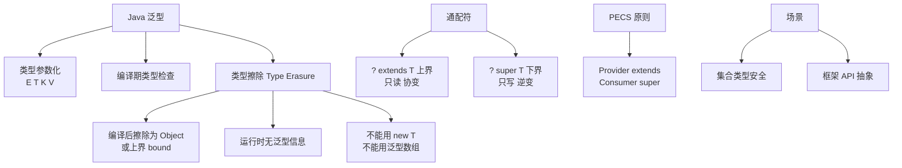

# 什么是泛型的使用？

**泛型的使用**

Java 5 引入泛型，提供了编译时类型安全检测机制，消除了强制类型转换的隐患（`ClassCastException`），使得代码更加健壮和可读。

### 核心作用

1.  **类型安全**：编译期检查类型，避免存入错误类型的数据。
2.  **消除强转**：取出数据时自动进行类型转换。
3.  **代码复用**：编写适用于多种类型的通用算法。

### 使用形式

1.  **泛型类**
    在类名后声明类型参数 `T`。
    ```java
    // 定义
    public class Box {
        private T value;
        public void set(T value) { this.value = value; }
        public T get() { return value; }
    }
    // 使用，泛型推断或显式指定
    Box<Integer> intBox = new Box<>(); // Java 7+ 支持菱形语法
    ```

2.  **泛型接口**
    ```java
    public interface Generator {
        T next();
    }
    // 实现类需指定具体类型，或者继续作为泛型类
    public class StringGenerator implements Generator<String> {
        public String next() { return "Hello"; }
    }
    ```

3.  **泛型方法**
    在方法返回类型前引入类型参数 ``，独立于类的类型参数。
    ```java
    public  void printArray(T[] array) {
        for (T element : array) System.out.println(element);
    }
    // 调用时，编译器通常能推断出 K 的类型
    ```

4.  **类型通配符**
    - `<?>`：无界通配符，用于未知类型，只能获取不能设置（set，null 除外）。
    - `<? extends T>`：上限通配符，用于读取数据（生产者），表示 T 或 T 的子类。
    - `<? super T>`：下限通配符，用于写入数据（消费者），表示 T 或 T 的父类。

### 实战案例：泛型与 JSON 序列化的坑
在使用 FastJSON 或 Jackson 将泛型对象 `Result<User>` 反序列化时，若直接传 `Result.class`，由于类型擦除，内部 `data` 字段会被反序列化为 `LinkedHashMap` 而非 `User`。实战中必须使用 `TypeReference`（Java）或 `ParameterizedType` 来传递完整的泛型类型信息。

### 代码示例 (PECS 原则应用)
```java
// source 生产数据，使用 extends
public static double sum(List<? extends Number> list) {
    double sum = 0;
    for (Number n : list) { // 只能读，不能写
        sum += n.doubleValue();
    }
    return sum;
}

// dest 消费数据，使用 super
public static void addNumbers(List<? super Integer> list) {
    list.add(10); // 可以写 Integer 及其子类
}
```

### 泛型选择对比 (PECS)

| 场景 | 通配符写法 | 读写行为 | 典型用途 |
| :--- | :--- | :--- | :--- |
| 生产者 (Producer) | `<? extends T>` | 只能读取 | API 响应解析、流计算输入 |
| 消费者 (Consumer) | `<? super T>` | 只能写入 | 集合填充、回调函数参数 |
| 无限制 | `<?>` | 只能读取 (null除外) | 作为不关心类型的中间参数 |
| 精确类型 | `<T>` | 可读写 | 类内部实现、返回值类型明确时 |

### 常见考点
1.  **泛型擦除**：Java 泛型是伪泛型，只在编译期存在，运行时字节码中所有泛型类型都会被擦除为 `Object` 或具体边界。不能直接创建泛型数组（`new T[]`）或使用 `instanceof` 判断泛型类型。
2.  **PECS 原则**：“Producer Extends, Consumer Super”。当需要从集合中读取数据（生产）时，使用 `extends`；当需要向集合写入数据（消费）时，使用 `super`。
3.  **桥接方法**：编译器为了保持泛型类型擦除后的多态性，会自动生成合成方法（桥接方法），在字节码层面连接子类重写的方法和父类泛型方法。


## 核心架构图



## 记忆要点

- 核心：因为提供编译期检查，所以能消除强转隐患并保障类型安全
- 形式：支持泛型类、泛型接口、泛型方法
- 口诀 PECS：频读用 extends（生产者），频写用 super（消费者）
- 通配符：<?> 无边界只能读不能写（null除外）
- 本质：伪泛型。因为编译后会类型擦除，所以运行时不存在泛型信息

## 结构化回答

**30 秒电梯演讲：** 参数化类型，让类和方法操作指定的数据类型。打个比方，像给贴有“水果”标签的篮子贴上具体“苹果”的标签，防止误放入石头。

**展开框架：**
1. **核心** — 因为提供编译期检查，所以能消除强转隐患并保障类型安全
2. **形式** — 支持泛型类、泛型接口、泛型方法
3. **口诀 PECS** — 频读用 extends（生产者），频写用 super（消费者）

**收尾：** 我在项目里踩过坑——实战案例：泛型与 JSON 序列化的坑。您想深入聊哪一段：原理、避坑还是对比选型？

## 视频脚本

> 预计时长：2 分钟 | 由浅入深

| 时间 | 画面/字幕 | 口播台词 | 讲解要点 |
|------|----------|----------|----------|
| 0:00 | 标题卡：什么是泛型的使用 | "什么是泛型的使用？一句话——像给贴有“水果”标签的篮子贴上具体“苹果”的标签，防止误放入石头。" | 开场钩子 |
| 0:40 | 概念动画/示意图 | "参数化类型，让类和方法操作指定的数据类型——像给贴有“水果”标签的篮子贴上具体“苹果”的标签，防止误放入石头" | 核心定义 |
| 1:20 | 核心示意 | "因为提供编译期检查，所以能消除强转隐患并保障类型安全" | 要点1 |
| 2:00 | 总结卡 | "记住这几条，面试不慌。下期讲进阶追问。" | 收尾 |
