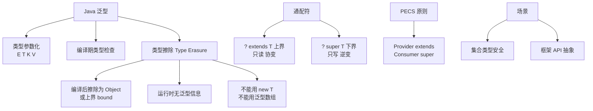

# 什么是泛型类<T>？

**泛型类**

泛型类是指在类声明时引入一个或多个类型参数的类。这些参数充当形式化参数，在实例化类时被具体的类型实参（如 `Integer`, `String`）所替换。

### 定义与示例

**类型参数命名规范**：通常使用单个大写字母，如 `T` (Type), `E` (Element), `K` (Key), `V` (Value), `N` (Number)。

```java
// 定义：T 是类型参数
public class Box {
    private T t;

    public void add(T t) {
        this.t = t;
    }

    public T get() {
        return t;
    }
}

// 使用：将 T 替换为 Integer
Box<Integer> integerBox = new Box<>();
integerBox.add(10);
Integer i = integerBox.get(); // 无需强制转换
```

### 进阶特性：通配符与限定

虽然题目问的是泛型类，但在使用泛型类时，通配符和类型限定是面试重点。

1.  **类型边界**：
    - ``：限制 T 必须是 Number 或其子类。

2.  **通配符使用**（通常用于方法参数或引用声明）：
    - `Box<? extends Number>`：可以接受 `Box<Integer>` 或 `Box<Double>`，用于读取数据。
    - `Box<? super Integer>`：可以接受 `Box<Integer>` 或 `Box<Number>`，用于写入数据。

### 泛型的本质

泛型的本质是**参数化类型**（Parameterized Type），它将数据类型也作为一个参数传递，使代码能够处理多种类型的数据，同时保持编译时的类型安全。常用于集合框架（`List`）和通用工具类。

### 实战案例：泛型类与静态上下文的冲突
在设计 `Pair<K, V>` 泛型工具类时，曾尝试编写一个静态工厂方法 `create(K key, V value)`，编译报错。因为静态方法属于类，在类加载时 `K`、`V` 尚未确定。解决方法是将该方法改为泛型方法 ``。

### 代码示例 (类型边界与数组模拟)
```java
public class NumericBox<T extends Number> {
    private T value;

    // 借助 Class 暴力创建泛型数组（虽然不推荐，但某些库源码会这么用）
    @SuppressWarnings("unchecked")
    public T[] createArray(int size) {
        // 这里的 getClass().getComponentType() 在运行时只能是 Number，所以不安全
        return (T[]) java.lang.reflect.Array.newInstance(value.getClass(), size);
    }
    
    // 利用边界调用 Number 的方法
    public int intValue() {
        return value.intValue(); // 合法，因为 T 限制为 Number
    }
}
```

### 常见考点
1.  **静态成员与泛型**：泛型类的静态方法或静态变量不能使用类的类型参数 `T`。因为静态成员在类加载时就已经确定，而 `T` 的具体类型是在实例化时确定的。
2.  **泛型数组问题**：为什么不能直接创建泛型数组 `List<String>[] listArray = new ArrayList<String>[10];`？因为泛型擦除会导致堆污染，可能破坏数组存储的类型检查机制。
3.  **泛型异常**：不能直接抛出或捕获泛型类型的异常（如 `catch(T e)`），因为异常处理机制依赖于运行时类型检查，而泛型在运行时已被擦除。


## 核心架构图


## 核心知识点图


## 记忆要点

- 定义：本质是参数化类型，将类型作为参数传递（如 T, E, K, V）
- 边界：通过 <T extends ClassName> 限制类型范围
- 限制：因为静态成员在类加载时确定，所以不能使用类的泛型参数 T
- 禁忌：因为类型擦除会破坏数组类型检查，所以禁止直接创建泛型数组
- 限制：因为运行时已擦除，所以不能用 instanceof 判断泛型类型

## 结构化回答

**30 秒电梯演讲：** 把类型当参数用的类，支持通配符限制类型范围。打个比方，像万能模具，先不定材质（类型），使用时再决定是做铁模还是铝模。

**展开框架：**
1. **定义** — 本质是参数化类型，将类型作为参数传递（如 T, E, K, V）
2. **边界** — 通过 <T extends ClassName> 限制类型范围
3. **限制** — 因为静态成员在类加载时确定，所以不能使用类的泛型参数 T

**收尾：** 我在项目里踩过坑——实战案例：泛型类与静态上下文的冲突。您想深入聊哪一段：原理、避坑还是对比选型？

## 视频脚本

> 预计时长：2 分钟 | 由浅入深

| 时间 | 画面/字幕 | 口播台词 | 讲解要点 |
|------|----------|----------|----------|
| 0:00 | 标题卡：什么是泛型类<T> | "什么是泛型类<T>？一句话——像万能模具，先不定材质（类型），使用时再决定是做铁模还是铝模。" | 开场钩子 |
| 0:40 | 概念动画/示意图 | "把类型当参数用的类，支持通配符限制类型范围——像万能模具，先不定材质（类型），使用时再决定是做铁模还是铝模" | 核心定义 |
| 1:20 | 定义示意 | "本质是参数化类型，将类型作为参数传递（如 T, E, K, V）" | 要点1 |
| 2:00 | 总结卡 | "记住这几条，面试不慌。下期讲进阶追问。" | 收尾 |
