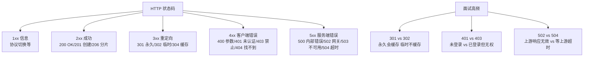

# 什么是消息编解码？

**消息编解码**

在 RPC（远程过程调用）框架中，消息编解码是实现网络通信的基础。

**1. 消息结构（协议）**
为了让服务端理解客户端的请求，请求消息通常包含以下部分：
- **接口名称**：调用的服务接口全限定名。
- **方法名**：调用的具体方法名称。
- **参数类型和参数值**：方法参数的具体类型定义和数值。
- **超时时间**：请求等待响应的最长时间。
- **requestID**：唯一标识一个请求，用于将响应与对应的请求匹配。

响应消息通常包含：**返回值**、**状态码** 和 **requestID**。

**2. 编码（序列化）**
客户端 stub 将上述信息序列化为二进制流或特定格式（如 JSON、Protobuf），以便在网络中传输。
- **关键细节**：
  - **魔数**：用于快速识别协议版本，防止解析非协议数据。
  - **序列化算法标识**：标识 body 使用的是 JSON、Hessian 还是 Protobuf，方便扩展。
  - **数据压缩**：对于大包，通常会进行 Snappy 或 GZIP 压缩以节省带宽。

**3. 解码（反序列化）**
服务端 stub 接收到二进制流后，将其反序列化为可读的对象，提取接口名、方法名和参数，进而调用本地服务。
- **边界条件**：处理半包/粘包问题（基于 TCP 流式传输），通常通过 Length-Field-Based frame decoder（基于长度字段的解码器）来解决。

### 实战案例：Protobuf 字段变更引发的解析失败
在升级微服务接口时，修改了 Protobuf 定义文件中的字段编号（而非添加字段）。导致未升级的消费端反序列化时发生错位，甚至引发 Panic/Exception。教训是： protobuf 协议中字段 tag 编号一旦发布生产环境，**永远禁止修改**，只能废弃或新增。

### 代码示例 (Netty LengthFieldPrepender 模拟)
```java
// 编码：将消息体长度作为前置 4 字节写入
// 对应 LengthFieldBasedFrameDecoder 的解码端
public byte[] encode(String content) throws IOException {
    byte[] body = content.getBytes(StandardCharsets.UTF_8);
    ByteArrayOutputStream baos = new ByteArrayOutputStream();
    DataOutputStream dos = new DataOutputStream(baos);
    
    // 写入消息体长度 (4 bytes)
    dos.writeInt(body.length);
    // 写入消息体
    dos.write(body);
    
    return baos.toByteArray();
}
```

### 编解码方案对比

| 维度 | Protobuf / Thrift | Hessian2 | JSON / XML |
| :--- | :--- | :--- | :--- |
| **数据格式** | 二进制 | 二进制 | 文本 |
| **序列化大小** | 极小 (紧凑) | 较小 | 大 (有标签冗余) |
| **解析性能** | 极高 (需预编译) | 高 | 低 (需大量字符串解析) |
| **可读性** | 差 (需 .proto 文件) | 差 | 优秀 (人类可读) |
| **兼容性** | 强 (基于 tag) | 一般 | 强 (字段冗余) |
| **适用场景** | 内部微服务高频调用 | 通用 RPC 框架 | 对外 API / 测试环境 |

**## 常见考点**
1. **为什么需要协议协商**：如何兼容不同版本的协议（如字段增删）？
2. **编解码性能对比**：Protobuf/Thrift (二进制，高效，跨语言) vs JSON (文本，可读性好，解析慢，包体大)。
3. **如何解决 TCP 粘包/拆包**：解释固定长度、分隔符、长度前缀三种方案的原理。


## 核心架构图


## 记忆要点

- 结构：RPC消息含头部(含长度/魔数)与消息体(接口/方法/参数/请求ID)
- 痛点：因为TCP是流式传输，所以解码端必须处理半包和粘包问题
- 对比：Protobuf二进制紧凑高效，而JSON文本可读性好但体积大
- 禁忌：因为基于 tag 标识解析，所以 Protobuf 字段编号发布后严禁修改

## 结构化回答

**30 秒电梯演讲：** 将调用信息转换为网络可传输的数据格式。打个比方，像写信，中文（对象）先翻译成摩尔斯电码（编码），接收方再翻译回中文（解码）。

**展开框架：**
1. **结构** — RPC消息含头部(含长度/魔数)与消息体(接口/方法/参数/请求ID)
2. **痛点** — 因为TCP是流式传输，所以解码端必须处理半包和粘包问题
3. **对比** — Protobuf二进制紧凑高效，而JSON文本可读性好但体积大

**收尾：** 我在项目里踩过坑——实战案例：Protobuf 字段变更引发的解析失败。您想深入聊哪一段：原理、避坑还是对比选型？

## 视频脚本

> 预计时长：2 分钟 | 由浅入深

| 时间 | 画面/字幕 | 口播台词 | 讲解要点 |
|------|----------|----------|----------|
| 0:00 | 标题卡：什么是消息编解码 | "什么是消息编解码？一句话——像写信，中文（对象）先翻译成摩尔斯电码（编码），接收方再翻译回中文（解码）。" | 开场钩子 |
| 0:40 | 概念动画/示意图 | "将调用信息转换为网络可传输的数据格式——像写信，中文（对象）先翻译成摩尔斯电码（编码），接收方再翻译回中文（解码）" | 核心定义 |
| 1:20 | 结构示意 | "RPC消息含头部(含长度/魔数)与消息体(接口/方法/参数/请求ID)" | 要点1 |
| 2:00 | 总结卡 | "记住这几条，面试不慌。下期讲进阶追问。" | 收尾 |
