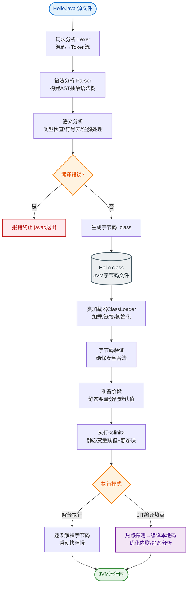

# 什么是编译系统如何工作？

**编译系统如何工作**

编译系统是将源代码转换为可执行程序的软件流水线，理解它有助于优化程序性能、理解链接错误及避免安全漏洞。

1.  **预处理**：处理 `#include`、`#define` 等指令，将源文件展开为纯文本（.i 文件）。
2.  **编译**：将预处理后的文本翻译成汇编代码（.s 文件）。涉及词法分析、语法分析、语义分析及中间代码优化。
3.  **汇编**：将汇编代码翻译成机器语言指令，生成可重定位目标文件（.o 或 .obj 文件）。
4.  **链接**：将多个目标文件和库函数组合，解析符号引用，生成最终的可执行目标文件。

**程序运行过程（以 Linux 为例）**：
当在 Shell 输入 `./hello` 时：
1.  Shell 读取指令并调用操作系统加载器。
2.  加载器将可执行文件的代码和数据从磁盘复制到内存（利用 DMA 技术）。
3.  处理器（CPU）开始执行内存中的指令，将字符串 "hello, world" 从内存复制到寄存器，再输出到显示设备。

**编译链接全流程图**：
```text
                    ┌──────────────┐
                    │   源代码      │
                    │  (.c/.cpp)   │
                    └──────┬───────┘
                           │ 预处理器
                           ▼
                    ┌──────────────┐
                    │ 修改后的源码  │
                    │    (.i)      │
                    └──────┬───────┘
                           │ 编译器
                           ▼
                    ┌──────────────┐
                    │   汇编代码    │
                    │    (.s)      │
                    └──────┬───────┘
                           │ 汇编器
                           ▼
          ┌────────────────┴────────────────┐
          ▼                                 ▼
   ┌─────────────┐                   ┌─────────────┐
   │ 可重定位文件 │       ...         │ 可重定位文件 │
   │    (.o)     │                   │    (.o)     │
   └──────┬──────┘                   └──────┬──────┘
          │                                 │
          └────────────────┬────────────────┘
                           │ 链接器
                           ▼
                    ┌──────────────┐
                    │  可执行文件   │
                    │ (Executable) │
                    └──────────────┘
```

**## 常见考点**
1.  **静态链接 vs 动态链接**：静态链接将库代码复制到可执行文件中（体积大，独立运行）；动态链接在运行时加载库（体积小，共享内存，版本依赖问题）。
2.  **符号解析与重定位**：链接器如何将全局符号引用（如 `printf`）与定义关联起来？
3.  **编译期优化**：常量折叠、死代码消除、循环展开等优化发生在哪个阶段？

---

**### 深化内容**

**1. 实战案例**
在大型 C++ 项目中，常遇到"Undefined Reference"错误，这通常发生在链接阶段，是因为头文件声明了函数但未链接对应的实现库（如忘记链接 `-lpthread`）。另一个常见坑是头文件重复包含，预处理导致符号重定义，需使用 `#pragma once` 或 `ifndef` 宏保护。

**2. 代码示例**
使用 GCC 指令分别查看编译系统的各个阶段产物：
```bash
# 1. 预处理：生成 main.i，查看宏展开结果
gcc -E main.c -o main.i

# 2. 编译：生成 main.s，查看汇编代码
gcc -S main.c -o main.s

# 3. 汇编：生成 main.o (机器码)
gcc -c main.c -o main.o

# 4. 链接：生成可执行文件
gcc main.o -o main
```

**3. 对比表格**

| 特性 | 静态链接 | 动态链接 |
| :--- | :--- | :--- |
**生成文件** | 可执行文件包含所有依赖代码 | 可执行文件较小，依赖 `.so`/`.dll` |
**启动速度** | 快（代码已加载，无需运行时解析） | 稍慢（需加载和重定位动态库） |
**内存占用** | 高（多进程间不共享库代码） | 低（多个进程共享物理内存中的同一库） |
**更新部署** | 困难（需重新编译整个程序） | 方便（只需替换 .so/.dll 文件） |
**常见场景** | 嵌入式设备、内核模块、无依赖环境 | GUI 应用、服务器、操作系统服务 |


## 核心流程图


## 记忆要点

- 四步曲：预处理(展开宏) -> 编译(生汇编) -> 汇编(生机器码.o) -> 链接(组合)
- 阶段：因为 #include 和宏定义需提前处理，所以预处理最先执行
- 区别：静态链接拷贝库代码体积大，而动态链接运行时加载体积小
- 报错：因为链接器找不到函数实现，所以报 Undefined Reference 错误

## 结构化回答

**30 秒电梯演讲：** 源代码经预处理、编译、汇编、链接生成可执行程序。打个比方，像烹饪，买菜（预处理）→切菜（编译）→烹饪（汇编）→摆盘（链接）→上桌（运行）。

**展开框架：**
1. **四步曲** — 预处理(展开宏) -> 编译(生汇编) -> 汇编(生机器码.o) -> 链接(组合)
2. **阶段** — 因为 #include 和宏定义需提前处理，所以预处理最先执行
3. **区别** — 静态链接拷贝库代码体积大，而动态链接运行时加载体积小

**收尾：** 我在项目里踩过坑——在大型 C++ 项目中，常遇到"Undefined Reference"错误，这通常发生在链接阶段，是因为头文件声明了函数但未链接对应的实现库（如忘记链接 `-lpthread`）。您想深入聊哪一段：原理、避坑还是对比选型？

## 视频脚本

> 预计时长：2 分钟 | 由浅入深

| 时间 | 画面/字幕 | 口播台词 | 讲解要点 |
|------|----------|----------|----------|
| 0:00 | 标题卡：什么是编译系统如何工作 | "什么是编译系统如何工作？一句话——像烹饪，买菜（预处理）→切菜（编译）→烹饪（汇编）→摆盘（链接）→上桌（运行）。" | 开场钩子 |
| 0:40 | 概念动画/示意图 | "源代码经预处理、编译、汇编、链接生成可执行程序——像烹饪，买菜（预处理）→切菜（编译）→烹饪（汇编）→摆盘（链接）→上桌（运行）" | 核心定义 |
| 1:20 | 四步曲示意 | "预处理(展开宏) -> 编译(生汇编) -> 汇编(生机器码.o) -> 链接(组合)" | 要点1 |
| 2:00 | 总结卡 | "记住这几条，面试不慌。下期讲进阶追问。" | 收尾 |

### 视频流程图


