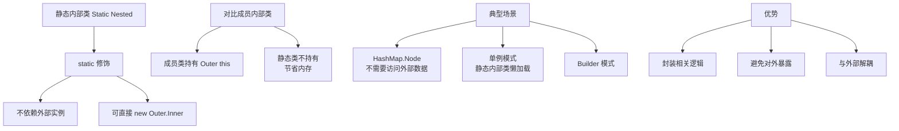
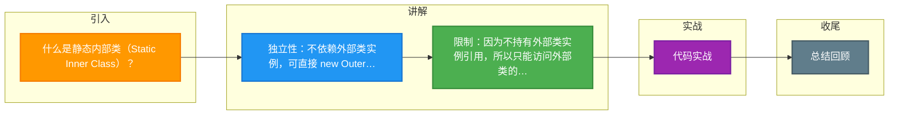

# 什么是静态内部类（Static Inner Class）？

**静态内部类**

静态内部类是用 `static` 修饰的成员内部类。

**特点：**
1.  **不依赖外部类实例**：创建静态内部类对象不需要先创建外部类对象：`Outer.Inner inner = new Outer.Inner();`。
2.  **不能访问外部类的非静态成员**：只能访问外部类的静态成员（因为不持有外部类实例的引用）。
3.  **可以定义静态成员**：普通内部类不能有静态成员，静态内部类可以。
4.  **编译后**：生成 `Outer$Inner.class`。

**典型应用场景：**
-   **Builder 模式**：`Person.Builder` 通常是静态内部类，方便 `new Person.Builder().build()`。
-   **辅助工具类**：只在外部类内部使用的工具类，用 static 避免与外部实例耦合。
-   **单例模式**：静态内部类实现懒加载单例（线程安全）。

**实战案例**：在 Android 开发中，Handler 经常被定义为静态内部类并持有 WeakReference，避免非静态内部类隐式持有 Activity 引用导致的内存泄漏。

**代码示例**（Java）:
```java
public class Outer {
    private int data = 10; // 非静态成员
    
    // 静态内部类
    public static class StaticInner {
        // static int x = 1; // 合法
        // void show() { System.out.println(data); } // 编译错误，无法访问 data
        
        public static void staticMethod() {
            System.out.println("Static Inner Method");
        }
    }
}
// 调用：new Outer.StaticInner().staticMethod();
```

**对比表格：**

| 特性 | 静态内部类 | 非静态内部类 (成员内部类) |
| :--- | :--- | :--- |
| **实例化方式** | `new Outer.Inner()` | `new Outer().new Inner()` |
| **持有外部类引用** | 否 | 是 (隐式持有 `Outer.this`) |
| **访问外部类成员** | 仅静态成员 | 静态 + 非静态成员 |
| **生命周期** | 独立于外部类实例 | 依赖外部类实例，外部类销毁则随之销毁 |
| **静态成员定义** | 支持 | 不支持 (JDK 16+ 支持静态成员，但不持有引用) |

**静态内部类实现单例（推荐）：**
```java
public class Singleton {
    private Singleton() {}
    private static class Holder {
        static final Singleton INSTANCE = new Singleton();
    }
    public static Singleton getInstance() {
        return Holder.INSTANCE;
    }
}
```
利用类加载机制保证线程安全和懒加载。

**## 常见考点**
1.  **为什么静态内部类实现单例是懒加载且线程安全的**？
    -   **原理**：Java 类加载机制保证了初始化锁。外部类加载时不会加载内部类，只有调用 `getInstance()` 访问 `Holder` 的静态字段时，JVM 才会加载 `Holder` 类并初始化 `INSTANCE`，且 JVM 保证该过程线程安全。
2.  **静态内部类 vs 非静态内部类（成员内部类）**：
    -   非静态内部类隐式持有外部类引用（`Outer.this`），可能导致内存泄漏（如在 Activity/Activity 中持有 Context）；静态内部类不持有。
3.  **非静态内部类为什么不能有静态成员**？
    -   因为非静态内部类依赖外部类实例，而静态成员属于类层级，如果允许，将产生语义冲突（无需实例即可访问依赖于实例的东西）。


## 核心架构图



## 记忆要点

- 独立性：不依赖外部类实例，可直接 new Outer.Inner() 创建
- 限制：因为不持有外部类实例引用，所以只能访问外部类的静态成员
- 特权：普通内部类不能有静态成员，而静态内部类可以
- 避坑：Handler 用静态内部类加弱引用，避免隐式持有导致内存泄漏
- 单例：因为利用类加载机制，所以天然实现懒加载且线程安全

## 结构化回答

**30 秒电梯演讲：** 不依赖外部类实例的内部类，可定义静态成员。打个比方，像钱包里的卡片，卡片属于钱包（类），但不依赖于钱包当前被拿着（实例）。

**展开框架：**
1. **独立性** — 不依赖外部类实例，可直接 new Outer.Inner() 创建
2. **限制** — 因为不持有外部类实例引用，所以只能访问外部类的静态成员
3. **特权** — 普通内部类不能有静态成员，而静态内部类可以

**收尾：** 我在项目里踩过坑——在 Android 开发中，Handler 经常被定义为静态内部类并持有 WeakReference，避免非静态内部类隐式持有 Activity 引用导致的内存泄漏。您想深入聊哪一段：原理、避坑还是对比选型？

## 视频脚本

> 预计时长：2 分钟 | 由浅入深

| 时间 | 画面/字幕 | 口播台词 | 讲解要点 |
|------|----------|----------|----------|
| 0:00 | 标题卡：什么是静态内部类（Static In… | "什么是静态内部类（Static Inner Class）？一句话——像钱包里的卡片，卡片属于钱包（类），但不依赖于钱包当前被拿着（实例）。" | 开场钩子 |
| 0:40 | 概念动画/示意图 | "不依赖外部类实例的内部类，可定义静态成员——像钱包里的卡片，卡片属于钱包（类），但不依赖于钱包当前被拿着（实例）" | 核心定义 |
| 1:20 | 独立性示意 | "不依赖外部类实例，可直接 new Outer.Inner() 创建" | 要点1 |
| 2:00 | 总结卡 | "记住这几条，面试不慌。下期讲进阶追问。" | 收尾 |

### 视频流程图



