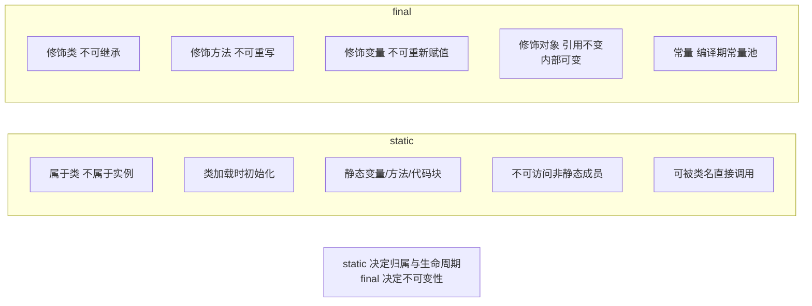

# 什么是静态字段与静态方法？

**静态字段与静态方法**

被 `static` 修饰的成员属于类本身，而不是类的某个具体实例。

**1. 静态字段**
-   静态字段属于类，在内存中只有一份副本，被所有对象共享。
-   非静态字段（实例字段）属于每个对象，每个对象都有独立的副本。

**2. 静态常量**
-   使用 `static final` 修饰的变量。
-   通常设为 public（如 `System.out`），因为其值不可变，安全性较高。

**3. 静态方法**
-   静态方法没有 `this` 隐式参数，不能直接访问实例字段和实例方法。
-   建议通过类名直接调用（如 `Math.pow()`），而不是通过对象引用。
-   **使用场景**：
    -   方法不需要访问对象状态（如工具方法）。
    -   方法仅需要访问类的静态字段。

**4. 静态工厂方法**
-   类似于 `LocalDate.now()` 或 `NumberFormat.getInstance()`。
-   **优点**：
    -   可以自定义命名（区别于构造器只能用类名）。
    -   可以返回子类型对象。
    -   可以控制实例的创建（如单例、缓存）。

**实战案例**：在使用 Hibernate/JPA 时，自定义 ID 生成器或策略通常需要无参构造函数和静态工厂方法。如果静态方法中误用了实例变量（如 `this`），会导致在类加载阶段而非实例化阶段出现难以预料的空指针异常或逻辑错误。

**代码示例**（Java）:
```java
public class Counter {
    private int instanceCount = 0; // 实例变量
    private static int staticCount = 0; // 静态变量

    public void increment() {
        instanceCount++;
        staticCount++;
    }

    // 静态方法无法访问 instanceCount
    public static int getStaticCount() {
        // return instanceCount; // 编译错误
        return staticCount;
    }
}
```

**静态成员内存布局图**：
```text
 JVM 堆内存                        方法区
┌──────────────────────────┐     ┌──────────────────────┐
│                          │     │                      │
│  Instance 1 (Object)     │     │   Class Metadata     │
│  ┌────────────────────┐  │────▶│  (Static Fields)     │
│  │ Instance Fields    │  │     │  ┌────────────────┐  │
│  └────────────────────┘  │     │  │ static count=2 │  │
│                          │     │  │ static ref...  │  │
│  Instance 2 (Object)     │     │  └────────────────┘  │
│  ┌────────────────────┐  │     │                      │
│  │ Instance Fields    │  │     │  (Static Methods)    │
│  └────────────────────┘  │     │  ┌────────────────┐  │
│                          │     │  │ methodA()...   │  │
└──────────────────────────┘     │  └────────────────┘  │
                                   └──────────────────────┘
```

**## 常见考点**
1.  **静态变量何时初始化**？
    -   类加载的**初始化阶段**（Initialization）。具体时机包括：创建类的实例、访问类的静态方法/静态字段、反射调用、子类初始化触发父类初始化等。
2.  **静态代码块执行顺序**：
    -   父类静态代码块 -> 子类静态代码块 -> 父类实例代码块/构造函数 -> 子类实例代码块/构造函数。
3.  **静态方法能否被重写**？
    -   **不能**。静态方法属于类，不参与多态。子类定义同名静态方法属于"隐藏"（Hide），而非重写（Override）。


## 核心架构图



## 记忆要点

- 归属：属于类级别全局唯一，被所有实例共享，而非属于单一实例对象
- 限制：因为无 this 隐式参数，所以静态方法不能直接访问实例变量或方法
- 调用：推荐直接使用类名调用，而不是通过具体对象实例调用
- 工厂：静态工厂方法可自定义命名、返回子类型，优于构造器
- 多态：子类同名静态方法是隐藏而非重写，因为静态方法不参与多态

## 结构化回答

**30 秒电梯演讲：** 属于类而非对象的成员，所有实例共享同一份。打个比方，像学校的校名（静态字段），属于学校这个类，所有学生共用；而学号是每个学生独有的。

**展开框架：**
1. **归属** — 属于类级别全局唯一，被所有实例共享，而非属于单一实例对象
2. **限制** — 因为无 this 隐式参数，所以静态方法不能直接访问实例变量或方法
3. **调用** — 推荐直接使用类名调用，而不是通过具体对象实例调用

**收尾：** 我在项目里踩过坑——在使用 Hibernate/JPA 时，自定义 ID 生成器或策略通常需要无参构造函数和静态工厂方法。您想深入聊哪一段：原理、避坑还是对比选型？

## 视频脚本

> 预计时长：2 分钟 | 由浅入深

| 时间 | 画面/字幕 | 口播台词 | 讲解要点 |
|------|----------|----------|----------|
| 0:00 | 标题卡：什么是静态字段与静态方法 | "什么是静态字段与静态方法？一句话——像学校的校名（静态字段），属于学校这个类，所有学生共用；而学号是每个学生独有的。" | 开场钩子 |
| 0:40 | 概念动画/示意图 | "属于类而非对象的成员，所有实例共享同一份——像学校的校名（静态字段），属于学校这个类，所有学生共用；而学号是每个学生独有的" | 核心定义 |
| 1:20 | 归属示意 | "属于类级别全局唯一，被所有实例共享，而非属于单一实例对象" | 要点1 |
| 2:00 | 总结卡 | "记住这几条，面试不慌。下期讲进阶追问。" | 收尾 |
