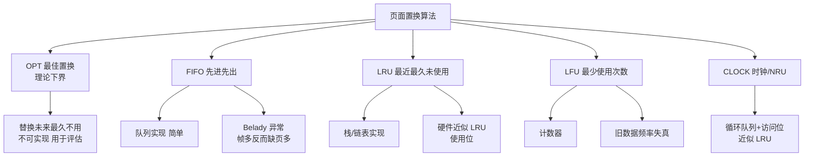

# 什么是页面置换算法？

**页面置换算法**

在虚拟内存管理中，当发生缺页中断且物理内存已满时，操作系统必须选择一个物理页换出到磁盘，以便为即将访问的页面腾出空间。页面置换算法的选择直接影响系统的性能（缺页率）。

**1. 最佳页面置换算法 (OPT)**
-   **策略**：置换在「未来」最长时间不访问的页面。
-   **特点**：理论上的最优算法，缺页率最低。
-   **局限性**：无法实现，因为程序访问页面是动态的，无法预知未来。通常用作衡量其他算法效率的标准。

**2. 先进先出算法 (FIFO)**
-   **策略**：选择最早进入内存的页面进行置换。
-   **实现**：维护一个页面队列，新页面加队尾，淘汰队首。
-   **缺点**：
    -   可能会淘汰经常使用的页面（如初始化代码、内核循环代码）。
    -   **Belady 异常**：分配给进程的物理页数增加时，缺页率反而可能增加。

**3. 最近最少使用算法 (LRU)**
-   **策略**：选择最长时间没有被访问过的页面进行置换。基于"局部性原理"（最近用过的可能很快再用）。
-   **实现**：需要记录每个页面的访问时间或维护一个访问链表，硬件支持成本较高。

**4. 时钟页面置换算法**
-   **策略**：LRU 的近似实现，软硬件开销折中方案。
-   **原理**：将所有页面通过环形链表连接，每个页面有一个访问位（Use Bit，0或1）。
    -   当缺页时，指针遍历页面。
    -   若 Use Bit = 1，置为 0（给第二次机会），指针前移。
    -   若 Use Bit = 0，置换该页面。

**5. 最不常用算法 (LFU)**
-   **策略**：记录每个页面访问次数，淘汰访问次数最少的页面。
-   **缺点**：需要统计计数，额外开销大；且可能导致历史高频但近期不再访问的页面无法被淘汰。

**实战案例**：在高并发 Redis 缓存淘汰策略中，LRU 算法被广泛使用（近似 LRU 算法）。如果错误地使用 FIFO 淘汰热点数据，会导致缓存命中率骤降，请求直接击穿缓存打满数据库，造成雪崩效应。

**代码示例**（Python - LRU 简化模拟）:
```python
from collections import OrderedDict

class LRUCache:
    def __init__(self, capacity: int):
        self.cache = OrderedDict()
        self.capacity = capacity

    def get(self, key: int) -> int:
        if key not in self.cache: return -1
        self.cache.move_to_end(key) # 访问时移到末尾
        return self.cache[key]

    def put(self, key: int, value: int) -> None:
        if key in self.cache: self.cache.move_to_end(key)
        self.cache[key] = value
        if len(self.cache) > self.capacity:
            self.cache.popitem(last=False) # 移除首部（最久未用）
```

**对比表格：**

| 算法 | 核心逻辑 | 优点 | 缺点 | 适用场景 |
| :--- | :--- | :--- | :--- | :--- |
| **OPT** | 置换未来最久不使用的页面 | 缺页率最低 | 无法预知未来，不可实现 | 理论基准对比 |
| **FIFO** | 置换最早进入的页面 | 实现简单 | Belady 异常，可能淘汰热点数据 | 简单场景，性能要求不高 |
| **LRU** | 置换过去最久未使用的页面 | 符合局部性原理，命中率高 | 需要记录访问历史，硬件开销大 | 通用操作系统，Redis 缓存 |
| **Clock** | 置换未被访问的页面 (循环扫描) | 近似 LRU，开销小 | 精度不如 LRU | Linux 通用页面置换 |
| **LFU** | 置换访问频率最低的页面 | 保留高频数据 | 计数器开销大，难以应对频率变化 | 访问模式相对稳定的场景 |

**时钟置换算法流程图**：
```text
      环形链表 (物理页面队列)
          ▲
          │
          │  (Clock Hand 指针)
          │
    ┌─────┴─────┐
    │           │
┌───▼───┐   ┌───▼───┐   ┌───▼───┐
│ Page 1│   │ Page 2│   │ Page 3│  ...
│Use=0  │   │Use=1  │   │Use=0  │
└───────┘   └───────┘   └───────┘
   ▲                       △
   └───────────┬───────────┘
               │
      缺页时指针顺时针扫描：
      1. Use=1 -> 改为0，继续走
      2. Use=0 -> 淘汰该页
```

**## 常见考点**
1.  **Belady 异常**：解释为什么 FIFO 会产生该现象？通常是因为 FIFO 简单地按时间排序，忽略了页面的访问频率，导致保留无用页面而淘汰频繁使用的页面。
2.  **LRU 的具体实现方式**：
    -   硬件实现：利用 TLB 或页表项中的 referenced/modified 位结合定时中断。
    -   软件实现：利用链表或栈，开销较大，通常使用 Clock 算法近似。
3.  **局部性原理**：解释为什么 LRU 通常表现较好？程序执行具有时间局限性（当前执行的代码近期大概率还会执行）和空间局限性。


## 核心架构图


## 核心知识点图


## 记忆要点

- OPT：置换未来最久不访问的页面，因无法预知未来仅作理论基准
- FIFO：简单先进先出，但可能淘汰热点，且存在缺页率反常的 Belady 异常
- LRU：淘汰最久未访问页面，命中率高但硬件开销大，适合内存与Redis缓存
- Clock：环形链表加访问位，若 Use=1 则改0给二次机会，若 Use=0 则淘汰

## 结构化回答

**30 秒电梯演讲：** 内存满时淘汰旧页面的策略。打个比方，书架满了，挑一本旧书扔掉再放新书。

**展开框架：**
1. **OPT** — 置换未来最久不访问的页面，因无法预知未来仅作理论基准
2. **FIFO** — 简单先进先出，但可能淘汰热点，且存在缺页率反常的 Belady 异常
3. **LRU** — 淘汰最久未访问页面，命中率高但硬件开销大，适合内存与Redis缓存

**收尾：** 我在项目里踩过坑——在高并发 Redis 缓存淘汰策略中，LRU 算法被广泛使用（近似 LRU 算法）。您想深入聊哪一段：原理、避坑还是对比选型？

## 视频脚本

> 预计时长：2 分钟 | 由浅入深

| 时间 | 画面/字幕 | 口播台词 | 讲解要点 |
|------|----------|----------|----------|
| 0:00 | 标题卡：什么是页面置换算法 | "什么是页面置换算法？一句话——书架满了，挑一本旧书扔掉再放新书。" | 开场钩子 |
| 0:40 | 概念动画/示意图 | "内存满时淘汰旧页面的策略——书架满了，挑一本旧书扔掉再放新书" | 核心定义 |
| 1:20 | 示意 | "置换未来最久不访问的页面，因无法预知未来仅作理论基准" | 要点1 |
| 2:00 | 总结卡 | "记住这几条，面试不慌。下期讲进阶追问。" | 收尾 |
