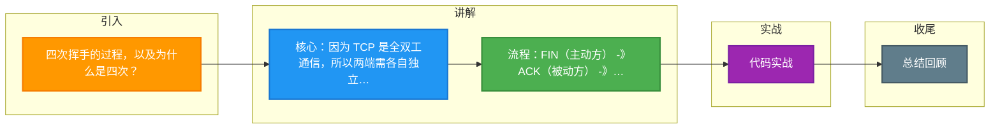

# 四次挥手的过程，以及为什么是四次？

TCP 是全双工协议，意味着数据可以在两个方向上同时传输。因此，每个方向都必须单独关闭。四次挥手（Four-Way Wavehand）正是为了确保双方都明确知道对方的数据传输已结束。

### 四次挥手详细流程

假设客户端主动发起关闭（被动关闭流程对称）：

1. **第一次挥手 (FIN)**：
   - 客户端发送 `FIN` 报文，序列号 `seq = u`。
   - 客户端进入 `FIN-WAIT-1` 状态。
   - 含义：客户端无数据发送了，申请关闭连接。

2. **第二次挥手 (ACK)**：
   - 服务端收到 `FIN`，发送 `ACK` 报文，确认号 `ack = u + 1`，序列号 `seq = v`。
   - 服务端进入 `CLOSE-WAIT` 状态。
   - 客户端收到 `ACK` 后进入 `FIN-WAIT-2` 状态。
   - 含义：服务端确认了客户端的关闭请求，但此时服务端可能还有数据需要传输给客户端（半关闭状态）。

3. **第三次挥手 (FIN)**：
   - 服务端数据发送完毕，发送 `FIN` 报文，序列号 `seq = w`（即便在第二次挥手中 seq=v，如果有数据发送 w 会变化，无数据则 w=v），确认号 `ack = u + 1`。
   - 服务端进入 `LAST-ACK` 状态。
   - 含义：服务端也申请关闭连接。

4. **第四次挥手 (ACK)**：
   - 客户端收到 `FIN`，发送 `ACK` 报文，确认号 `ack = w + 1`，序列号 `seq = u + 1`。
   - 客户端进入 `TIME-WAIT` 状态，等待 2MSL（Maximum Segment Lifetime，最大报文生存时间）。服务端收到 `ACK` 后进入 `CLOSED` 状态。
   - 含义：客户端确认服务端的关闭请求。

---

### 状态转换图

```text
      客户端                                服务端

  ESTABLISHED                          ESTABLISHED
      |                                    |
  (关闭应用)                          (收到 FIN)
      |                                    |
   FIN, seq=u  ----------------------> |
      |                                    |
  FIN-WAIT-1                            CLOSE-WAIT
      |                                    |
      | <---------------------- ACK, ack=u+1
      |                                    |
  FIN-WAIT-2                           (继续发送剩余数据)
      |                                    |
      | <---------------------- FIN, seq=w
      |                                    |
      |   (收到 FIN)                    LAST-ACK
      |                                    |
   ACK, ack=w+1  ---------------------> |
      |                                    |
  TIME-WAIT                            CLOSED
   (等待 2MSL)
      |
   CLOSED
```

### 为什么是四次？

核心原因是 **TCP 是全双工**。

1. 当 A 发送 `FIN` 时，仅代表 A 没有数据发送了，但 A 仍然可以接收数据。
2. B 收到 `FIN` 后，立即回复 `ACK` 告诉 A：“我收到了你的关闭请求”。
3. 但此时 B 可能还有遗留数据需要发送给 A，所以 B 不能立即发送 `FIN`。
4. 只有等 B 把数据发完了，B 才会发送 `FIN` 给 A。
5. 因此，`ACK` 和 `FIN` 通常情况下是分开发送的，导致多了一次交互，总共四次。

**实战案例**：在高并发短连接服务（如 HTTP 老版本）中，如果服务器处理过快，服务端的 `FIN` 和 `ACK` 可能会合并成一个包（这对应了三次挥手的情况），客户端直接从 `FIN_WAIT_1` 进入 `TIME_WAIT`。但在处理慢请求时，`CLOSE_WAIT` 状态持续过长会导致服务器句柄耗尽，无法接受新连接。

**代码示例**（Linux 网络编程 - C）:
```c
// 服务端端常见：防止服务器处于大量 CLOSE_WAIT 状态
// 需要确保应用层及时检测到对端关闭并调用 close()

int n = recv(sockfd, buffer, sizeof(buffer), 0);
if (n == 0) {
    // 对方发送了 FIN，TCP 栈已自动回复 ACK
    // 应用层必须调用 close 触发本端的 FIN
    close(sockfd);
    printf("Client closed connection.\n");
} else if (n < 0) {
    // 处理错误
    perror("recv");
}
```

**对比表格：**

| 特性 | 三次握手 (建立连接) | 四次挥手 (断开连接) |
| :--- | :--- | :--- |
| **核心目的** | 同步双方的初始序列号 (ISN) | 确保双方数据都完整传输完毕 |
| **为什么不是 2/4 次** | 二次握手无法确认客户端的接收能力；四次握手可将中间两步合并 | 二次挥手无法保证服务端数据发完；无法合并 FIN 和 ACK (通常情况) |
| **状态变化** | LISTEN -> SYN_RCVD -> ESTABLISHED | ESTABLISHED -> FIN_WAIT_1/2 -> TIME_WAIT |
| **特殊性** | SYN 攻击 (SYN Flood) 风险 | TIME_WAIT 状态过多导致端口耗尽 |

**## 常见考点**
1.  **为什么客户端最后要等待 2MSL？**
    -   保证最后一个 ACK 能到达服务端（如果丢了，服务端会重传 FIN，客户端可重发 ACK）。
    -   等待 2MSL 后，本次连接产生的所有报文段都从网络中消失，避免影响新连接。
2.  **如果已经建立了连接，但是客户端突然故障了怎么办？**
    -   TCP 设有保活计时器。如果客户端故障，服务端不会一直傻等，超过 2 小时后，服务端会主动发送探测报文，连续 10 次无响应则关闭连接。


## 核心架构图

```mermaid
sequenceDiagram
    classDef start fill:#4CAF50,color:#fff
    classDef process fill:#2196F3,color:#fff
    classDef decision fill:#FF9800,color:#fff
    classDef special fill:#9C27B0,color:#fff
    classDef error fill:#f44336,color:#fff
    classDef info fill:#607D8B,color:#fff
    class ACK start
    class C process
    class ESTABLISHED decision
    class FIN special
    class S error
    class SYN info
    class TIME_WAIT start
    class ack process
    class as decision
    class seq special
    class u error
    class v info
    class w start
    class x process
    class y decision
    participant C as 客户端
    participant S as 服务端
    Note over C,S: 三次握手 建立连接
    C->>S: SYN seq=x
    S->>C: SYN+ACK seq=y ack=x+1
    C->>S: ACK seq=x+1 ack=y+1
    Note over C,S: 数据传输 ESTABLISHED
    Note over C,S: 四次挥手 断开连接
    C->>S: FIN seq=u 主动关闭
    S->>C: ACK seq=v ack=u+1 半关闭
    S->>C: FIN seq=w 数据发完
    C->>S: ACK seq=u+1 ack=w+1
    Note over C: TIME_WAIT 2MSL 后关闭
```

## 记忆要点

- 核心：因为 TCP 是全双工通信，所以两端需各自独立关闭发送通道
- 流程：FIN(主动方) -> ACK(被动方) -> FIN(被动方) -> ACK(主动方)
- 状态：被动方在收到关闭请求后进入 CLOSE-WAIT，此时仍可发送剩余数据
- 合并：若被动方无剩余数据发送，ACK 和 FIN 会合并实现三次挥手
- TIME-WAIT：主动方需等 2MSL，确保最后的 ACK 到达且旧报文失效

## 结构化回答

**30 秒电梯演讲：** TCP全双工连接的双方分别确认断开。打个比方，挂电话需两边都说“再见”并确认听到。

**展开框架：**
1. **核心** — 因为 TCP 是全双工通信，所以两端需各自独立关闭发送通道
2. **流程** — FIN(主动方) -> ACK(被动方) -> FIN(被动方) -> ACK(主动方)
3. **状态** — 被动方在收到关闭请求后进入 CLOSE-WAIT，此时仍可发送剩余数据

**收尾：** 我在项目里踩过坑——在高并发短连接服务（如 HTTP 老版本）中，如果服务器处理过快，服务端的 `FIN` 和 `ACK` 可能会合并成一个包（这对应了三次挥手的情况），客户端直接从 `FIN_WAIT_1` 进入 `TIME_WAIT`。您想深入聊哪一段：原理、避坑还是对比选型？

## 视频脚本

> 预计时长：2 分钟 | 由浅入深

| 时间 | 画面/字幕 | 口播台词 | 讲解要点 |
|------|----------|----------|----------|
| 0:00 | 标题卡：四次挥手的过程，以及为什么是四次 | "四次挥手的过程，以及为什么是四次？一句话——挂电话需两边都说“再见”并确认听到。" | 开场钩子 |
| 0:40 | 概念动画/示意图 | "TCP全双工连接的双方分别确认断开——挂电话需两边都说“再见”并确认听到" | 核心定义 |
| 1:20 | 核心示意 | "因为 TCP 是全双工通信，所以两端需各自独立关闭发送通道" | 要点1 |
| 2:00 | 总结卡 | "记住这几条，面试不慌。下期讲进阶追问。" | 收尾 |

---

### 视频流程图




## 延伸：什么是四次挥手的过程？

> 合并自 `core-017`（相似度 76%）

## TCP 四次挥手过程

TCP 断开连接通常由一方主动发起，经过四次通信确认双方都关闭数据传输。

### 状态流转
假设 **Client** 主动发起断开，**Server** 被动接收。

1. **第一次挥手 (FIN_WAIT_1)**
   - **Client** 发送 `FIN` 报文，序列号为 `seq = u`。
   - **含义**：Client 没有数据要发了，请求关闭连接。
   - **状态**：Client → `FIN_WAIT_1`。

2. **第二次挥手 (CLOSE_WAIT)**
   - **Server** 收到 `FIN`，回复 `ACK` 报文，确认号 `ack = u + 1`。
   - **含义**：Server 知道 Client 要断开了，但 Server 可能还有数据要发。
   - **状态**：Server → `CLOSE_WAIT`；Client 收到 ACK 后 → `FIN_WAIT_2`。

3. **第三次挥手 (LAST_ACK)**
   - **Server** 处理完剩余数据后，发送 `FIN` 报文，序列号 `seq = w`。
   - **含义**：Server 也准备好断开了。
   - **状态**：Server → `LAST_ACK`。

4. **第四次挥手 (TIME_WAIT)**
   - **Client** 收到 `FIN`，回复 `ACK` 报文，确认号 `ack = w + 1`。
   - **含义**：Client 确认收到断开请求。
   - **状态**：Client → `TIME_WAIT`；Server 收到 ACK 后 → `CLOSED`。

5. **等待结束**
   - Client 在 `TIME_WAIT` 状态等待 **2MSL**（约 1-4 分钟），确保 Server 收到 ACK。
   - 之后 Client → `CLOSED`。

### 为什么是 4 次？
TCP 是**全双工**协议，意味着数据可以在两个方向上同时传输。建立连接时（SYN 同步）可以合并发送，但断开时：
- "我发完了" (FIN) 和 "我知道你发完了" (ACK) 是两件事。
- 当 Client 发 FIN 时，Server 可能还有数据在传输，所以 Server 先回 ACK（确认收到 FIN），等数据发完再发自己的 FIN。因此多了一次，总共 4 次。

## 实战案例
在短连接服务（如早期的 HTTP 1.0 或高频 API 网关）中，若服务器处理速度极快，大量连接会处于 `TIME_WAIT` 状态。**踩坑经验**：在高并发压测场景下，客户端机器因 `TIME_WAIT` 占满所有临时端口（默认约 28,000 个），导致无法发起新的连接，报错 "Cannot assign requested address"。**解决**：开启 `net.ipv4.tcp_tw_reuse`（Linux 允许将 TIME_WAIT socket 重新用于新的 TCP 连接），并调整 `net.ipv4.ip_local_port_range` 扩大端口范围。

## 代码示例 (Shell - 检查 TCP 状态)
```bash
# 统计当前各种 TCP 状态的数量
netstat -ant | awk '{print $6}' | sort | uniq -c | sort -rn

# 查看处于 TIME_WAIT 状态的连接数
ss -ant | grep TIME_WAIT | wc -l

# 快速复用 TIME_WAIT sockets (Linux内核参数调优)
sysctl -w net.ipv4.tcp_tw_reuse=1
```

## 对比表格：三次握手 vs 四次挥手

| 阶段 | 三次握手 | 四次挥手 |
|------|---------|---------|
| **发起方** | 任意一方（通常为 Client） | 任意一方（通常为 Client） |
| **中间状态** | SYN_RECV | CLOSE_WAIT (被动方), FIN_WAIT_2 (主动方) |
| **报文数** | 3 (SYN, SYN+ACK, ACK) | 4 (FIN, ACK, FIN, ACK) |
| **核心原因** | 建立连接时，双方的发送能力同时就绪 | 断开连接时，双方的发送能力可能不同步（一方可能还有数据要发） |
| **特殊状态** | 无 | TIME_WAIT (主动关闭方必须存在) |

## 常见考点
1. **TIME_WAIT 的作用**：为什么需要等待 2MSL？（1. 保证最后的 ACK 能到达 Server，防止 Server 重发 FIN；2. 等待网络中所有旧的报文段消失，避免影响新连接）。
2. **大量 CLOSE_WAIT 原因**：通常是因为程序代码 Bug，如对方关闭了连接，但我方没有及时调用 `close()`，或者业务逻辑阻塞在处理剩余数据上，导致一直停留在 CLOSE_WAIT。
3. **Simultaneous Close**：双方同时发送 FIN 的情况会如何？（状态会直接从 FIN_WAIT_1 跳转到 CLOSING，然后经过 TIME_WAIT 关闭）。

## 记忆要点

- 全双工关闭需四步：主动方FIN，被动方ACK与FIN分开发
- 被动方收到FIN先回ACK，处理完剩余数据再发FIN
- 挥手状态：被动方CLOSE_WAIT，主动方最终停留TIME_WAIT
- TIME_WAIT需等2MSL，确保最后的ACK到达并消亡旧报文
- 大量CLOSE_WAIT是程序Bug，因业务阻塞或未及时调用close()

## 结构化回答

**30 秒电梯演讲：** 双向全双工断开，双方分别停止发送并确认。打个比方，挂电话：A说“挂了”，B说“好的（再讲两句）”，B说“我挂了”，A说“拜拜”。

**展开框架：**
1. **全双工关闭需四步** — 主动方FIN，被动方ACK与FIN分开发
2. **被动方收到FIN先回ACK** — 处理完剩余数据再发FIN
3. **挥手状态** — 被动方CLOSE_WAIT，主动方最终停留TIME_WAIT

**收尾：** 这三点都能配合实战聊。您想深入聊原理、对比还是避坑？

## 视频脚本

> 预计时长：2 分钟 | 由浅入深

| 时间 | 画面/字幕 | 口播台词 | 讲解要点 |
|------|----------|----------|----------|
| 0:00 | 标题卡：什么是四次挥手的过程 | "什么是四次挥手的过程？一句话——挂电话：A说“挂了”，B说“好的（再讲两句）”，B说“我挂了”，A说“拜拜”。" | 开场钩子 |
| 0:40 | 概念动画/示意图 | "双向全双工断开，双方分别停止发送并确认——挂电话：A说“挂了”，B说“好的（再讲两句）”，B说“我挂了”，A说“拜拜”" | 核心定义 |
| 1:20 | 全双工关闭需四步示意 | "主动方FIN，被动方ACK与FIN分开发" | 要点1 |
| 2:00 | 总结卡 | "记住这几条，面试不慌。下期讲进阶追问。" | 收尾 |

### 视频流程图


