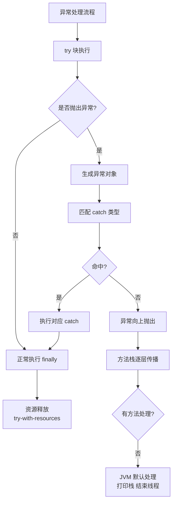
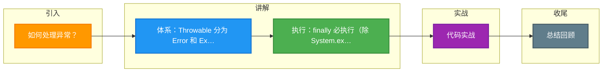

# 如何处理异常？

在 Java 中，异常处理是构建健壮程序的核心机制。以下从异常体系、分类、处理原则及最佳实践进行详细说明。

### 1. 异常体系结构

Java 中所有的异常和错误都继承自 `Throwable` 类。

```text
              Object
                |
             Throwable
           /         \
        Error        Exception
                       |
           /-----------------------\
     CheckedException      RuntimeException (Unchecked)
```

- **Error**：表示 JVM 层面的严重错误（如 `OutOfMemoryError`, `StackOverflowError`），通常不由程序捕获处理。
- **Exception**：表示程序本身可以处理的异常。
  - **Checked Exception** (受检异常)：编译期检查，必须显式处理 (`try-catch` 或 `throws`)，如 `IOException`, `SQLException`。
  - **Unchecked Exception** (非受检异常)：运行时异常，编译期不检查，通常是编程逻辑错误，如 `NullPointerException`, `ArrayIndexOutOfBoundsException`。

### 2. 异常处理关键字：try-catch-finally

- **try**：包裹可能抛出异常的代码块。
- **catch**：捕获并处理特定类型的异常。
- **finally**：无论是否发生异常，都会执行的代码块（除了 `System.exit(0)`）。常用于资源回收（关闭流、锁释放）。

**执行细节**：
1. try 块中遇到异常，跳出 try，进入匹配的 catch 块。
2. 如果有 finally，执行 catch 之后再执行 finally；如果 catch 中也有异常或 return，finally 依然会在方法返回前执行。
3. 如果 try 块中有 return 语句，会先保存返回值的副本，执行完 finally 后再返回副本（注意引用类型在 finally 中修改属性会影响返回结果）。

### 3. 自定义异常

**适用场景**：当 JDK 提供的异常类型无法准确描述业务错误时（如 `BalanceInsufficientException`）。

**实现规范**：
- 通常继承 `RuntimeException`（Unchecked），避免侵入式处理。
- 建议提供 `serialVersionUID`。
- 构造器支持传入 `message` 和 `cause` (原始异常)。

### 4. 处理原则与最佳实践

1. **不要捕获 Throwable**：除非你是框架底层的容器，否则不要捕获 `Error` 或 `Throwable`，这会掩盖系统级严重错误。
2. **不要吞掉异常**：`catch (Exception e) {}` 是最糟糕的做法，至少应打印日志 (`logger.error("msg", e)`)。
3. **尽量使用具体的异常**：优先捕获具体的子类（如 `FileNotFoundException`）而不是宽泛的 `Exception`。
4. **尽早抛出**：在方法入口检查参数合法性，如果不满足直接抛出异常（Fail-Fast 原则）。
5. **异常链**：在捕获底层异常抛出业务异常时，将原始异常作为 Cause 传入 (`throw new BusinessException("msg", e)`)，保留堆栈信息。
6. **try-with-resources**：JDK 7+ 特性，自动实现 `AutoCloseable` 接口的资源关闭，替代繁琐的 `finally` 关闭流代码。

### 5. 重写方法时的异常规则

子类重写父类方法时，抛出的异常范围**不能比父类更宽**。
- 父类抛出 `IOException`，子类可以抛出 `IOException`、`FileNotFoundException` (子类) 或不抛出，但不能抛出 `Exception`。
- 父类未抛出受检异常，子类也不能抛出受检异常，但可以抛出非受检异常。

## 常见考点

1. **try-catch-finally 块中 return 的执行顺序？**
   - 如果 finally 中有 return，会覆盖 try/catch 中的返回值（编译器通常会警告）。如果没有 return，finally 中的代码会先执行，然后回 到之前的 return 点执行返回。

2. **Java 异常是线程独立的吗？**
   - 是的。主线程中未捕获的异常会导致主线程终止，但不会影响其他子线程的运行（除非子线程等待主线程的结果）。每个线程都有独立的调用栈。

3. **Spring 事务中异常未回滚是什么原因？**
   - 默认情况下，Spring 只在抛出 `RuntimeException` 或 `Error` 时回滚。如果抛出的是 Checked Exception（如自定义异常继承 `Exception`），事务默认不回滚，需指定 `@Transactional(rollbackFor = Exception.class)`。


## 核心架构图



## 记忆要点

- 体系：Throwable 分为 Error 和 Exception，Exception 分为 Checked（受检）和 Unchecked（运行时）。
- 执行：finally 必执行（除 System.exit），若 try 中有 return，会先存副本，执行完 finally 再返回。
- 规范：别吞异常、别抓 Throwable、尽量捕获具体异常，JDK 7+ 用 try-with-resources。
- 规则：子类重写方法抛出的异常范围不能比父类更宽（窄或相等）。
- 事务坑：Spring 默认只在抛 RuntimeException 或 Error 时回滚。

## 结构化回答

**30 秒电梯演讲：** 程序错误的分类、捕获与处理机制。打个比方，医生看病：分类（病症）、诊断（捕获）、治疗（处理）。

**展开框架：**
1. **体系** — Throwable 分为 Error 和 Exception，Exception 分为 Checked（受检）和 Unchecked（运行时）。
2. **执行** — finally 必执行（除 System.exit），若 try 中有 return，会先存副本，执行完 finally 再返回。
3. **规范** — 别吞异常、别抓 Throwable、尽量捕获具体异常，JDK 7+ 用 try-with-resources。

**收尾：** 这三点都能配合实战聊。您想深入聊原理、对比还是避坑？

## 视频脚本

> 预计时长：2 分钟 | 由浅入深

| 时间 | 画面/字幕 | 口播台词 | 讲解要点 |
|------|----------|----------|----------|
| 0:00 | 标题卡：如何处理异常 | "如何处理异常？一句话——医生看病：分类（病症）、诊断（捕获）、治疗（处理）。" | 开场钩子 |
| 0:40 | 概念动画/示意图 | "程序错误的分类、捕获与处理机制——医生看病：分类（病症）、诊断（捕获）、治疗（处理）" | 核心定义 |
| 1:20 | 体系示意 | "Throwable 分为 Error 和 Exception，Exception 分为 Checked（受检）和 Unchecked（运行时）。" | 要点1 |
| 2:00 | 总结卡 | "记住这几条，面试不慌。下期讲进阶追问。" | 收尾 |

### 视频流程图



