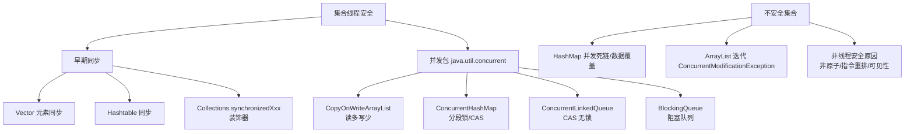

# 如何设计一个本地缓存？

设计一个高性能、线程安全的本地缓存，需要综合考虑数据结构、淘汰策略、并发控制及命中率优化。以下是设计要点及架构方案。

### 1. 核心架构设计

本地缓存本质上是一个内存中的 Key-Value 存储容器。基础架构如下：

```text
+-------------------------------------------------------+
|                   Local Cache                         |
+-------------------------------------------------------+
|  Concurrent Hash Map (核心存储)                       |
|    +-------------------+    +-----------------------+ |
|    | Key-1  |  Node-1  | -> | Value | Header| Tail | |
|    +-------------------+    +-----------------------+ |
+-------------------------------------------------------+
|  Eviction Policy (淘汰策略管理器)                     |
|    +-------------------------------------------------+ |
|    | LRU Queue (双向链表) / LFU Counter Map          | |
|    +-------------------------------------------------+ |
+-------------------------------------------------------+
```

### 2. 关键设计模块

#### A. 数据存储结构
- **核心存储**：通常使用 `ConcurrentHashMap` 或 `ConcurrentHashMap` 分段锁机制，保证高并发下的读写性能（如 Java 8+ 的 `ConcurrentHashMap` 或 Caffeine 使用的非阻塞算法）。
- **节点封装**：Value 封装为 Node 对象，包含：
  - 实际数据 `Object value`
  - 访问时间戳 `long accessTime`
  - 写入时间戳 `long writeTime`
  - 频次计数器 `long frequency` (LFU需要)

#### B. 淘汰策略

当缓存达到上限时，需要移除旧数据。常见策略：

1.  **LRU (Least Recently Used)**：最近最少使用。
    - **实现**：维护一个双向链表。访问命中时将节点移至链表头部；添加新数据也放头部；淘汰时移除链表尾部。
    - **优化**：使用 Hash 表 + 双向链表 (类似 `LinkedHashMap`)，读写 O(1)。

2.  **LFU (Least Frequently Used)**：最近最不经常使用。
    - **实现**：记录每个 Key 的访问次数，维护一个优先级队列（小顶堆）或分层频次队列。
    - **适用场景**：数据访问频率差异明显的场景（如热点数据）。

3.  **FIFO (First In First Out)**：先进先出。
    - **实现**：使用队列。命中率较低，一般不推荐。

4.  **基于时间的过期**：
    - **Write Expire**：写入后固定时长过期（TTL）。
    - **Access Expire**：每次访问后重置过期时间（类似 Session）。

#### C. 线程安全

- **并发容器**：利用 `ConcurrentHashMap` 的分段锁或 CAS 机制。
- **同步策略**：对于淘汰策略涉及的全局操作（如更新链表），可以使用：
    - `synchronized` 锁住整个链表（简单但性能低）。
    - 分段锁，降低锁竞争。
    - Caffeine 使用的环形缓冲区 和 W-TinyLFU 算法，利用 ReadWriteLock 或无锁技术。

#### D. 缓存击穿与保护

- **伪异步加载**：当 Key 不存在时，使用 `Future` 包装加载任务。多个线程同时请求同一 Key 时，只有一个线程执行加载，其他线程等待 Future 结果。

```text
Thread 1 请求 Key A ----> Map.get(Key A) ----> Miss
                                         |
                                         v
                              put Future <Loading Task> into Map
                                         |
                                         v
                              Thread 2 请求 Key A ----> Map.get -> Wait Future
```

### 3. 简易代码结构

```java
public class LocalCache<K, V> {
    private final ConcurrentHashMap<K, Node<K, V>> map;
    private final int maxSize;
    // 也可以用 LRU 链表头节点
    
    public V get(K key) {
        Node<K, V> node = map.get(key);
        if (node != null) {
            // 1. 更新访问时间/移到 LRU 头部
            updateAccessStatus(node);
            return node.value;
        }
        return load(key); // 缓存加载逻辑
    }
    
    public void put(K key, V value) {
        if (map.size() >= maxSize) {
            evict(); // 执行淘汰
        }
        map.put(key, new Node<>(value));
    }
}
```

### 4. 性能优化点
- **引用类型**：可配置使用 `SoftReference`（软引用，内存不足时 GC）或 `WeakReference`（弱引用，GC 立即回收）来存储 Value，防止 OOM。
- **统计监听**：提供 `hitRate` (命中率), `evictCount` (淘汰次数) 等指标监控。

## 常见考点

1. **本地缓存与 Redis（分布式缓存）的区别？**
   - **数据一致性**：本地缓存无法在多实例间自动同步，适合一致性要求不高的数据（如配置、字典）；Redis 共享数据。
   - **性能**：本地缓存无网络开销，速度极快（微秒级）；Redis 有网络延迟（毫秒级）。
   - **容量**：本地缓存受限于 JVM 堆内存；Redis 受限于物理内存。

2. **如何解决本地缓存的内存泄露问题？**
   - 使用弱引用或软引用存储 Key 或 Value。
   - 严格控制最大容量，并确保淘汰算法正确执行。
   - 使用 `WeakHashMap` 或第三方库（Caffeine, Guava Cache）而非简单的 HashMap。

3. **LRU 的实现原理及其在 Java 中的体现？**
   - `LinkedHashMap` 的 `accessOrder` 设为 true 时，就是 LRU 实现。重写 `removeEldestEntry` 方法可实现自动移除最老元素。


## 核心架构图


## 核心知识点图


## 记忆要点

- 核心存储：选用 ConcurrentHashMap 保证高并发读写安全。
- 淘汰策略：LRU 用链表+哈希，LFU 用频次统计，常用 TTL 过期机制。
- 缓存击穿防：用 Future 包装加载任务，保证同 Key 并发仅加载一次。
- 高级优化：高性能缓存（如 Caffeine）用 W-TinyLFU 和无锁算法提升吞吐。
- 淘汰对比：LRU 适合热点少且集中场景，LFU 适合热点区分明显场景。

## 结构化回答

**30 秒电梯演讲：** 应用内存中的高效数据暂存容器。打个比方，随身背包，拿取快但容量有限。

**展开框架：**
1. **核心存储** — 选用 ConcurrentHashMap 保证高并发读写安全。
2. **淘汰策略** — LRU 用链表+哈希，LFU 用频次统计，常用 TTL 过期机制。
3. **缓存击穿防** — 用 Future 包装加载任务，保证同 Key 并发仅加载一次。

**收尾：** 这三点都能配合实战聊。您想深入聊原理、对比还是避坑？

## 视频脚本

> 预计时长：2 分钟 | 由浅入深

| 时间 | 画面/字幕 | 口播台词 | 讲解要点 |
|------|----------|----------|----------|
| 0:00 | 标题卡：如何设计一个本地缓存 | "如何设计一个本地缓存？一句话——随身背包，拿取快但容量有限。" | 开场钩子 |
| 0:40 | 概念动画/示意图 | "应用内存中的高效数据暂存容器——随身背包，拿取快但容量有限" | 核心定义 |
| 1:20 | 核心存储示意 | "选用 ConcurrentHashMap 保证高并发读写安全。" | 要点1 |
| 2:00 | 总结卡 | "记住这几条，面试不慌。下期讲进阶追问。" | 收尾 |
