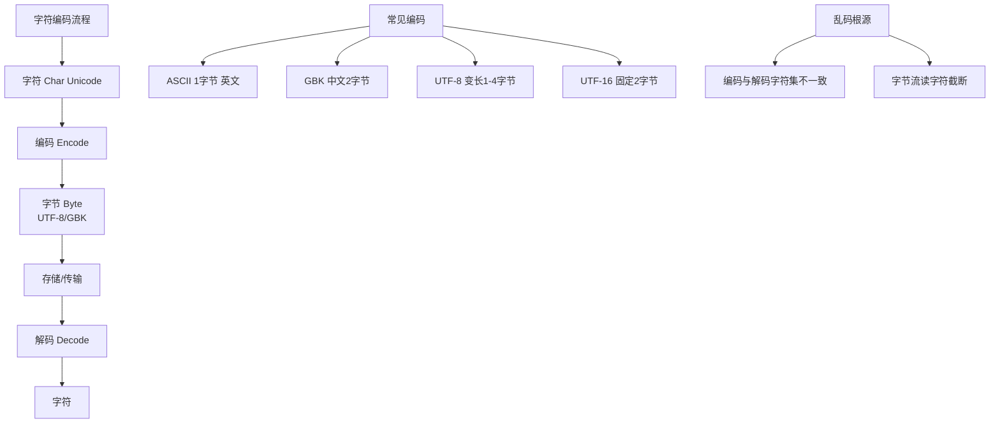

# 字节流和字符流的区别？

Java IO 流根据处理数据单元的不同，分为**字节流**（Byte Stream）和**字符流**（Character Stream）。理解两者的区别及转换机制是 IO 处理的基础。

### 1. 核心区别对比表

| 特性 | 字节流 | 字符流 |
| :--- | :--- | :--- |
| **基本单元** | 8位字节 (1 Byte) | 16位 Unicode 字符 (2 Bytes) |
| **顶级基类** | `InputStream`, `OutputStream` | `Reader`, `Writer` |
| **适用场景** | 处理二进制数据（图片、音频、视频、文件拷贝） | 处理文本数据（txt, xml, 读取控制台输出） |
| **编码问题** | 不涉及编码，原样传输 | 必须指定字符集（UTF-8, GBK等），否则乱码 |
| **缓冲** | `BufferedInputStream` / `BufferedOutputStream` | `BufferedReader` / `BufferedWriter` (支持按行读取) |

### 2. 为什么需要字符流？

Java 内部使用 `char` 类型（UTF-16）表示字符。而文件或网络传输通常使用字节（ASCII, UTF-8 等）。

- **字节流的问题**：如果直接用字节流读取文本，需要手动将字节转换为字符，处理多字节字符（如中文在 UTF-8 中占 3 字节）时极易出现“半个汉字”或乱码问题。
- **字符流的优势**：字符流底层封装了字节到字符的解码过程，提供了 `readLine()` 等便捷方法，适合处理文本。

### 3. 字节流与字符流的转换（桥梁）

**转换流** `InputStreamReader` 和 `OutputStreamWriter` 是两者之间的桥梁，它们属于**字符流**，但构造时接收字节流。

```text
File (字节)  -> FileInputStream (字节流) -> InputStreamReader (解码) -> BufferedReader (字符流)
```

- **InputStreamReader**：将字节输入流按指定字符集解码为字符流。
- **OutputStreamWriter**：将字符流按指定字符集编码为字节流输出。

### 4. 使用场景详解

#### A. 字节流 (使用 `FileInputStream` / `FileOutputStream`)

```java
// 拷贝图片、压缩包等二进制文件
try (FileInputStream fis = new FileInputStream("input.jpg");
     FileOutputStream fos = new FileOutputStream("output.jpg")) {
    int b;
    while ((b = fis.read()) != -1) {
        fos.write(b);
    }
}
```
**注意**：不要用字符流操作图片等非文本文件，否则数据会被破坏。

#### B. 字符流 (使用 `FileReader` / `FileWriter` 或转换流)

```java
// 读取文本文件，推荐使用转换流明确指定编码，防止乱码
try (InputStreamReader isr = new InputStreamReader(new FileInputStream("test.txt"), "UTF-8");
     BufferedReader br = new BufferedReader(isr)) {
    String line;
    while ((line = br.readLine()) != null) {
        System.out.println(line);
    }
}
```

### 5. 补充：设计模式（装饰器模式）

Java IO 大量使用了**装饰器模式**。
- **基础组件**：`FileInputStream` (节点流，直接接触数据源)。
- **装饰组件**：`BufferedInputStream` (处理流，给节点流增加缓冲功能)。

```text
InputStream is = new FileInputStream("a.txt"); // 节点流
InputStream bis = new BufferedInputStream(is);   // 装饰流，增强功能
```

## 常见考点

1. **使用字节流读取汉字为什么会出现乱码？**
   - UTF-8 中一个汉字占 3 个字节。如果使用 `read()` 读取一个字节并强制转换为 `char`，或者读取的字节数不是 3 的倍数，就会破坏字符的编码结构，导致乱码。解决方法是使用字符流或 `byte[]` 缓冲区正确解码。

2. **有了字节流为什么还要有缓冲流？**
   - 直接读写磁盘或网络是昂贵操作。缓冲流在内存中维护一个数组（buffer），每次读写一大块数据，减少底层系统调用的次数，显著提升 IO 性能。

3. **`new FileReader("file.txt")` 和 `new InputStreamReader(new FileInputStream("file.txt"), "UTF-8")` 有什么区别？**
   - `FileReader` 使用系统默认字符集（不可控，跨平台可能乱码）。
   - `InputStreamReader` 可以显式指定字符集编码（推荐用法）。


## 核心架构图



## 记忆要点

- 基本单元：字节流操作 8 位字节，字符流操作 16 位 Unicode 字符。
- 基类区别：字节流是 InputStream/OutputStream，字符流是 Reader/Writer。
- 核心场景：字节流处理音视频等二进制，字符流处理纯文本防乱码。
- 桥梁转换：InputStreamReader/OutputStreamWriter 实现字节转字符，需指定编码。
- 设计模式：IO 流底层大量使用装饰器模式（如 BufferedInputStream 增加缓冲）。

## 结构化回答

**30 秒电梯演讲：** 字节流是二进制传输，字符流是文本传输。打个比方，运煤（字节）和运信（字符）的区别。

**展开框架：**
1. **基本单元** — 字节流操作 8 位字节，字符流操作 16 位 Unicode 字符。
2. **基类区别** — 字节流是 InputStream/OutputStream，字符流是 Reader/Writer。
3. **核心场景** — 字节流处理音视频等二进制，字符流处理纯文本防乱码。

**收尾：** 这三点都能配合实战聊。您想深入聊原理、对比还是避坑？

## 视频脚本

> 预计时长：2 分钟 | 由浅入深

| 时间 | 画面/字幕 | 口播台词 | 讲解要点 |
|------|----------|----------|----------|
| 0:00 | 标题卡：字节流和字符流的区别 | "字节流和字符流的区别？一句话——运煤（字节）和运信（字符）的区别。" | 开场钩子 |
| 0:40 | 概念动画/示意图 | "字节流是二进制传输，字符流是文本传输——运煤（字节）和运信（字符）的区别" | 核心定义 |
| 1:20 | 基本单元示意 | "字节流操作 8 位字节，字符流操作 16 位 Unicode 字符。" | 要点1 |
| 2:00 | 总结卡 | "记住这几条，面试不慌。下期讲进阶追问。" | 收尾 |

---

## 延伸：什么是字符流？

> 合并自 `core-237`（相似度 68%）

字符流是 Java IO 中专门用于处理**文本数据**（16位 Unicode 字符）的流，其顶层抽象是 Reader（输入）和 Writer（输出）。

**核心特点**：
1. **编码转换**：字节流与字符流之间通过编码表（如 UTF-8）进行转换。
2. **最小单位**：操作的基本单位是字符，适合处理中文等文本。
3. **缓冲**：字符流通常内置缓冲区，提高读写效率（如 BufferedReader 的 readLine 方法）。

**原理细节与架构**：
字符流本质上是对字节流的封装。底层仍然是字节流（InputStream/OutputStream），通过**StreamDecoder**（解码）和 **StreamEncoder**（编码）实现字节与字符的转换。例如，`InputStreamReader` 在构造时可以指定字符集，若不指定则使用 JVM 默认字符集（可能引发乱码）。

**常见类**：
- `FileReader`/`FileWriter`：文件字符读写（注意：早期版本不能指定编码，源码显示其内部硬编码了默认字符集，建议在需要指定编码时使用 `InputStreamReader` 包装 `FileInputStream`）。
- `BufferedReader`/`BufferedWriter`：提供缓冲和按行读写功能。
- `InputStreamReader`/`OutputStreamWriter`：将字节流转换为字符流，可指定编码。

```text
┌─────────────┐    bytes    ┌──────────────────┐    chars    ┌───────────────┐
│   File/Net  │ ──────────> │ InputStreamReader │ ──────────> │   App Logic   │
│ (Byte Data) │             │  (Charset Decode) │             │   (Reader)    │
└─────────────┘             └──────────────────┘             └───────────────┘
```

**## 常见考点**
1. 字符流与字节流的区别？
   - 字节流（8 bit）处理二进制数据（图片、音频）；字符流（16 bit）处理文本。
2. 为什么 FileReader 无法指定编码？
   - 这是一个常见的设计缺陷，源码中它直接调用了 `FileInputStream` 并使用系统默认编码。跨平台推荐使用 `new InputStreamReader(new FileInputStream(path), StandardCharsets.UTF_8)`。
3. 使用字符流需要注意什么？
   - 务必在 `finally` 块或 try-with-resources 中关闭流，因为底层可能持有文件句柄或系统资源。

---

**实战案例**：
在处理跨平台日志文件上传时，曾遇到 Windows 服务器（默认 GBK）生成的日志在 Linux（默认 UTF-8）服务器上读取乱码。后强制指定 `InputStreamReader` 为 `GBK` 解码，并利用 `BufferedReader` 逐行分析，成功解决了“断行符”和“中文乱码”的双重问题。

**代码示例**：
```java
// 实战：标准化的文件读取方式（指定编码 + 缓冲 + 自动关闭）
try (BufferedReader reader = new BufferedReader(
        new InputStreamReader(
            new FileInputStream("data.log"), 
            StandardCharsets.UTF_8))) { // 明确指定 UTF-8，防止环境差异导致乱码
    String line;
    while ((line = reader.readLine()) != null) {
        // 按行处理业务逻辑
        processLine(line);
    }
} catch (IOException e) {
    e.printStackTrace();
}
```

**对比表格**：

| 特性 | 字节流 | 字符流 |
| :--- | :--- | :--- |
| **核心类** | InputStream, OutputStream | Reader, Writer |
| **处理单位** | Byte (8位) | Char (16位) |
| **适用场景** | 图片、视频、压缩包、网络传输 | 文本文件、CSV、XML、日志 |
| **编码支持** | 不涉及编码，原样传输 | 涉及编码转换，易产生乱码 |
| **缓冲机制** | BufferedInputStream | BufferedReader (支持 readLine) |

## 记忆要点

- 本质：底层是字节流，通过StreamDecoder/Encoder实现编解码转换
- 操作单位：处理16位Unicode字符，专为文本设计，常内置缓冲区
- 选型对比：字节流处理二进制(图片/视频)，字符流处理纯文本防乱码
- 防坑指南：FileReader无法指定编码，跨平台必须用InputStreamReader

## 结构化回答

**30 秒电梯演讲：** 专门处理文本的IO流，自动进行字节与字符的编码转换。打个比方，像翻译官，把底层的0/1数字流自动翻译成人类能读懂的文字。

**展开框架：**
1. **本质** — 底层是字节流，通过StreamDecoder/Encoder实现编解码转换
2. **操作单位** — 处理16位Unicode字符，专为文本设计，常内置缓冲区
3. **选型对比** — 字节流处理二进制(图片/视频)，字符流处理纯文本防乱码

**收尾：** 我在项目里踩过坑——在处理跨平台日志文件上传时，曾遇到 Windows 服务器（默认 GBK）生成的日志在 Linux（默认 UTF-8）服务器上读取乱码。您想深入聊哪一段：原理、避坑还是对比选型？

## 视频脚本

> 预计时长：3 分钟 | 由浅入深

| 时间 | 画面/字幕 | 口播台词 | 讲解要点 |
|------|----------|----------|----------|
| 0:00 | 标题卡：什么是字符流 | "什么是字符流？一句话——像翻译官，把底层的0/1数字流自动翻译成人类能读懂的文字。" | 开场钩子 |
| 0:45 | 概念动画/示意图 | "专门处理文本的IO流，自动进行字节与字符的编码转换——像翻译官，把底层的0/1数字流自动翻译成人类能读懂的文字" | 核心定义 |
| 1:30 | 本质示意 | "底层是字节流，通过StreamDecoder/Encoder实现编解码转换" | 要点1 |
| 2:15 | 操作单位示意 | "处理16位Unicode字符，专为文本设计，常内置缓冲区" | 要点2 |
| 3:00 | 总结卡 | "记住这几条，面试不慌。下期讲进阶追问。" | 收尾 |

---

## 延伸：什么是IO流基本认识？

> 合并自 `core-068`（相似度 66%）

### IO流基本认识

Java中的I/O（Input/Output）流是用于处理输入和输出的机制。I/O 流以字节（byte）为基本单位，提供了一种灵活的方式来读取和写入数据。I/O 流分为输入流和输出流，根据数据的流向分为输入和输出。

Java的I/O流主要分为两大类：字节流和字符流。字节流用于处理原始的二进制数据，而字符流用于处理文本数据。

#### 1. 字节流
- **InputStream 和 OutputStream**：是所有字节输入流和输出流的抽象基类。它们分别用于读取和写入字节。
- **FileInputStream 和 FileOutputStream**：用于从文件中读取字节和向文件中写入字节。
- **ByteArrayInputStream 和 ByteArrayOutputStream**：分别用于从字节数组中读取数据和将数据写入字节数组。

#### 2. 字符流
- **Reader 和 Writer**：是所有字符输入流和输出流的抽象基类。它们分别用于读取和写入字符。
- **FileReader 和 FileWriter**：用于从文件中读取字符和向文件中写入字符。
- **BufferedReader 和 BufferedWriter**：用于提供缓冲区，提高读取和写入的效率。

#### 3. 高级流
- **ObjectInputStream 和 ObjectOutputStream**：用于读取和写入对象。可以序列化和反序列化对象。

**实战案例**：
在生产环境中，直接使用 `FileInputStream` 逐字节读取大文件会导致性能极差（频繁的磁盘 I/O 系统调用）。正确的做法是使用 `BufferedInputStream` 包装流，利用默认 8KB 的缓冲区批量读取。此外，在处理流关闭时，若流 A 依赖流 B（如 `new BufferedReader(new FileReader(...))`），关闭最外层流 A 时会自动关闭内层流 B，但手动将流声明放在 try-with-resources 块中是最安全的做法，能防止句柄泄露。

**代码示例 (Java Try-with-resources)**：
```java
// 推荐做法：使用 try-with-resources 自动关闭流
try (BufferedReader br = new BufferedReader(new FileReader("input.txt"));
     BufferedWriter bw = new BufferedWriter(new FileWriter("output.txt"))) {
    
    String line;
    while ((line = br.readLine()) != null) {
        bw.write(line);
        bw.newLine(); // 跨平台换行
    }
} catch (IOException e) {
    e.printStackTrace();
}
// 离开 try 块时，br 和 bw 会自动按顺序关闭
```

**代码示例 (JDK 7+ NIO)**：
```java
// 使用 Files.copy 一行代码完成文件复制，底层自动优化
import java.nio.file.*;
Files.copy(Paths.get("source.txt"), Paths.get("dest.txt"), StandardCopyOption.REPLACE_EXISTING);
```

## 记忆要点

- 核心概念：Java以字节(byte)为基本单位处理数据流向的机制
- 基础分类：字节流处理二进制(如音视频)，字符流处理纯文本(解决乱码)
- 性能优化：因为节点流逐字节读写引发频繁IO，所以用缓冲流(如8KB包装)批量读写
- 资源释放：务必用try-with-resources语法，自动调用close防止句柄泄露

## 结构化回答

**30 秒电梯演讲：** 数据传输的管道，分字节（8位）和字符（16位）流。打个比方，水管运送水，I/O流运送字节或字符数据。

**展开框架：**
1. **核心概念** — Java以字节(byte)为基本单位处理数据流向的机制
2. **基础分类** — 字节流处理二进制(如音视频)，字符流处理纯文本(解决乱码)
3. **性能优化** — 因为节点流逐字节读写引发频繁IO，所以用缓冲流(如8KB包装)批量读写

**收尾：** 这三点都能配合实战聊。您想深入聊原理、对比还是避坑？

## 视频脚本

> 预计时长：2 分钟 | 由浅入深

| 时间 | 画面/字幕 | 口播台词 | 讲解要点 |
|------|----------|----------|----------|
| 0:00 | 标题卡：什么是IO流基本认识 | "什么是IO流基本认识？一句话——水管运送水，I/O流运送字节或字符数据。" | 开场钩子 |
| 0:40 | 概念动画/示意图 | "数据传输的管道，分字节（8位）和字符（16位）流——水管运送水，I/O流运送字节或字符数据" | 核心定义 |
| 1:20 | 核心概念示意 | "Java以字节(byte)为基本单位处理数据流向的机制" | 要点1 |
| 2:00 | 总结卡 | "记住这几条，面试不慌。下期讲进阶追问。" | 收尾 |
