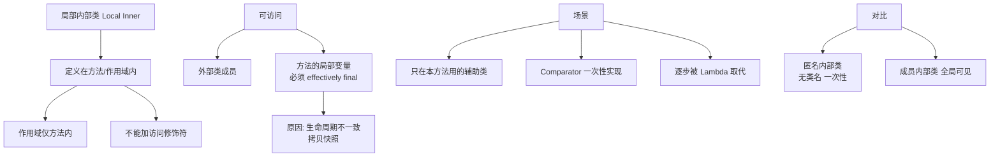

# 局部内部类（定义在方法中的类）是什么？

局部内部类是定义在方法、作用域块（如代码块、构造器）内部的类。它仅在定义它的方法或作用域内可见。

### 关键特性与原理细节
1. **作用域限制**：局部内部类仅在定义它的块内有效，外部无法访问。它类似于局部变量，不能使用 public、protected、private 或 static 修饰符（因为它们属于成员层级，而局部内部类属于块级作用域）。

2. **访问外部成员**：
   - 可以访问外部类的成员变量（包括私有成员）。
   - 可以访问外部方法的局部变量，但**仅限于有效地 final（Effectively Final）的变量**（即变量初始化后不再被修改，或在 Java 8 之前显式声明为 final）。
   - **原理**：这是因为局部内部类实例的生命周期可能比方法栈帧长（例如被返回或赋值给成员变量），方法结束后局部变量栈帧销毁。为了保证内部类仍能访问该变量，Java 会将局部变量**拷贝**一份作为内部类的成员变量。为了保证拷贝的一致性，强制要求该变量不可变（final）。

### 代码示例
```java
public class Out {
    private static int staticVar = 1;
    private int instanceVar = 2;

    public void test(final int paramVar) {
        final int localVar = 3;
        // int modifiableVar = 4; // 如果在内部类中使用，不能修改此变量

        // 局部内部类定义
        class LocalInner {
            public void print() {
                System.out.println("Static Var: " + staticVar); // 允许
                System.out.println("Instance Var: " + instanceVar); // 允许
                System.out.println("Param Var: " + paramVar); // 允许（必须effectively final）
                System.out.println("Local Var: " + localVar); // 允许（必须effectively final）
                // modifiableVar++; // 编译错误
            }
        }

        LocalInner inner = new LocalInner();
        inner.print();
    }
}
```

## 常见考点
1. 为什么局部内部类和匿名内部类只能访问 final 的局部变量？（考察生命周期与变量拷贝机制）
2. 局部内部类可以定义静态成员吗？（不可以，因为非静态内部类依赖于外部实例，而静态成员属于类级别，定义在局部中语义不明；JDK 16+ 允许定义 static final 的常量）
3. 局部内部类与匿名内部类的区别？（局部内部类有类名，可复用；匿名内部类无类名，通常用于一次性实现接口或继承类）

## 技术原理

局部内部类是 Java 编译器层面的语法糖，本质是**把"只在某个方法里用的辅助类"封装在该方法的作用域内，避免污染外部类的命名空间**。它的核心难点是跨作用域的变量访问——为什么必须 final。

- **编译产物的存在形式**：局部内部类编译后生成独立的 `.class` 文件，命名格式为 `Outer$1LocalInner.class`（`$数字` 前缀区分同一外部类里的多个局部内部类）。它不是外部类的成员，所以不能用 `public/private/static` 等成员修饰符。运行时仍由普通 ClassLoader 加载，只是它对外部的可见性被限制在源码作用域。
- **Effectively Final 的本质——变量拷贝 + 一致性保证**：局部变量存在于方法栈帧中，方法返回时栈帧销毁。但局部内部类的实例可能逃逸（被 return、赋值给成员变量），生命周期长于方法栈帧。为了让内部类在方法返回后仍能访问这些变量，编译器**把用到的局部变量拷贝一份作为内部类的实例字段**（构造时传入）。如果允许变量修改，内部类持有的是拷贝，外部修改后两者不一致——这正是"闭包变量必须 final"的根因。Java 8 引入 Effectively Final（不显式写 final 但事实不变），编译器自动判定，减少样板代码。
- **成员限制的语义原因**：局部内部类是"实例上下文"的（依赖外部实例），如果允许定义 `static` 成员会产生语义歧义——静态成员属于类级别，但这个类连独立的类加载时机都不明确。JDK 16+ 放宽到允许 `static final` 常量（编译期常量无歧义），但仍不允许普通 static 字段或方法。
- **与 Lambda 的等价性**：Lambda 本质上就是"匿名局部内部类的语法糖"，访问外部变量也要 Effectively Final。理解局部内部类的原理就理解了 Lambda 闭包捕获的本质——`invokedynamic` + `LambdaMetafactory` 只是把内部类的实例化优化成了更轻量的形式。

## 代码示例

```java
// 1. 局部内部类的基本用法：方法内的辅助数据封装
public class Calculator {

    public Result compute(int[] data) {
        // 局部内部类：封装中间计算结果，只在本方法用
        class Intermediate {
            int sum = 0;
            int max = Integer.MIN_VALUE;
            int count = 0;

            void add(int v) {
                sum += v;
                if (v > max) max = v;
                count++;
            }
        }

        Intermediate im = new Intermediate();
        for (int v : data) im.add(v);
        return new Result(im.sum, im.max, (double) im.sum / im.count);
    }
}
```

```java
// 2. Effectively Final 演示：闭包变量捕获
public class HandlerFactory {

    // 错误写法：变量被修改，不能在局部内部类中访问
    public Runnable buildBad() {
        int x = 0;
        // x++;  // 一旦修改，下面局部类访问 x 会编译失败
        class Task implements Runnable {
            public void run() {
                // System.out.println(x);  // 编译错误：x 不是 effectively final
            }
        }
        return new Task();
    }

    // 正确写法：变量初始化后不再修改
    public Runnable buildGood(int input) {
        int multiplier = input * 2;   // effectively final，后续不修改
        class Task implements Runnable {
            public void run() {
                System.out.println(multiplier);   // 编译通过
            }
        }
        return new Task();   // 实例逃逸，但 multiplier 作为字段拷贝保留
    }
}
```

```java
// 3. 编译产物验证：查看 Outer$1LocalInner.class
// 反编译可见编译器自动添加了接收外部变量拷贝的构造器
public class Outer$1LocalInner {
    // 编译器自动注入的字段（拷贝自方法局部变量）
    private final int val$paramVar;
    private final int val$localVar;
    private final Outer this$0;   // 外部类实例引用

    Outer$1LocalInner(Outer outer, int paramVar, int localVar) {
        this.this$0 = outer;
        this.val$paramVar = paramVar;
        this.val$localVar = localVar;
    }
}
```

```java
// 4. JDK16+ 允许 static final 常量
public class Service {
    public void process() {
        class LocalWorker {
            static final int MAX_RETRY = 3;   // JDK16+ 允许
            // static int count = 0;          // 仍编译错误

            void doWork() {
                for (int i = 0; i < MAX_RETRY; i++) { /* ... */ }
            }
        }
    }
}
```

## 对比选型

| 维度 | 局部内部类 | 匿名内部类 | Lambda | 成员内部类 |
| :--- | :--- | :--- | :--- | :--- |
| **定义位置** | 方法/块内 | 方法内（表达式） | 方法内（表达式） | 外部类内部 |
| **类名** | 有，可复用 | 无，一次性 | 无，函数式 | 有 |
| **作用域** | 仅定义块内 | 仅定义处 | 仅定义处 | 整个外部类 |
| **访问修饰符** | 不能用 | 不能用 | N/A | 可用 |
| **外部变量** | Effectively Final | Effectively Final | Effectively Final | 无限制 |
| **适用场景** | 方法内辅助逻辑复用 | 一次性接口实现 | 函数式接口 | 与外部类强绑定 |

## 常见坑

- **局部变量修改后访问失败**：在内部类定义前修改了变量，后续局部内部类访问会编译失败。把变量声明拆成两个（一个不变给内部类用，一个可变给外部用）可绕过。
- **不要用局部内部类做控制流**：早期 Java 没有 Lambda，开发者习惯用局部内部类做策略模式。现在应优先用 Lambda/方法引用，可读性更好。
- **static 成员限制**：JDK 16 前完全不允许，16+ 只允许 `static final` 常量。误用会编译失败，IDE 通常会提示。
- **序列化陷阱**：局部内部类实例如果实现了 `Serializable`，会连带捕获外部类实例（`this$0`），可能导致意外持有外部类引用，阻碍 GC。生产代码避免让局部内部类可序列化。
- **反编译可看到捕获字段**：局部内部类实例的字段比代码里写的多（编译器注入的 `val$xxx`），调试时注意区分业务字段和编译器生成字段。
- **作用域不能跨方法**：局部内部类只在定义它的方法内可见，无法被其他方法引用。需要跨方法共享时升级为成员内部类或顶级类。


## 核心架构图


## 核心知识点图


## 记忆要点

- 作用域：定义在方法或作用域块内，仅在当前块内可见，不能加访问修饰符。
- 访问限制：访问外部局部变量必须是 Effectively Final（不可变）。
- 原理：因内部类生命周期可能长于方法栈帧，局部变量必须作为拷贝存入内部类。
- 成员限制：不能随意定义静态成员（JDK16+ 仅允许 static final 常量）。

## 结构化回答

**30 秒电梯演讲：** 定义在方法或作用域内部的类。打个比方，只在特定房间里使用的专用工具。

**展开框架：**
1. **作用域** — 定义在方法或作用域块内，仅在当前块内可见，不能加访问修饰符。
2. **访问限制** — 访问外部局部变量必须是 Effectively Final（不可变）。
3. **原理** — 因内部类生命周期可能长于方法栈帧，局部变量必须作为拷贝存入内部类。

**收尾：** 这三点都能配合实战聊。您想深入聊原理、对比还是避坑？

## 视频脚本

> 预计时长：2 分钟 | 由浅入深

| 时间 | 画面/字幕 | 口播台词 | 讲解要点 |
|------|----------|----------|----------|
| 0:00 | 标题卡：局部内部类（定义在方法中的类）是什么 | "局部内部类（定义在方法中的类）是什么？一句话——只在特定房间里使用的专用工具。" | 开场钩子 |
| 0:40 | 概念动画/示意图 | "定义在方法或作用域内部的类——只在特定房间里使用的专用工具" | 核心定义 |
| 1:20 | 作用域示意 | "定义在方法或作用域块内，仅在当前块内可见，不能加访问修饰符。" | 要点1 |
| 2:00 | 总结卡 | "记住这几条，面试不慌。下期讲进阶追问。" | 收尾 |
