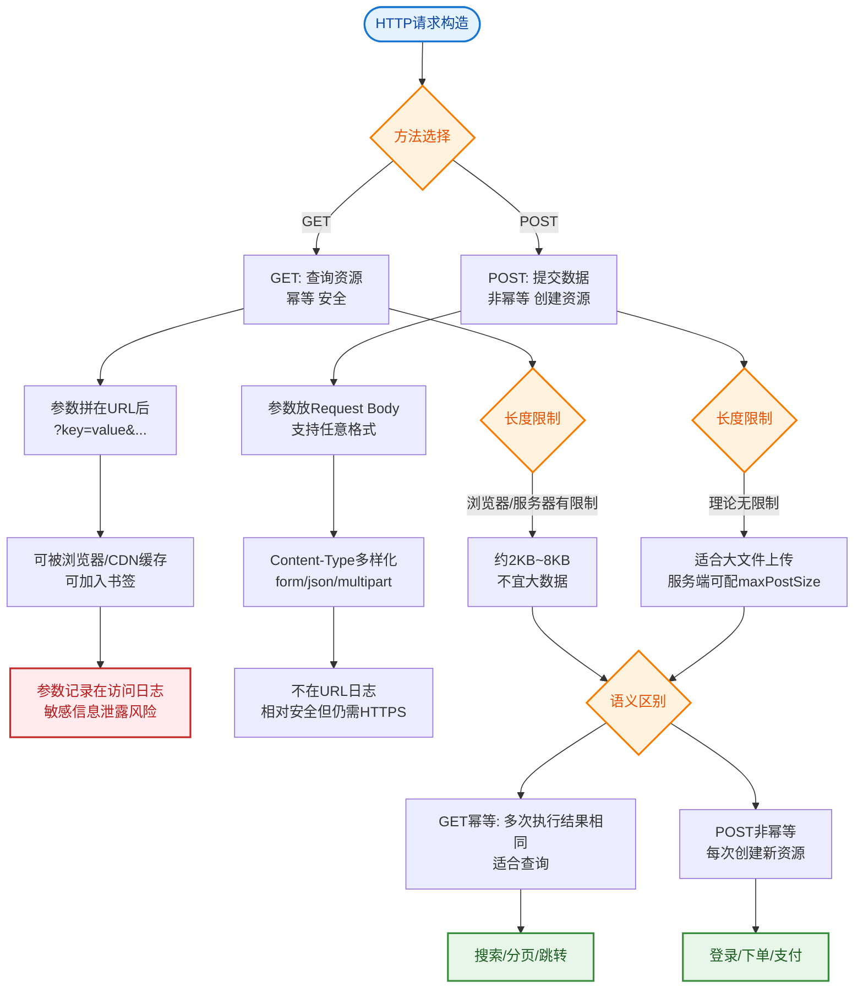

# 常见的请求方式？GET和POST请求的区别？

GET 和 POST 是 HTTP 协议中最常用的两种请求方法，主要区别如下：

### 1. 作用与语义
*   **GET**：用于**获取**资源。具有幂等性和安全性，多次请求不应改变服务器状态。
*   **POST**：用于**提交**数据和处理资源。通常用于注册、上传文件等，非幂等，多次请求可能产生不同结果。

### 2. 参数传递位置与编码
*   **GET**：参数通过 **URL** 传递（拼接在 Query String 中），只接受 ASCII 字符，需要进行 URL 编码。
*   **POST**：参数通常放在 **Request Body** 中，支持多种数据类型（文本、二进制），支持多种编码格式（application/x-www-form-urlencoded, multipart/form-data, application/json 等）。

### 3. 安全性
*   **GET**：参数暴露在 URL 中，会被浏览器历史记录、服务器日志记录，**不适合传递敏感信息**（如密码）。
*   **POST**：参数在 Body 中，相对安全，但并非加密传输，HTTPS 才是安全的保障。

### 4. 数据长度限制
*   **GET**：URL 长度受限。HTTP 协议本身无限制，但浏览器和服务器对 URL 长度有限制（如旧版 IE 限制 2KB，Chrome 约 8KB，服务器视配置而定）。
*   **POST**：理论无限制，受服务器配置（如 `max_post_size`）和内存限制。

### 5. 缓存与书签
*   **GET**：请求可被浏览器**主动缓存**，可保存为**书签**，浏览器回退时通常不会重新发起请求（从缓存读取）。
*   **POST**：默认**不缓存**，不能保存为书签，浏览器回退时会弹出提示，可能再次提交表单。

### 6. TCP 数据包与性能（底层原理）
*   **GET**：浏览器将 header 和 data 一起发送，发送**一个 TCP 数据包**（通常情况）。服务器返回 200。
*   **POST**：浏览器先发送 header，服务器响应 **100 Continue**，浏览器再发送 data，发送**两个 TCP 数据包**。
    *   *注*：但这并非绝对，在持久连接（Keep-Alive）或特定实现中可能合并。

### 7. 幂等性
*   **GET**：幂等。查询操作不改变资源状态。
*   **POST**：非幂等。每次提交可能创建新资源或修改状态。

```text
        TCP 数据包发送流程对比

  GET 请求流程：
  ┌─────────┐       Header + Data        ┌──────────┐
  │ Browser │ ────────────────────────> │  Server  │
  └─────────┘                            └──────────┘

  POST 请求流程（标准）
  ┌─────────┐       Header (Expect: 100) ┌──────────┐
  │ Browser │ ────────────────────────> │  Server  │
  └─────────┘                            └──────────┘
                                          │
                                          │ 100 Continue
                                          │
  ┌─────────┐ <──────────────────────── ─┘
  │ Browser │
  └─────────┘
      │
      │ Data (Body)
      │
      └───────────────────────────────> ┌──────────┐
                                        │  Server  │
                                        └──────────┘
```

## 常见考点
1. GET 请求可以带 Body 吗？（HTTP 协议允许，但标准服务端通常会忽略，不建议这样做）
2. 为什么 POST 产生两个 TCP 数据包？（先确认服务器愿意接收数据再发送，避免浪费带宽传输大文件后被拒）
3. 如何实现 RESTful 风格的 API 设计？（GET 用于查询，POST 用于创建，PUT 用于更新，DELETE 用于删除）


## 核心流程图


## 记忆要点

- 语义对比：GET 是获取（安全且幂等），POST 是提交（非幂等）。
- 位置区别：GET 参数拼在 URL 受长度限制，POST 放在 Request Body 无限制。
- 缓存机制：GET 默认会被浏览器主动缓存，POST 默认不缓存。
- 底层包数：GET 通常产生 1 个 TCP 数据包，POST 可能产生 2 个。
- 安全性：GET 参数暴露在 URL，不适合传密码；POST 相对隐蔽。

## 结构化回答

**30 秒电梯演讲：** GET获取资源（读），POST提交数据（写）。打个比方，GET是看菜单，POST是下单。

**展开框架：**
1. **语义对比** — GET 是获取（安全且幂等），POST 是提交（非幂等）。
2. **位置区别** — GET 参数拼在 URL 受长度限制，POST 放在 Request Body 无限制。
3. **缓存机制** — GET 默认会被浏览器主动缓存，POST 默认不缓存。

**收尾：** 这三点都能配合实战聊。您想深入聊原理、对比还是避坑？

## 视频脚本

> 预计时长：2 分钟 | 由浅入深

| 时间 | 画面/字幕 | 口播台词 | 讲解要点 |
|------|----------|----------|----------|
| 0:00 | 标题卡：常见的请求方式？GET和POST请求… | "常见的请求方式？GET和POST请求的区别？一句话——GET是看菜单，POST是下单。" | 开场钩子 |
| 0:40 | 概念动画/示意图 | "GET获取资源（读），POST提交数据（写）——GET是看菜单，POST是下单" | 核心定义 |
| 1:20 | 语义对比示意 | "GET 是获取（安全且幂等），POST 是提交（非幂等）。" | 要点1 |
| 2:00 | 总结卡 | "记住这几条，面试不慌。下期讲进阶追问。" | 收尾 |
