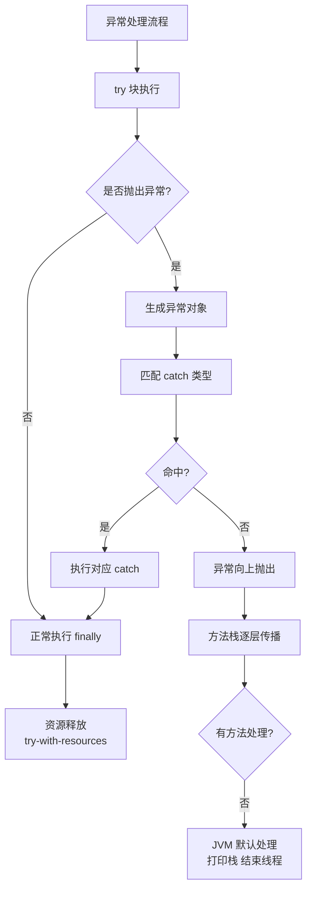

# 异常处理机制是什么？

Java 异常处理机制是程序健壮性的重要保障，主要包含异常分类、关键字语法和执行流程。

### 一、 异常体系结构
所有异常都继承自 `Throwable`。主要分为两大类：**Error** 和 **Exception**。

1.  **Error**：JVM 内部错误或资源耗尽等严重问题（如 `StackOverflowError`, `OutOfMemoryError`）。程序无法处理，不建议 `catch`。
2.  **Exception**：程序本身可以处理的异常。
    *   **Checked Exception（受检异常/编译时异常）**：编译器强制要求处理（捕获或声明抛出）。如 `IOException`, `SQLException`。
    *   **Unchecked Exception（非受检异常/运行时异常）**：编译器不强制要求，通常是编程逻辑错误。如 `NullPointerException`, `IndexOutOfBoundsException`, `ArrayStoreException`。

### 二、 处理关键字：try-catch-finally, throw, throws

*   **try**：包裹可能抛出异常的代码块。
*   **catch**：捕获并处理特定类型的异常。
    *   **细节**：多个 catch 块时，**子类异常必须写在父类异常之前**，否则编译报错（父类捕获后代码不可达）。Java 7 支持单 catch 捕获多个异常（`catch (A | B e)`）。
*   **finally**：无论是否发生异常，均执行的代码块（常用于释放资源如关闭流、锁）。
    *   **边界条件**：
        1.  如果在 try/catch 中执行了 `System.exit(0)`，finally 不会执行。
        2.  如果 JVM 物理崩溃（断电、kill -9），finally 不会执行。
        3.  如果 try/catch 中有 return 语句，finally 会在 return 之前执行（但 finally 中的修改可能不影响已确定的返回值引用，基本类型不影响，对象引用可能影响）。
*   **throw**：手动抛出一个异常实例（`throw new Exception(...)`）。
*   **throws**：声明在方法签名上，表示该方法可能抛出的受检异常，交由调用者处理。

### 三、 实战深化与代码示例

#### 1. 实战案例
*   **资源泄漏陷阱**：在 Java 7 之前，如果在 `try` 块中手动关闭资源（如 `InputStream.close()`）且该方法本身抛出异常，会掩盖 `try` 块中业务逻辑抛出的原始异常（即“异常屏蔽”），导致排查困难。Java 7 引入 try-with-resources 自动解决了此问题，并通过 `addSuppressed` 记录被屏蔽的异常。
*   **事务回滚**：在 Spring 框架中，默认只对 `RuntimeException` 和 `Error` 进行回滚。如果业务代码抛出 Checked Exception（如 `SQLException`）且未特殊配置，事务将不会回滚，导致数据不一致。

#### 2. 代码示例 (Java)
```java
// try-with-resources 自动资源管理 + 多异常捕获
public static void readFile(String path) throws IOException {
    // 1. 实战：自动调用 close()，防止资源泄漏
    try (BufferedReader br = new BufferedReader(new FileReader(path))) {
        // 2. 业务逻辑
        System.out.println(br.readLine());
    } catch (FileNotFoundException e) {
        // 具体的异常处理
        logger.error("文件未找到", e);
        throw e; 
    } catch (IOException e) {
        // 3. 多个异常可合并处理 (Java 7+)
        logger.error("读写IO异常", e);
        throw e;
    }
}
```

```text
          异常处理执行流程图

      ┌─────────────┐
      │   try 块    │ ──── 发生异常 ──┐
      └─────────────┘               │
                                    ▼
                         ┌───────────────────┐
                         │ 匹配对应 catch 块 │ ──── 匹配成功？ ──┐
                         └───────────────────┘                 │
                                   No │                       │ Yes
                                      ▼                        ▼
                              ┌─────────────┐         ┌─────────────┐
                              │   向上抛出   │         │ catch 处理   │
                              │ (或崩溃)    │         └─────────────┘
                              └─────────────┘                 │
                                                                ▼
                                                       ┌─────────────┐
                       (无论是否异常，是否 return) ───> │ finally 块  │
                                                       └─────────────┘
```


## 核心架构图



## 记忆要点

- 体系：Throwable 分 Error（不可抗力）和 Exception（可处理，含受检和非受检）。
- 顺序：多 catch 块时，子类异常必须在父类异常之前。
- 细节：try/catch 遇 return 时，finally 会在 return 前执行（但不改变已存返回值）。
- 资源管理：Java 7+ 推荐用 try-with-resources 自动关闭流，防内存泄漏。
- 实战坑：Spring 默认只在抛出 RuntimeException 时回滚事务。

## 结构化回答

**30 秒电梯演讲：** Try-Catch捕获异常，Throws抛出异常。打个比方，Try是试错，Catch是补救，Throws是推责。

**展开框架：**
1. **体系** — Throwable 分 Error（不可抗力）和 Exception（可处理，含受检和非受检）。
2. **顺序** — 多 catch 块时，子类异常必须在父类异常之前。
3. **细节** — try/catch 遇 return 时，finally 会在 return 前执行（但不改变已存返回值）。

**收尾：** 我在项目里踩过坑——资源泄漏陷阱：在 Java 7 之前，如果在 `try` 块中手动关闭资源（如 `InputStream.close()`）且该方法本身抛出异常，会掩盖 `try` 块中业务逻辑抛出的原始异常（即“异常屏蔽”），导致排查困难。您想深入聊哪一段：原理、避坑还是对比选型？

## 视频脚本

> 预计时长：2 分钟 | 由浅入深

| 时间 | 画面/字幕 | 口播台词 | 讲解要点 |
|------|----------|----------|----------|
| 0:00 | 标题卡：异常处理机制是什么 | "异常处理机制是什么？一句话——Try是试错，Catch是补救，Throws是推责。" | 开场钩子 |
| 0:40 | 概念动画/示意图 | "Try-Catch捕获异常，Throws抛出异常——Try是试错，Catch是补救，Throws是推责" | 核心定义 |
| 1:20 | 体系示意 | "Throwable 分 Error（不可抗力）和 Exception（可处理，含受检和非受检）。" | 要点1 |
| 2:00 | 总结卡 | "记住这几条，面试不慌。下期讲进阶追问。" | 收尾 |
