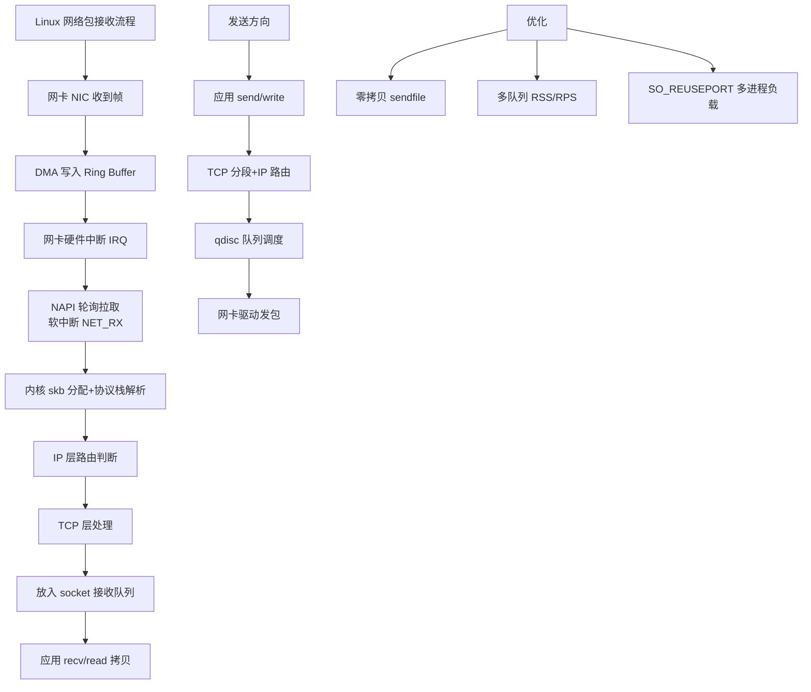

# 收发流程是什么？

网络数据包的收发流程涉及从用户态到内核态的切换，以及协议栈各层的数据封装与解封装。以下是详细的流程解析：

### 一、 发送流程

1.  **用户态写入**：应用程序调用 `write()` 或 `send()` 系统调用，数据从用户态拷贝到**内核态**的 Socket **发送缓冲区**（Send Buffer）。
2.  **协议栈处理（TCP/IP 封装）**：
    *   **传输层**：内核从发送缓冲区取数据，添加 **TCP 首部**（源端口、目的端口、Seq 等）。如果数据超过 MSS，会进行分段。
    *   **网络层**：添加 **IP 首部**（源 IP、目的 IP），查询路由表确定下一跳 IP。如果数据超过 MTU，IP 层进行分片。
    *   **数据链路层**：添加 **以太网帧头/帧尾**。通过 ARP 协议获取下一跳的 MAC 地址。
3.  **驱动与硬件发送**：
    *   数据包放入网卡的 **发包队列**（Ring Buffer）。
    *   触发**软中断**，通知网卡驱动程序。
    *   网卡驱动通过 **DMA（直接内存访问）** 将数据从 Ring Buffer 拷贝到网卡硬件缓存。
    *   物理网卡将数字信号转换为电信号/光信号发送出去。

### 二、 接收流程

1.  **硬件接收**：网卡收到数据包，通过 DMA 将数据写入内核内存的 **Ring Buffer**（环形缓冲区）。
2.  **中断通知**：
    *   **传统方式**：网卡触发硬中断，CPU 暂停当前任务，处理中断。
    *   **NAPI（New API）机制**（Linux 2.6+）：为了解决高频中断导致 CPU 疲劳，采用**中断 + 轮询**混合模式。
        *   初始包到达触发硬中断，内核关闭硬中断，开启软中断（`NET_RX_SOFTIRQ`）。
        *   软中断处理函数（`ksoftirqd`）通过**轮询**（Poll）方式一次性处理 Ring Buffer 中的多个数据包，直到数据为空或配额用尽，再重新开启硬中断。
3.  **协议栈处理（IP/TCP 解封装）**：
    *   **数据链路层**：检查帧校验序列（FCS），丢弃错误帧。剥离帧头，交给 IP 层。
    *   **网络层**：检查 IP 校验和，如果是本机 IP 则剥离 IP 头，根据协议号交给 TCP/UDP 层；如果不是本机则转发。
    *   **传输层**：找到对应的 Socket（通过四元组：源IP、源端口、目的IP、目的端口）。检查序列号，处理乱序、重传等。数据最终被放入 Socket 的 **接收缓冲区**（Receive Buffer）。
4.  **用户态读取**：应用程序调用 `read()` 或 `recv()`，内核将数据从接收缓冲区拷贝到用户态内存。

### 三、 实战深化与对比

#### 1. 实战案例
*   **Zero Copy（零拷贝）优化**：在处理大文件传输（如 Kafka、Nginx）时，传统的“用户态->内核态->磁盘”多次数据拷贝会导致 CPU 飙升。实战中常使用 `sendfile` 系统调用，数据直接在内核空间从文件系统缓存复制到 Socket 缓冲区，减少 2 次 CPU 拷贝和 2 次上下文切换，极大提升吞吐量。
*   **接收丢包排查**：当监控系统报 “RX dropped” 时，通常是因为接收流量超过了软中断 `ksoftirqd` 的处理能力，或者应用层读取数据太慢导致 Socket 接收缓冲区满。解决手段包括增大 Ring Buffer（`ethtool -G`）、增大 Socket Buffer（`net.core.rmem_max`）或开启多队列网卡（RSS）。

#### 2. 代码示例 (C - 设置 Socket 缓冲区)
```c
#include <sys/socket.h>
#include <netinet/in.h>

void set_socket_buffer(int sockfd) {
    int recv_buf_size = 2 * 1024 * 1024; // 2MB 接收缓冲区
    // 设置 SO_RCVBUF 选项，避免小包导致缓冲区满丢包
    if (setsockopt(sockfd, SOL_SOCKET, SO_RCVBUF, 
                   &recv_buf_size, sizeof(recv_buf_size)) == -1) {
        perror("setsockopt");
    }
}
```

#### 3. 性能对比表：传统模式 vs Zero Copy

| 特性 | 传统 I/O (read/write) | 零拷贝 | 优势 |
| :--- | :--- | :--- | :--- |
| **上下文切换** | 4次 (用户<->内核) | 2次 | 减少 CPU 切换开销 |
| **数据拷贝** | 4次 (CPU拷贝 + DMA) | 2次 (全DMA) | 降低 CPU 负载，提高吞吐 |
| **适用场景** | 普通小数据量交互 | 大文件传输、静态资源服务 | Kafka、Nginx、高性能代理 |

```text
        发送数据流向

  用户应用
     │ (write/send)
     ▼
  ┌─────────────┐
  │ Socket Send │◄── 拥塞控制/流量窗口限制
  │   Buffer    │
  └─────────────┘
     │ (TCP封装)
     ▼
  ┌─────────────┐
  │  TCP Layer  │
  └─────────────┘
     │ (IP封装 + 路由)
     ▼
  ┌─────────────┐
  │  IP Layer   │
  └─────────────┘
     │ (MAC封装 + ARP)
     ▼
  ┌─────────────┐
  │   Driver    │ ── DMA ──> ┌───────────┐
  └─────────────┘           │   NIC HW  │ ──> 网络
                            └───────────┘
```

```text
        接收数据流向

  网络 ──> ┌───────────┐ ── DMA ──> ┌─────────────┐
  入口    │   NIC HW  │           │ Ring Buffer │
         └───────────┘           └─────────────┘
               │                      │
               │ Hard Interrupt      │
               ▼                      ▼
         ┌─────────────┐      ┌─────────────┐
         │    Driver   │─────>│   IP Layer  │ ──> TCP Layer ──> Recv Buffer
         └─────────────┘      └─────────────┘
```


## 核心架构图



## 记忆要点

- 发送流：应用调用 send 触发拷贝到内核发送缓冲，经协议栈层层封装，由网卡 DMA 发出。
- 接收流：网卡通过 DMA 收入 Ring Buffer，NAPI 采用硬中断唤醒软中断轮询，层层解包入接收缓冲。
- 实战优化：大文件传输（如 Kafka/Nginx）用 sendfile 实现零拷贝，减少 CPU 拷贝。
- 丢包排查：RX dropped 多因软中断处理慢或应用读取慢导致缓冲区满。
- 对比：零拷贝将数据拷贝次数从 4 次减至 2 次且全为 DMA。

## 结构化回答

**30 秒电梯演讲：** 数据在网卡、内核缓冲区与应用间的传输。打个比方，货物在码头、仓库与客户间的流转。

**展开框架：**
1. **发送流** — 应用调用 send 触发拷贝到内核发送缓冲，经协议栈层层封装，由网卡 DMA 发出。
2. **接收流** — 网卡通过 DMA 收入 Ring Buffer，NAPI 采用硬中断唤醒软中断轮询，层层解包入接收缓冲。
3. **实战优化** — 大文件传输（如 Kafka/Nginx）用 sendfile 实现零拷贝，减少 CPU 拷贝。

**收尾：** 我在项目里踩过坑——Zero Copy（零拷贝）优化：在处理大文件传输（如 Kafka、Nginx）时，传统的“用户态->内核态->磁盘”多次数据拷贝会导致 CPU 飙升。您想深入聊哪一段：原理、避坑还是对比选型？

## 视频脚本

> 预计时长：2 分钟 | 由浅入深

| 时间 | 画面/字幕 | 口播台词 | 讲解要点 |
|------|----------|----------|----------|
| 0:00 | 标题卡：收发流程是什么 | "收发流程是什么？一句话——货物在码头、仓库与客户间的流转。" | 开场钩子 |
| 0:40 | 概念动画/示意图 | "数据在网卡、内核缓冲区与应用间的传输——货物在码头、仓库与客户间的流转" | 核心定义 |
| 1:20 | 发送流示意 | "应用调用 send 触发拷贝到内核发送缓冲，经协议栈层层封装，由网卡 DMA 发出。" | 要点1 |
| 2:00 | 总结卡 | "记住这几条，面试不慌。下期讲进阶追问。" | 收尾 |
